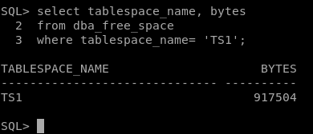

# Práctica ALMACENAMIENTO

## Oracle

1. Establece que los objetos que se creen en el TS1 (creado por tí) tengan un tamaño inicial de 200K, y que cada extensión sea del doble del tamaño que la anterior. El número máximo de extensiones debe ser de 3.

~~~
SQL> CREATE TABLESPACE TS1 DATAFILE '/home/oracle/TS1.img' SIZE 2M AUTOEXTEND ON;

Tablespace creado.
~~~

Una vez creado el TS1 crearemos el objeto para que el tamaño inicial sea 200K.
Lo apagamos primero.
~~~
Alter tablespace TS1 offline;

Tablespace modificado.
~~~

~~~
ALTER TABLESPACE TS1
DEFAULT STORAGE (
INITIAL 200K
NEXT 400K
PCTINCREASE 100
MINEXTENTS 1
MAXEXTENTS 3);

ALTER TABLESPACE TS1
*
ERROR en línea 1:
ORA-25143: la cláusula de almacenamiento por defecto no es compatible con la
política de asignación
~~~

No salta un error porque el tablespace esta hecho en local, no por diccionario, por ello no podremos modificar las clausulas de almacenamiento y si podemos ver que el tablespace system esta guardado en local.
~~~
SQL> SELECT tablespace_name, extent_management FROM dba_tablespaces where tablespace_name='SYSTEM';

TABLESPACE_NAME 	       EXTENT_MAN
------------------------------ ----------
SYSTEM			       LOCAL
~~~

2. Crea dos tablas en el tablespace recién creado e inserta un registro en cada una de ellas. Comprueba el espacio libre existente en el tablespace. Borra una de las tablas y comprueba si ha aumentado el espacio disponible en el tablespace. Explica la razón.

Empezamos por poner el tablespace online.
~~~
alter tablespace TS1 online;
~~~

Vamos a ver el espacio antes de nada del tablespace.
~~~
SQL> select tablespace_name, bytes
  2  from dba_free_space
  3  where tablespace_name = 'TS1';

TABLESPACE_NAME 		    BYTES
------------------------------ ----------
TS1				  1048576
~~~

Creamos dos tablas de prueba para TS1.
~~~
SQL> Create table prueba1
(
	Prueba varchar2(25)
)
tablespace TS1;

Table created.

SQL> Create table prueba2
(
	Prueba2 varchar2(25)
)
tablespace TS1;

Table created.
~~~

Insertamos datos en las tablas.
~~~
insert into prueba1 values('prueba1 para ts1');
insert into prueba2 values('prueba2 para ts1');
~~~

Volvemos a ver el espacio que tiene ahora.

Vamos ahora a borrar la tabla prueba2 para ver si tenemos mas espacio o no.
~~~
SQL> drop table prueba2;

Table dropped.
~~~

Vemos que tenemos una nueva linea y es porque en oracle los tablespaces se divide en segmentos, los bytes del segundo TS1 son los que se ha liberado cuando hemos borrado la tabla.

3. Convierte a TS1 en un tablespace de sólo lectura. Intenta insertar registros en la tabla existente. ¿Qué ocurre?. Intenta ahora borrar la tabla. ¿Qué ocurre? ¿Porqué crees que pasa eso?

Convertimos el tablespace en modo lectura.
~~~
SQL> alter tablespace TS1 read only;

Tablespace altered.
~~~

Vamos a intentar insertar datos en la tabla prueba1.

Vemos como no nos deja introducir datos en la tabla.

Vamos a borrar la tabla prueba1.
~~~
SQL> drop table prueba1;

Table dropped.
~~~

La tabla la podemos borrar porque el tablespace que gestiona el diccionario de datos si tiene permiso para borra la tabla.

4. Crea un espacio de tablas TS2 con dos ficheros en rutas diferentes de 1M cada uno no autoextensibles. Crea en el citado tablespace una tabla con la clausula de almacenamiento que quieras. Inserta registros hasta que se llene el tablespace. ¿Qué ocurre?

Creamos el tablespace no autoextensible.
~~~
SQL> Create tablespace TS2
Datafile '/home/oracle/TS2_1.img'
size 1M,
'/home/oracle/TS2_2.img'
size 1M
autoextend off;  

Tablespace created.

~~~

Creamos la clausula de almacenamiento.
~~~
Create table prueba3
(
	prueba1 char(1000),
	prueba2 char(1000)
)
Storage
(
	Initial 10K
)
tablespace TS2;
~~~

Insertamos datos hasta que superemos los 2M.

Como hemos puesto la opción de extender cuando se llena todo los 2M nos saltará con el error que vemos.

5. Realiza una consulta al diccionario de datos que muestre qué índices existen para objetos pertenecientes al esquema de SCOTT y sobre qué columnas están definidos. Averigua en qué fichero o ficheros de datos se encuentran las extensiones de sus segmentos correspondientes.

Consulta para mostrar los índices de la tabla SCOTT.
~~~
select index_name, column_name,table_name, table_owner
from dba_ind_columns
where table_owner='SCOTT';
~~~

Ahora hacemos una consulta para saber las extensiones de los segmentos de la tabla SCOTT.
~~~
select FILE_NAME, TABLESPACE_NAME
from dba_data_files
where tablespace_name=(select distinct tablespace_name
                    from DBA_SEGMENTS
                    where segment_type='INDEX'
                    and owner='SCOTT');
~~~

## Caso Práctico

6. Resuelve el siguiente caso práctico en ORACLE:

En nuestra empresa existen tres departamentos: Informática, Ventas y Producción. En Informática trabajan tres personas: Pepe, Juan y Clara. En Ventas trabajan Ana y Eva y en Producción Jaime y Lidia.

a) Pepe es el administrador de la base de datos.
Juan y Clara son los programadores de la base de datos, que trabajan tanto en la aplicación que usa el departamento de Ventas como en la usada por el departamento de Producción.
Ana y Eva tienen permisos para insertar, modificar y borrar registros en las tablas de la aplicación de Ventas que tienes que crear, y se llaman Productos y Ventas, siendo propiedad de Ana.
Jaime y Lidia pueden leer la información de esas tablas pero no pueden modificar la información.
Crea los usuarios y dale los roles y permisos que creas conveniente.
~~~
CREATE USER Pepe identified by Pepe;
GRANT dba to Pepe;

CREATE USER Juan identified by Juan;
CREATE USER Clara identified by Clara;
GRANT resource to Juan;
GRANT resource to Clara;

CREATE USER Ana identified by Ana;
CREATE USER Eva identified by Eva;
GRANT select on Ana.Ventas to Eva;
GRANT insert on Ana.Ventas to Eva;
GRANT update on Ana.Ventas to Eva;
GRANT delete on Ana.Ventas to Eva;
GRANT select on Ana.Productos to Eva;
GRANT insert on Ana.Productos to Eva;
GRANT update on Ana.Productos to Eva;
GRANT delete on Ana.Productos to Eva;

CREATE USER Jaime identified by Jaime;
CREATE USER Lidia identified by Lidia;
GRANT select on Ana.Ventas to Jaime;
GRANT select on Ana.Ventas to Lidia;
GRANT select on Ana.Productos to Jaime;
GRANT select on Ana.Productos to Lidia;
~~~

Voy a crear los roles.

- Rol Producción
~~~
CREATE ROLE Produccion;
GRANT select on Ana.Ventas to Produccion;
GRANT select on Ana.Productos to Produccion;

GRANT Produccion to Lidia;
GRANT Produccion to Jaime;
~~~

- Rol Ventas
~~~
CREATE ROLE Ventas;
GRANT select, insert, update, delete on Ana.Ventas to Ventas;
GRANT select, insert, update, delete on Ana.Productos to Ventas;
GRANT Ventas to Eva;
~~~

b) Los espacios de tablas son System, Producción (ficheros prod1.dbf y prod2.dbf) y Ventas (fichero vent.dbf).
Los programadores del departamento de Informática pueden crear objetos en cualquier tablespace de la base de datos, excepto en System.
Los demás usuarios solo podrán crear objetos en su tablespace correspondiente teniendo un límite de espacio de 30 M los del departamento de Ventas y 100K los del de Producción.
Pepe tiene cuota ilimitada en todos los espacios, aunque el suyo por defecto es System.

Creo los tablespace de system, producción y ventas.
~~~
CREATE TABLESPACE ts_produccion
DATAFILE 'prod1.dbf' SIZE 100M,
'prod2.dbf' SIZE 100M AUTOEXTEND ON;

CREATE TABLESPACE ts_venta
DATAFILE 'vent.dbf'
SIZE 100M AUTOEXTEND ON;
~~~

Asignamos las cuotas de los tablespaces a los usuarios.
~~~
ALTER USER ANA QUOTA 30M ON ts_venta;
ALTER USER EVA QUOTA 30M ON ts_venta;
ALTER USER JAIME QUOTA 100K ON ts_produccion;
ALTER USER LIDIA QUOTA 100K ON ts_produccion;
~~~

Modificamos el tablespace de pepe para que este por defecto en system.
~~~
ALTER USER Pepe DEFAULT TABLESPACE SYSTEM;
GRANT UNLIMITED TABLESPACE TO Pepe;
~~~

Le asignamos la cuota igual a 0 para revocar los privilegios de creación de objetos sobre un usuario de la tablespace.
~~~
GRANT UNLIMITED TABLESPACE TO JUAN;
GRANT UNLIMITED TABLESPACE TO CLARA;
ALTER USER JUAN QUOTA 0 ON SYSTEM;
ALTER USER CLARA QUOTA 0 ON SYSTEM;
~~~

c) Pepe quiere crear una tabla Prueba que ocupe inicialmente 256K en el tablespace Ventas.

Pasamos a crear la tabla prueba para pepe con INITIAL 256K.
~~~
CREATE TABLE PEPE.PRUEBA (
Codigo    VARCHAR2(5),
Nombre    VARCHAR2(30),
CONSTRAINT pk_codigo PRIMARY KEY(Codigo),
TABLESPACE Ventas,
STORAGE ( INITIAL 256K)
);
~~~

d) Pepe decide que los programadores tengan acceso a la tabla Prueba antes creada y puedan ceder ese derecho y el de conectarse a la base de datos a los usuarios que ellos quieran.

~~~
GRANT SELECT ON PEPE.PRUEBA TO Juan WITH GRANT OPTION;
GRANT SELECT ON PEPE.PRUEBA TO Clara WITH GRANT OPTION;
GRANT CONNECT TO Clara WITH ADMIN OPTION;
GRANT CONNECT TO Juan WITH ADMIN OPTION;
~~~

e) Lidia y Jaime dejan la empresa, borra los usuarios y el espacio de tablas correspondiente, detalla los pasos necesarios para que no quede rastro del espacio de tablas.

Borramos los usuarios primero.
~~~
DROP USER LIDIA cascade;
DROP USER JAIME cascade;
~~~

Con el siguiente comando borraremos todo lo incluido en el tablespaces.
~~~
drop tablespace ts_produccion including contents and datafiles;
~~~

## Postgres   

7. Averigua si existe el concepto de segmento y el de extensión en Postgres, en qué consiste y las diferencias con los conceptos correspondientes de ORACLE.

En Postgres no existe el concepto de segmento como en Oracle, cuando creamos un segmento en Postgres, creamos un archivo de datos dentro del directorio asignado al tablespaces, en el cual, no podemos indicar ni nombre ni tamaño ya que no es ni compartido por otras tablas. Y como sabemos en Oracle el segmento reserva el espacio en la base de datos en su datafile y este es utilizado por un objeto.

En Postgres para utilizar la extensión tendremos que instalarla con `create extension`. El concepto extensión en Postgres no es como en Oracle, el concepto como tal serian librerías o módulos que se le agregan funcionalidades especificas.

## MySQL

8. Averigua si existe el concepto de espacio de tablas en MySQL y las diferencias con los tablespaces de ORACLE.

En MySQL tenemos varios conceptos de espacio de tablas, los mas conocidos InnoDB y myISAM.

InnoDB podemos editar clausulas mediante la lógica del almacenamiento físico y acceso a los datos. InnoDB tiene una serie de características.

- Tiene fácil recuperación de datos
- Tiene rollback
- Tiene restricciones de Foreign Key
- Los datos se guardan en discos
- Es transaccional
- Consume mucho espacio en disco y RAM

Por otro lado myISAM que es mas liviano que InnoDB y este se utiliza para espacio de tablas que no consuman mucho espacio en disco y RAM.

Diferencia entre Oracle y MySQL es que en Oracle está pensado para una sola base de datos y contiene un tipo de motor de almacenamiento y en MariaDB es al contrario.

## MongoDB

9. Averigua si existe la posibilidad en MongoDB de decidir en qué archivo se almacena una colección.

MongoDB por defecto guarda sus archivos en `/var/lib/mongodb`, para cambiar esta ruta tendremos que entrar en el fichero de configuración `/etc/mongodb.conf` y en la parte dbpath tendremos que introducir la nueva ruta. En mi caso dejare la siguiente ruta `dbpath=/home/ismael/data/mongodb`.

Le damos permisos con `chown -R /home/ismael/data/mongodb` y reiniciamos el servicio MongoDB `sudo service mongodb restart`.

También tendremos la opción de cambiar la ruta de la siguiente forma.

~~~
mongod --dbpath /home/ismael/data/mongodb --fork --logpath /home/ismael/data/mongodb/log
~~~
