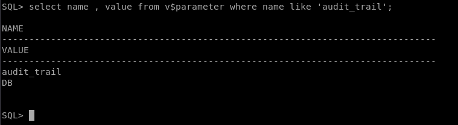

# Auditorías

Realiza y documenta adecuadamente las siguientes operaciones:

1. Activa desde SQL*Plus la auditoría de los intentos de acceso fallidos al sistema. Comprueba su funcionamiento.

Por defecto Oracle tiene las auditorias activadas, lo comprobamos con el siguiente comando.

Ahora vamos a activar la auditoría para que compruebe que hay un acceso a la base de datos no validos.

Hacemos la prueba de conexión intentando acceder primero con.
~~~
SQL> connect asd/asd
ERROR:
ORA-01017: invalid username/password; logon denied
~~~

2. Realiza un procedimiento en PL/SQL que te muestre los accesos fallidos junto con el motivo de los mismos, transformando el código de error almacenado en un mensaje de texto comprensible.

~~~
CREATE OR REPLACE FUNCTION CodFallido(p_codigo NUMBER)
RETURN VARCHAR2
IS
fallos VARCHAR2(25);
BEGIN
    CASE p_codigo
        WHEN 1017 THEN
            fallos:='Contraseña incorrecta';
        WHEN 28000 THEN
            fallos:='Cuenta bloqueada';
        ELSE
            fallos:='Error desconocido';
    END CASE;
RETURN fallos;
END;
/

CREATE OR REPLACE PROCEDURE Accesos
IS
    CURSOR c_acceso
    IS
    SELECT username, returncode, timestamp
    FROM dba_audit_session
    WHERE action_name='LOGON'
    AND returncode != 0
    ORDER BY timestamp;
    v_motivo VARCHAR2(25);
BEGIN
    FOR prueba IN c_acceso LOOP
        v_motivo:=CodFallido(prueba.returncode);
        DBMS_OUTPUT.PUT_LINE('Usuario: '||prueba.username||CHR(9)||CHR(9)|| 'Fecha: '||prueba.timestamp||CHR(9)|| 'Fallo: '||v_motivo);
    END LOOP;
END;
/
~~~

3. Activa la auditoría de las operaciones DML realizadas por SCOTT. Comprueba su funcionamiento.

Activamos auditoria.
~~~
SQL> Audit insert table, update table, delete table by SCOTT;
~~~

Ahora accedemos a scott y vamos a realizar un insert y un delete.
~~~
SQL> insert into EMP(empno) values ('asdasd');

1 row created.

SQL> delete from emp where empno='asdasd';
~~~

Comprobamos la auditoría.
~~~
SQL> select OS_USERNAME, username, action_name, timestamp
from dba_audit_object
where username='SCOTT';

OS_USERNAME	USERNAME   ACTION_NAME			TIMESTAM
--------------- ---------- ---------------------------- --------
oracle		SCOTT	   INSERT			25/02/20
oracle		SCOTT	   DELETE			25/02/20
~~~

4. Realiza una auditoría de grano fino para almacenar información sobre la inserción de empleados del departamento 10 en la tabla emp de scott.

Primero vamos a crear un procedimiento para ejecutar la auditoría grano fino y a continuación lo comprobamos.
~~~
begin
DBMS_FGA.ADD_POLICY (
	object_schema      =>  'SCOTT',
	object_name        =>  'EMP',
	policy_name        =>  'InserEmp',
	audit_condition    =>  'DEPTNO = 10',
	statement_types    =>  'INSERT');
end;
/
~~~

5. Explica la diferencia entre auditar una operación by access o by session.

La diferencia entre by access y by session es que en by access se queda almacenada y crea un registro por cada sentencia(se incluyen las sentencias repetidas) y en cambio by session nos almacena las sentencias por cada sesión iniciada(nos almacena solo una acción aunque la repitamos varias veces).

6. Documenta las diferencias entre los valores db y db, extended del parámetro audit_trail de ORACLE. Demuéstralas poniendo un ejemplo de la información sobre una operación concreta recopilada con cada uno de ellos.

Diferencias entre db y db, extended:

- db: Los datos se almacenan en SYS.AUD$ y lleva un control de los registros de auditoría a la pista de auditoría de la base de datos dicha anteriormente.

- db, extended: A parte de hacer lo mismo que db, también escribe los valores en las columnas SQLBIND Y SQLTEXT de la tabla SYS.AUD$

Ahora ponemos un ejemplo, vamos a ver primero el estado de audit_trail:
~~~
SQL> show parameter audit;

NAME				     TYPE	 VALUE
------------------------------------ ----------- ------------------------------
audit_file_dest 		     string	 /home/oracle/app/oracle/admin/
						 orcl/adump
audit_sys_operations		     boolean	 TRUE
audit_syslog_level		     string
audit_trail			     string	 DB
unified_audit_sga_queue_size	     integer	 1048576
~~~

Activamos db, extended.
~~~
SQL> ALTER SYSTEM SET audit_trail = DB,EXTENDED SCOPE=SPFILE;

System altered.
~~~

Reiniciamos la base de datos y vemos que se ha activado el valor al parámetro audit_trail.

7. Localiza en Enterprise Manager las posibilidades para realizar una auditoría e intenta repetir con dicha herramienta los apartados 1, 3 y 4.

Voy a utilizar Enterprise Manager 11g para acceder a valores de auditoría tendremos que acceder haciendo click en "Servidor" --> dentro de seguridad "Valores de auditoria"

Arriba a la derecha nos aparece conexiones fallidas, hacemos click y nos deberá de aparecer todas las conexiones fallidas que hemos hecho.

Podemos ver también los objetos de auditoría.

8. Averigua si en Postgres se pueden realizar los apartados 1, 3 y 4. Si es así, documenta el proceso adecuadamente.

Existe un modo de crear auditorias en postgres para ello nos tendremos que descargar el sigiente fichero en nuestra maquina postgres.
~~~
debian@servidor:~$ wget wget https://raw.githubusercontent.com/2ndQuadrant/audit-trigger/master/audit.sql
~~~

Una vez tengamos esto entramos en la vase de datos psql y ejecutamos lo siguiente.
~~~
postgres=# \i audit.sql

CREATE EXTENSION
CREATE SCHEMA
REVOKE
COMMENT
CREATE TABLE
REVOKE
COMMENT
COMMENT
COMMENT
COMMENT
COMMENT
COMMENT
COMMENT
COMMENT
COMMENT
COMMENT
COMMENT
COMMENT
COMMENT
COMMENT
COMMENT
COMMENT
COMMENT
COMMENT
CREATE INDEX
CREATE INDEX
CREATE INDEX
CREATE FUNCTION
COMMENT
CREATE FUNCTION
COMMENT
CREATE FUNCTION
CREATE FUNCTION
COMMENT
CREATE VIEW
COMMENT
~~~

Creamos una tabla de prueba.
~~~
create table prueba
(
Nombre Varchar(20),
Telefono Varchar(9)  
);
~~~

Ahora ponemos la recogida e datos.
~~~
postgres=# SELECT audit.audit_table('prueba');
~~~

Insertamos datos y vemos la auditoría.
~~~
postgres=# insert into prueba(Nombre,Telefono)
postgres-# values('pepito','659721548');
INSERT 0 1
postgres=# select session_user_name, action, table_name, action_tstamp_clk, client_query
postgres-# from audit.logged_actions;
~~~

9. Averigua si en MySQL se pueden realizar los apartados 1, 3 y 4. Si es así, documenta el proceso adecuadamente.

Para crear auditorías en MySQL vamos a realizar los siguientes pasos.

Primero tendremos que crear una base de datos y una tabla.
~~~
MariaDB [(none)]> create database prueba;
Query OK, 1 row affected (0.001 sec)

MariaDB [(none)]> use prueba;
Database changed
MariaDB [prueba]> create table prueba
    -> (
    -> Nombre varchar(20),
    -> Telefono varchar(9)
    -> );
Query OK, 0 rows affected (1 min 3.237 sec)

MariaDB [prueba]>
~~~

Tendremos que crear una base de datos para la auditoria, una vez creada tendremos que almacenar la salida del trigger.
~~~
CREATE TABLE accesos
 (
   codigo int(11) NOT NULL AUTO_INCREMENT,
   usuario varchar(100),
   fecha datetime,
   PRIMARY KEY (`codigo`)
 )
 ENGINE=MyISAM AUTO_INCREMENT=1 DEFAULT CHARSET=latin1;
~~~

~~~
delimiter $$
CREATE TRIGGER prueba.ismael
BEFORE INSERT ON prueba.prueba
FOR EACH ROW
BEGIN
INSERT INTO auditorias.accesos (usuario, fecha)
values (CURRENT_USER(), NOW());
END$$
~~~

10.  Averigua las posibilidades que ofrece MongoDB para auditar los cambios que va sufriendo un documento.

MongoDB permite auditar tareas, lo podremos especificar usando la siguiente opción.
~~~
--auditFilter
~~~

Por ejemplo, en este caso auditaremos la creación de colecciones de la siguiente forma.
~~~
{ atype: { $in: [ "createCollection", "dropCollection" ] } }
~~~

Y para finalizar creamos una sentencia que auditara la creación o eliminación de colecciones.
~~~
mongod --dbpath data/db --auditDestination file --auditFilter '{ atype: { $in: [ “createCollection”, “dropCollection” ] } }' --auditFormat BSON --auditPath data/db/auditLog.bson
~~~

11.  Averigua si en MongoDB se pueden auditar los accesos al sistema.

Podremos auditar el acceso al sistema con el siguiente comando.
~~~
{ atype: "authenticate", "param.db": "test" }
~~~

También podremos auditar la colección de autentificación pasándolo a un fichero.
~~~
mongod --dbpath data/db --auth --auditDestination file --auditFilter '{ atype: "authenticate", "param.db": "test" }' --auditFormat BSON --auditPath data/db/auditLog.bson
~~~
