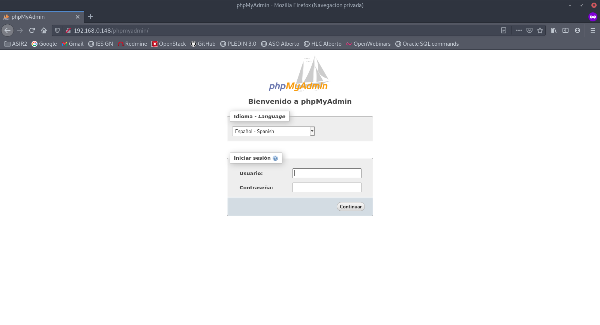
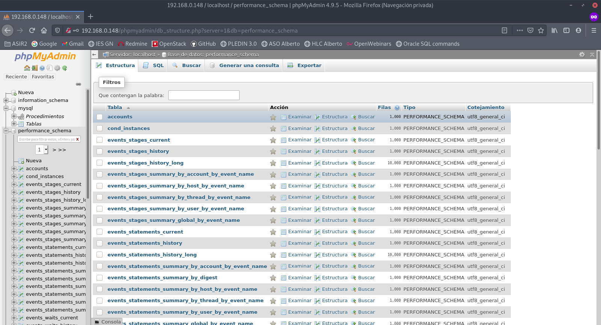
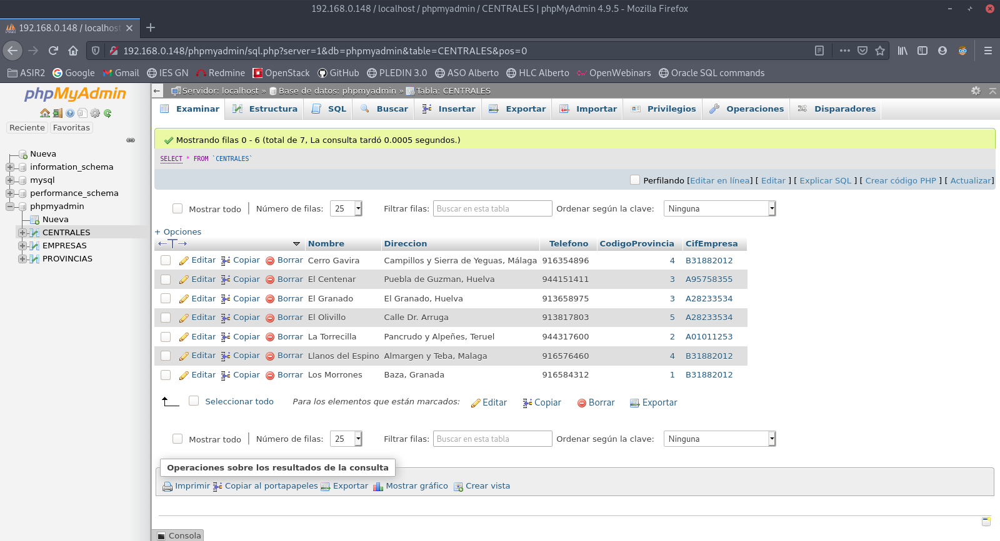
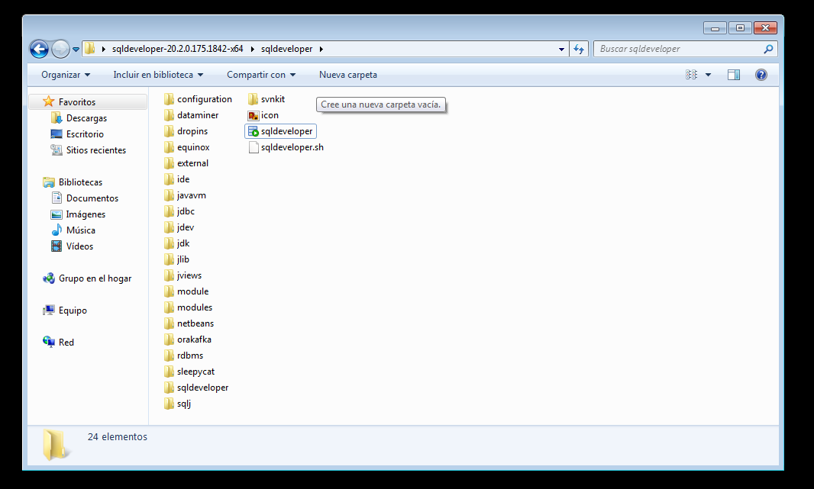
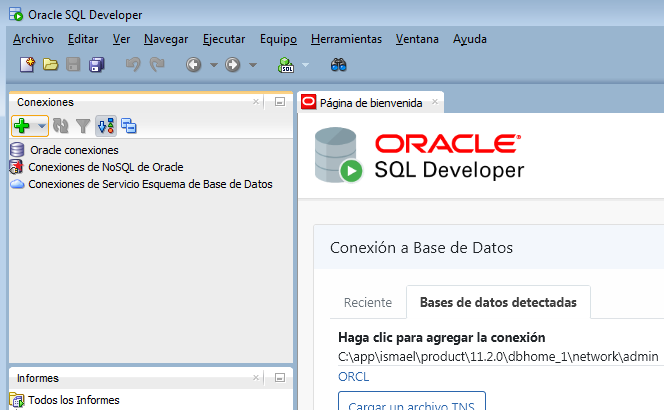
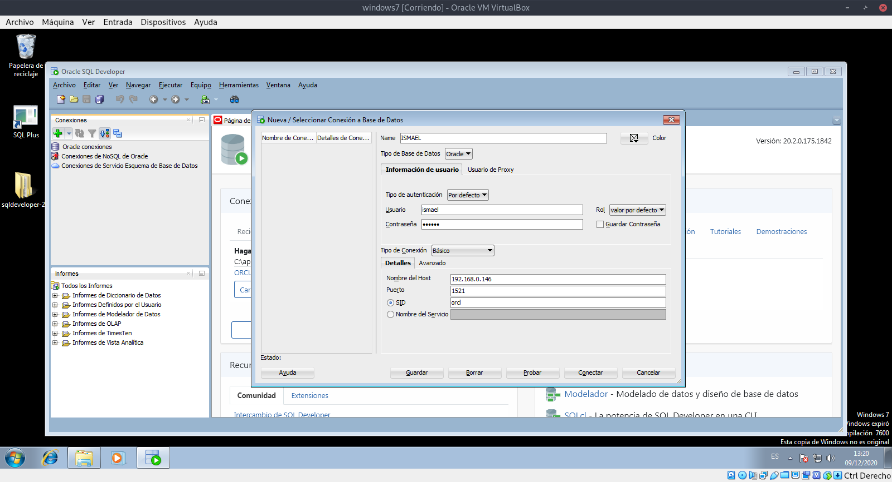
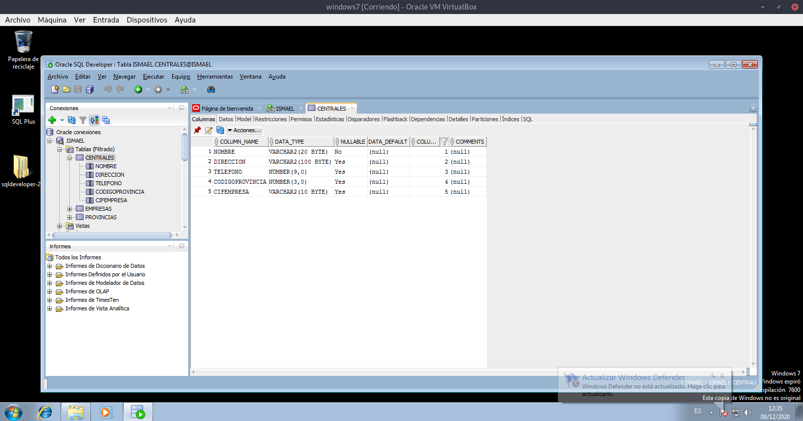

# Instalacion y configuración de servidores y clientes.

## Instalación de un servidor Postgres y configuración para permitir el acceso remoto desde la red local.

Primero vamos a instalar Postgres para ello tendremos que ejecutar el comando.
~~~
sudo apt install postgresql
~~~

Ahora si no tenemos el usuario postgres creado en nuestro sistema lo creamos.
~~~
sudo useradd -m postgres
~~~

Ahora vamos a modificar el fichero (/etc/postgresql/11/main/postgresql.conf) para que podamos acceder desde cualquier ip. Tendremos que editar la siguiente linea y dejarla de la siguiente manera.
~~~
#------------------------------------------------------------------------------
# CONNECTIONS AND AUTHENTICATION
#------------------------------------------------------------------------------

# - Connection Settings -

listen_addresses = '*'
~~~

A continuación vamos a permitir a todos los usuario mediante ipv4, para ello entramos en el fichero (/etc/postgresql/11/main/pg_hba.conf) y tendremos que editar la siguiente linea.
~~~
# IPv4 local connections:
host	all		all		all		md5
~~~

Reiniciamos el servicio postgres.
~~~
sudo systemctl restart postgresql
~~~

Pasamos a crear el usuario invitado.
~~~
createuser invitado
~~~

Ahora creamos la base de datos.
~~~
createdb invitado_db -O invitado
~~~

Accedemos a la base de datos y le pondremos una contraseña al usuario invitado.
~~~
$ psql
psql (9.4.26)
Digite «help» para obtener ayuda.

postgres=# alter user invitado with password 'invitado';
~~~

Le damos permisos al usuario invitado sobre la base de datos que habiamos creado.
~~~
invitado_db=# grant all privileges on all tables in schema public to invitado;
~~~

Comprobamos que nos conectamos al servidor de postgres desde la maquina cliente.
~~~
ismael@Ismael:~$ sudo psql -h 172.22.2.144 -U invitado -d invitado_db
Contraseña para usuario invitado:
psql (11.9 (Debian 11.9-0+deb10u1), servidor 9.4.26)
conexión SSL (protocolo: TLSv1.2, cifrado: ECDHE-RSA-AES256-GCM-SHA384, bits: 256, compresión: desactivado)
Digite «help» para obtener ayuda.

invitado_db=>
~~~

## Prueba desde un cliente remoto del intérprete de comandos de MongoDB.

Para probar el interprete de comandos de MongoDB en un cliente primero vamos a tener que hacer una instalación rápida de mongo server para ello vamos a introducir un nuevo repositorio.
~~~
wget https://www.mongodb.org/static/pgp/server-4.4.asc -qO- | sudo apt-key add -
~~~

~~~
sudo nano /etc/apt/sources.list.d/mongodb-org.list
~~~

Introducimos la siguiente linea en el fichero.
~~~
deb http://repo.mongodb.org/apt/debian buster/mongodb-org/4.4 main
~~~

Actualizamos los repositorios e instalamos mongo-server.
~~~
sudo apt update
sudo apt install -y mongodb-org
~~~

Entramos a mongo y creamos un nuevo usuario.
~~~
debian@servidor:~$ mongo --port 27017
MongoDB shell version v4.4.2
connecting to: mongodb://127.0.0.1:27017/?compressors=disabled&gssapiServiceName=mongodb
Implicit session: session { "id" : UUID("02db5fb1-f3c6-4d30-a471-f7846f10ebaf") }
MongoDB server version: 4.4.2
---
The server generated these startup warnings when booting:
        2020-12-01T10:21:35.272+01:00: Using the XFS filesystem is strongly recommended with the WiredTiger storage engine. See http://dochub.mongodb.org/core/prodnotes-filesystem
        2020-12-01T10:21:38.949+01:00: Access control is not enabled for the database. Read and write access to data and configuration is unrestricted
        2020-12-01T10:21:38.949+01:00: /sys/kernel/mm/transparent_hugepage/enabled is 'always'. We suggest setting it to 'never'
---
---
        Enable MongoDB's free cloud-based monitoring service, which will then receive and display
        metrics about your deployment (disk utilization, CPU, operation statistics, etc).

        The monitoring data will be available on a MongoDB website with a unique URL accessible to you
        and anyone you share the URL with. MongoDB may use this information to make product
        improvements and to suggest MongoDB products and deployment options to you.

        To enable free monitoring, run the following command: db.enableFreeMonitoring()
        To permanently disable this reminder, run the following command: db.disableFreeMonitoring()
---
> use admin
switched to db admin
> db.createUser({user: "ismael", pwd: "ismael", roles: [{role: "root", db: "admin"}]})
Successfully added user: {
	"user" : "ismael",
	"roles" : [
		{
			"role" : "root",
			"db" : "admin"
		}
	]
}
>
~~~

Vamos a pasar ahora a crear un usuario para conectarse desde un cliente para ello accedemos a nuestro server con nuestro usuario.
~~~
mongo --authenticationDatabase "admin" -u "ismael" -p "ismael"
~~~

Una vez dentro creamos la base de datos invitado y creamos un usuario.
~~~
use invitados
~~~

~~~
db.createUser({user: "invitado",pwd: "invitado",roles: ["dbOwner"]})
~~~

Ahora nos vamos al fichero de configuración de mongo (/etc/mongod.conf) y tenemos que poner el puerto por el que va a escuchar.
~~~
# network interfaces
net:
  port: 27017
  bindIp: 0.0.0.0
~~~

También vamos a editar el apartado de seguridad dentro del fichero (/etc/mongod.conf) donde tendremos que poner lo siguiente.
~~~
security:
  authorization: enabled
~~~

Abrimos los puertos y reiniciamos mongod.
~~~
sudo iptables -A INPUT -p tcp --dport 27017 -j ACCEPT
sudo systemctl restart mongod
~~~

Nos conectamos a la base de datos de mongo con el siguiente comando desde un cliente Debian.
~~~
ismael@ismael:~$ mongo -u invitado -p invitado 192.168.0.121/invitados
MongoDB shell version v4.4.2
connecting to: mongodb://192.168.0.121:27017/invitado?compressors=disabled&gssapiServiceName=mongodb
Implicit session: session { "id" : UUID("121aca55-417d-4954-992c-0ab9178ebcd2") }
MongoDB server version: 4.4.2
~~~

En el servidor cree dos colleciones desde el usuario de invitados y para verlas desde el cliente podemos ejecutar el siguiente comando.
~~~
> show collections
usuarios
compras
~~~

## Realización de una aplicación web en cualquier lenguaje que conecte con el servidor MySQL desde un cliente remoto tras autenticarse y muestre alguna información almacenada en el mismo.

Para empezar lo primero que tenemos que hacer es instalar mariadb, para ello tendremos que ejecutar el siguiente comando.
~~~
mariadb@oracle:~$ sudo apt install mariadb-server
~~~

Hacemos la instalación segura.
~~~
mariadb@oracle:~$ sudo mysql_secure_installation

NOTE: RUNNING ALL PARTS OF THIS SCRIPT IS RECOMMENDED FOR ALL MariaDB
      SERVERS IN PRODUCTION USE!  PLEASE READ EACH STEP CAREFULLY!

In order to log into MariaDB to secure it, we'll need the current
password for the root user.  If you've just installed MariaDB, and
you haven't set the root password yet, the password will be blank,
so you should just press enter here.

Enter current password for root (enter for none):
OK, successfully used password, moving on...

Setting the root password ensures that nobody can log into the MariaDB
root user without the proper authorisation.

You already have a root password set, so you can safely answer 'n'.

Change the root password? [Y/n] y
New password:
Re-enter new password:
Password updated successfully!
Reloading privilege tables..
 ... Success!

By default, a MariaDB installation has an anonymous user, allowing anyone
to log into MariaDB without having to have a user account created for
them.  This is intended only for testing, and to make the installation
go a bit smoother.  You should remove them before moving into a
production environment.

Remove anonymous users? [Y/n] y
 ... Success!

Normally, root should only be allowed to connect from 'localhost'.  This
ensures that someone cannot guess at the root password from the network.

Disallow root login remotely? [Y/n] y
 ... Success!

By default, MariaDB comes with a database named 'test' that anyone can
access.  This is also intended only for testing, and should be removed
before moving into a production environment.

Remove test database and access to it? [Y/n] y
 - Dropping test database...
 ... Success!
 - Removing privileges on test database...
 ... Success!

Reloading the privilege tables will ensure that all changes made so far
will take effect immediately.

Reload privilege tables now? [Y/n] y
 ... Success!

Cleaning up...

All done!  If you've completed all of the above steps, your MariaDB
installation should now be secure.

Thanks for using MariaDB!
~~~

Vamos a crear la base de datos y darle permiso al usuario cliente para que se pueda conectar.
~~~
MariaDB [(none)]> create database invitado_db;
Query OK, 1 row affected (0.00 sec)

MariaDB [(none)]> grant all privileges on *.* to 'Ismael'@'172.22.5.160'
    -> identified by 'ismael';
~~~

Nos dirigimos al fichero de configuración (sudo nano /etc/mysql/mariadb.conf.d/50-server.cnf) y tendremos que comentar la linea de bind-address.
~~~
# Instead of skip-networking the default is now to listen only on
# localhost which is more compatible and is not less secure.
#bind-address           = 127.0.0.1
~~~

Creamos la regla de cortafuegos.
~~~
mariadb@oracle:~$ sudo iptables -I INPUT -p tcp -m tcp --dport 3306 -j ACCEPT
~~~

Con esto ya tendriamos nuestra base de datos para conectarnos desde un cliente mediante terminal pero ahora vamos a pasar mediante una aplicación web.

Ahora pasamos a instalar phpmyadmin en nuestro servidor para que podamos abrirlo desde nuestro cliente por el navegador. Para ello vamos a empezar instalando los paquetes que nos haran falta de php.
~~~
sudo apt install php-imagick php-phpseclib php-php-gettext php7.3-common php7.3-mysql php7.3-gd php7.3-imag php7.3-json php7.3-curl php7.3-zip php7.3-xml php7.3-mbstring php7.3-bz2 php7.3-intl php7.3-gmp php-zip php-gd apache2 libapache2-mod-php
~~~

A continuación descargarmos phpmyadmin como no estan en los repositorios tendremos que descargarlo con wget.
~~~
wget https://files.phpmyadmin.net/phpMyAdmin/4.9.5/phpMyAdmin-4.9.5-all-languages.tar.gz
~~~

Ahora lo descomprimimos
~~~
sudo tar xvzf phpMyAdmin-4.9.5-all-languages.tar.gz
~~~

Movemos la carpeta descomprimida al directorio /usr/share que es donde espera encontrar los ficheros.
~~~
mv phpMyAdmin-4.9.5-all-languages /usr/share/phpmyadmin
~~~

Ahora vamos a pasar a crear el directorio para php.
~~~
sudo mkdir -p /var/lib/phpmyadmin/tmp
~~~

Y le damos permisos de usuario y grupo web para que apache2 pueda trabajar con el directorio.
~~~
sudo chown -R www-data:www-data /var/lib/phpmyadmin
~~~

Accedemos a la base de datos y configuramos el usuario y la contraseña que queremos darle.
~~~
MariaDB [(none)]> create database phpmyadmin default character set utf8mb4
collate utf8mb4_unicode_ci;
Query OK, 1 row affected (0.026 sec)
MariaDB [(none)]> grant all on phpmyadmin.* to phpmyadmin@localhost identified
by 'phpmyadmin';
Query OK, 0 rows affected (0.016 sec)
MariaDB [(none)]> flush privileges;
Query OK, 0 rows affected (0.007 sec)
~~~

Creamos un nuevo usuario y contraseña con el que vamos a trabajar en phpmyadmin y le daremos todos los permisos.
~~~
GRANT ALL PRIVILEGES ON *.* TO 'ismael'@'localhost' IDENTIFIED BY 'ismael' WITH GRANT OPTION;
~~~

Por ultimo reiniciamos apache2.
~~~
sudo systemctl restart apache2
~~~

Entramos desde el navegador y vemos que podemos acceder correctamente.

He introducido información desde el servidor y desde el cliente con phpmyadmin vemos las tres tablas que he creado.

## Instalación de SQL Developer sobre Windows como cliente remoto de ORACLE.

Descargarmos SQL Developer del siguiente enlace: https://www.oracle.com/tools/downloads/sqldev-downloads.html

Una vez que lo tengamos tendremos que descomprimirlo y para abrir el programar abriremos el archivo sqldeveloper como vemos en la imagen.

Ahora vamos a crear un nuevo usuario para poder acceder mediante SQL Developer.
~~~
SQL> create user ismael identified by ismael;

Usuario creado.

SQL> grant connect to ismael;

Concesi¾n terminada correctamente.

SQL> grant resource to ismael;

Concesi¾n terminada correctamente.

SQL> grant unlimited tablespace to ismael;

Concesi¾n terminada correctamente.

SQL> alter user ismael identified by ismael account unlock;

Usuario modificado.
~~~

Creamos el SID para poder acceder, lo creamos con el comando:
~~~
set ORACLE_SID=orcl
~~~

Nos dirigimos a SQL Developer y nos vamos al más, como vemos en la imagen.

Ponemos el nombre con el cual nos queremos conectar, también el nombre de usuario y contraseña y nos conectamos.

Una vez dentro tengo creadas 3 tablas como vemos a continuación.

## Instalación y prueba desde un cliente remoto de Oracle Enterprise Manager.

Nos descargamos Oracle Enterprise Manager del siguiente enlace: https://www.oracle.com/enterprise-manager/downloads/win-x86-64-13c-rel4-downloads.html

Ahora pasamos a instalarlo
