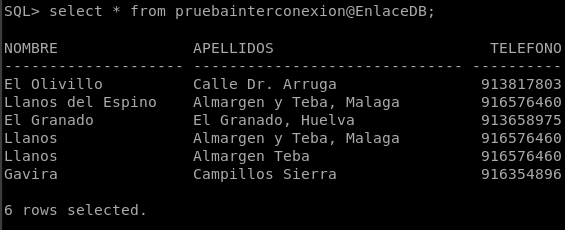
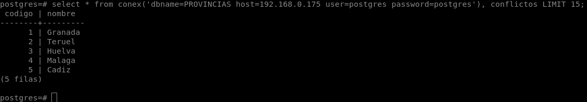
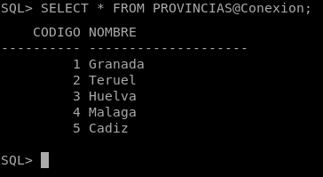
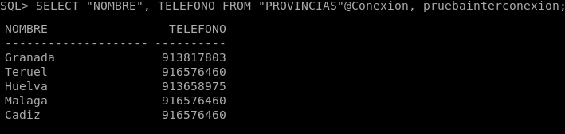

# INTERCONEXIONES DE SERVIDORES DE BASE DE DATOS

Las interconexiones de servidores de bases de datos son operaciones que pueden ser muy útiles en diferentes contextos. Básicamente, se trata de acceder a datos que no están almacenados en nuestra base de datos, pudiendo combinarlos con los que ya tenemos.

En esta práctica veremos varias formas de crear un enlace entre distintos servidores de bases de datos:

- Realizaremos un enlace entre dos servidores de bases de datos ORACLE, explicando la configuración necesaria en ambos extremos y demostrando su funcionamiento.

- Realizaremos un enlace entre dos servidores de bases de datos Postgres, explicando la configuración necesaria en ambos extremos y demostrando su funcionamiento.

- Realizaremos un enlace entre un servidor ORACLE y otro Postgres o MySQL empleando Heterogeneus Services, explicando la configuración necesaria en ambos extremos y demostrando su funcionamiento.

## INTERCONEXION ENTRE SERVIDOR ORACLE A ORACLE

Lo primero vamos a diferenciar las dos direcciones IP que tenemos para hacer la interconexión, la primera es nuestro servidor oracle con la IP 192.168.0.118 y nuestro cliente al que nos vamos a conectar será 192.168.0.145.

Para hacer una conexión entre dos servidores oracle lo primero que tenemos que hacer es configurar el fichero de configuración de tnsnames.ora para acceder a él, en mi caso es la siguiente ruta.
~~~
sudo nano /home/oracle/app/oracle/product/12.1.0/dbhome_1/network/admin/tnsnames.ora
~~~

Una vez dentro la configuración seria la siguiente.
~~~
ServidorRemoto =
  (DESCRIPTION =
    (ADDRESS = (PROTOCOL = TCP)(HOST = 192.168.0.118)(PORT = 1521))
    (CONNECT_DATA =
      (SERVER = DEDICATED)
      (SERVICE_NAME = orcl)
    )
  )
~~~
- Este LISTENER es donde especificamos la dirección y puertos para la conexión remota.

Ahora en el servidor cliente tendremos que crear un usuario para poder conectarnos mediante ese usuario.
~~~
SQL> CREATE USER remoto IDENTIFIED BY "remoto";

Usuario creado.
~~~

Ahora pasamos al servidor primario y vamos a crear el DATABASE LINK.
~~~
CREATE DATABASE LINK EnlaceDB
CONNECT TO remoto
IDENTIFIED BY "remoto"
USING 'ServidorRemoto';

Enlace con la base de datos creado.
~~~
Con esto lo que haremos es decir que el link EnlaceDB se conecte al usuario remoto usando el nombre de ServidorRemoto.

Hacemos la comprobación de que se ha creado correctamente el enlace.
~~~
SQL> SELECT * FROM dba_db_links WHERE db_link = 'ENLACEDB';

OWNER                | DB_LINK              | USERNAME             | HOST                 | CREATED
____________________ | ____________________ | ____________________ | ____________________ | ____________________
SYS                  | ENLACEDB             | REMOTO               | ServidorRemoto       | 02-FEB-21

SQL>
~~~

Tendremos que reiniciar el servicio para que se aplique la configuración del listener.
~~~
lsnrctl stop
lsnrctl start
~~~

Y ahora nos dirigimos al servidor secundario y comprobaremos que todo esta correcto haciendo un select a la tabla que tenemos en el primer servidor con el EnlaceDB que habíamos creado.
~~~
SQL> SELECT * FROM pruebainterconexion@EnlaceDB;

NOMBRE		           APELLIDOS			                TELEFONO
-------------------- ------------------------------ ----------
El Olivillo	         Calle Dr. Arruga		            913817803
Llanos del Espino    Almargen y Teba, Malaga	      916576460
El Granado	         El Granado, Huelva 	          913658975
Llanos		           Almargen y Teba, Malaga	      916576460
Llanos		           Almargen Teba		              916576460
Gavira		           Campillos Sierra		            916354896

6 rows selected.
~~~

## INTERCONEXION ENTRE SERVIDOR POSTGRES A POSTGRES

Vamos a crear una conexión entre dos servidores Postgres, la dirección del primer servidor es 192.168.0.148 y la del segundo servidor es 192.168.0.175. Ahora lo primero que tenemos que hacer es modificar el fichero `/etc/postgresql/11/main/postgresql.conf` en nuestro primer servidor y tendremos que descomentar la siguiente linea y añadir la ip del servidor 2.
~~~
listen_addresses = '192.168.0.175, localhost'
~~~

Reiniciamos el servidor.
~~~
sudo systemctl restart postgresql.service
~~~

Nos dirigimos ahora a nuestro segundo servidor y tendremos que instalar `postgresql-contrib` que nos servirá para crear extensiones.
~~~
sudo apt install postgresql-contrib
~~~

Ahora tendremos que añadir en el fichero de configuración `/etc/postgresql/11/main/pg_hba.conf` un nuevo registro para la autenticación de fichero, lo pondremos de la siguiente forma.
~~~
# TYPE  DATABASE        USER            ADDRESS                 METHOD
  host  all             all             192.168.0.175/24        md5
~~~

Reiniciamos el cliente.
~~~
sudo systemctl restart postgresql.service
~~~

Crearemos un enlace con el paquete de extensión que hemos instalado antes.
~~~
postgres=# CREATE EXTENSION conex;
CREATE EXTENSION
~~~

Ahora solo queda comprobar la conexión.
~~~
postgres=# select * from conex('dbname=PROVINCIAS host=192.168.0.175 user=postgres password=postgres'), conflictos LIMIT 15;
codigo | nombre  
--------+---------
     1 | Granada
     2 | Teruel
     3 | Huelva
     4 | Malaga
     5 | Cadiz
(5 filas)
~~~

## INTERCONEXION ENTRE SERVIDOR ORACLE A POSTGRES

Vamos a realizar una conexión entre dos servidores esta vez entre un servidor Oracle y uno Postgres. La IP que vamos a utilizar del servidor Oracle será 192.168.0.118 y la del servidor de Postges será 192.168.0.148.

Para empezar tendremos que configurar el servidor Postgres donde entraremos en el fichero de configuración `/etc/postgresql/11/main/postgresql.conf` y tendremos que modificar la siguiente linea y poner la dirección del servidor Oracle.
~~~
listen_addresses = '192.168.0.118, localhost'
~~~

Ahora tendremos que dirigirnos al fichero `/etc/postgresql/11/main/pg_hba.conf` y tendremos que añadir un nuevo registro de autenticación e indicamos la dirección del servidor Oracle.
~~~
# TYPE  DATABASE        USER            ADDRESS                 METHOD
  host  all             all             192.168.0.118/24        md5
~~~

Reiniciamos postgres.
~~~
sudo systemctl restart postgresql.service
~~~

Nos vamos al servidor Oracle y vamos a configurarlo para conectarnos a Postgres. Lo primero que necesitamos es instalar el driver ODBC.
~~~
sudo apt install odbc-postgresql unixodbc
~~~

A continuación tenemos que modificar los parametros de conexion en el servidor Postgres, el cual el fichero es `/etc/odbc.ini`.
~~~
[PSQLA]
Debug = 0
CommLog = 0
ReadOnly = 1
Driver = PostgreSQL ANSI
Servername = 192.168.43.66
Username = postgres
Password = postgres
Port = 5432
Database = postgres_db
Trace = 0
TraceFile = /tmp/sql.log

[PSQLU]
Debug = 0
CommLog = 0
ReadOnly = 0
Driver = PostgreSQL Unicode
Servername = 192.168.43.66
Username = postgres
Password = postgres
Port = 5432
Database = postgres_db
Trace = 0
TraceFile = /tmp/sql.log

[Default]
Driver = /usr/lib/x86_64-linux-gnu/odbc/liboplodbcS.so
~~~
El nombre Driver va referido al fichero `/etc/odbcinst.ini` donde se indican los drivers de ODBC que utiliza.

Hacemos una comprobación de conexión con Postgres desde Oracle.
~~~
root@oracle:/home/oracle# isql -v PSQLU
+---------------------------------------+
| Connected!                            |
|                                       |
| sql-statement                         |
| help [tablename]                      |
| quit                                  |
|                                       |
+---------------------------------------+
SQL> select * from PROVINCIAS;
+---------+--------------------+       
| CODIGO  | NOMBRE             |
+---------+--------------------+
|	 1| Granada            |
|	 2| Teruel             |
|	 3| Huelva             |
|	 4| Malaga             |
|	 5| Cadiz              |
+---------+--------------------+
SQLRowCount returns 7
7 rows fetched
~~~

Pasamos a configurar el servicio Heterogeneus Services, lo primero que tendremos que hacer es crear el fichero en `/opt/oracle/product/12.2.0.1/dbhome_1/hs/admin/initPSQLU.ora` y tendremos que añadir lo siguiente.
~~~
HS_FDS_CONNECT_INFO = PSQLU
HS_FDS_TRACE_LEVEL = Debug
HS_FDS_SHAREABLE_NAME = /usr/lib/x86_64-linux-gnu/odbc/psqlodbcw.so
HS_LANGUAGE = AMERICAN_AMERICA.WE8ISO8859P1
set ODBCINI=/etc/odbc.ini
~~~

Ahora tendremos que edita el fichero Listener, vamos a configurarlo en el fichero `/home/oracle/app/oracle/product/12.1.0/dbhome_1/network/admin/tnsnames.ora` para poder escuchar en el driver ODBC.
~~~
SID_LIST_LISTENER =
 (SID_LIST =
  (SID_DESC =
   (GLOBAL_DBNAME = orcl)
   (ORACLE_HOME = /opt/oracle/product/12.2.0.1/dbhome_1)
   (SID_NAME = orcl)
  )
  (SID_DESC =
    (SID_NAME = PSQLU) #Nombre del servicio Heterogeneus Services.
    (PROGRAM = dg4odbc) #Programa por defecto.
    (ORACLE_HOME = /opt/oracle/product/12.2.0.1/dbhome_1)
  )
 )
~~~

También tendremos que configurar en el mismo fichero `/home/oracle/app/oracle/product/12.1.0/dbhome_1/network/admin/tnsnames.ora` la conexión del diver ODBC, en el cual le indicaremos el SID=PSQLU el nombre que hemos asignado antes y HS=OK para que utilice Heterogeneus Services.
~~~
PSQLU =
 (DESCRIPTION=
 (ADDRESS=(PROTOCOL=tcp)(HOST=localhost)(PORT=1521))
   (CONNECT_DATA=(SID=PSQLU))
   (HS=OK)
 )
~~~

Reiniciamos el Listener.
~~~
lsnrctl stop
lsnrctl start
~~~

Ahora tendremos que crear un enlace para poder realizar la consulta.
~~~
CREATE PUBLIC DATABASE LINK Conexion
CONNECT TO "postgres"
IDENTIFIED BY "postgres"
USING 'PSQLU';
~~~

Con todo esto ya configurado haremos la consulta desde Oracle para ver si funciona correctamente.
~~~
SQL> SELECT * FROM PROVINCIAS@Conexion;

    CODIGO NOMBRE
---------- --------------------
	 1 Granada
	 2 Teruel
	 3 Huelva
	 4 Malaga
	 5 Cadiz
~~~

Podremos comprobar que podremos hacer un select de una tabla prueba que tengo en oracle y la tabla PROVINCIAS de Postgres.

