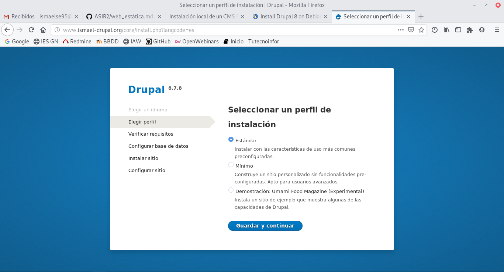
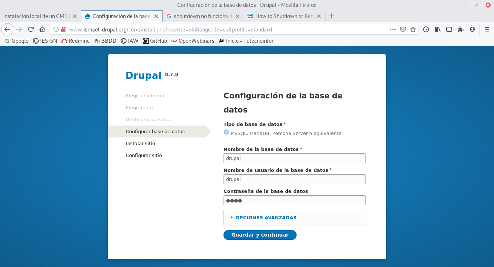
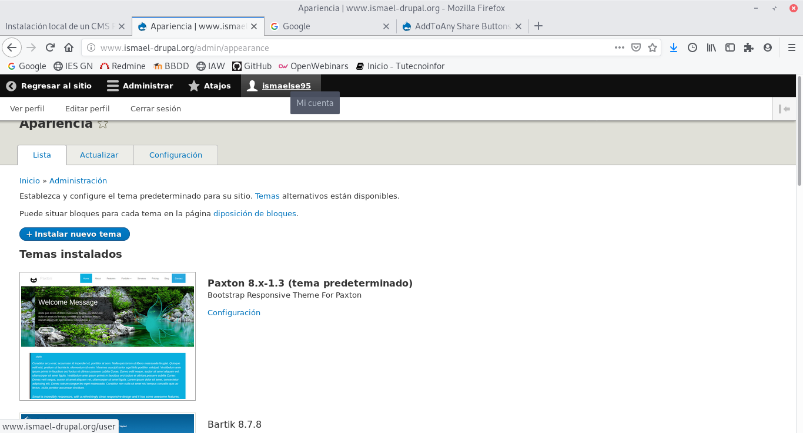
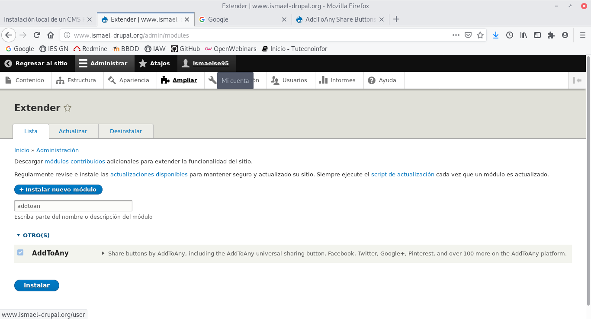
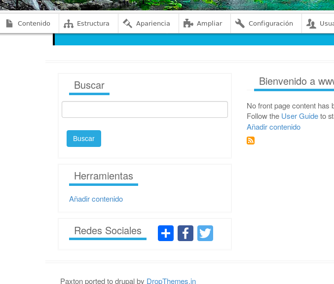

# Instalación local de un CMS PHP

## Tarea 1

Vamos a instalar toda la pila LAMP en mi caso voy a utilizar una maquina virtual de virtual box, empezaremos por apache:

~~~
apt-get install apache2
~~~

A continuacion instalamos mysql:

~~~
apt-get install mariadb-server-10.3
~~~

Pasamos a crear un base de datos con el nombre de drupal, para ello entramos en la base de datos de mariadb:

Y por ultimo la ultima version de php:

~~~
apt-get install php7.3
~~~

## TAREA 2

Vamos a empezar por crear una base de datos de drupal para ello tendremos que entrar en mariadb:

~~~
mysql -u root -p
~~~

Una vez dentro creamos la base de datos y le damos privilegio con los siguientes comandos:

~~~
MariaDB [(none)]>CREATE DATABASE drupal;

MariaDB [(none)]>GRANT ALL PRIVILEGES on drupal.* to 'drupal'@'localhost' identified by 'root';

MariaDB [(none)]>FLUSH PRIVILEGES;
~~~

Una vez creada la base de datos vamos a descargar drupal en la version 8.7.8:

~~~
wget https://ftp.drupal.org/files/projects/drupal-8.7.8.tar.gz
~~~

Lo descomprimimos y lo pasamos al carpeta /etc/www/html/drupal

~~~
tar xvf drupal-8.7.8.tar.gz
~~~

~~~
mv drupal-8.7.8 /var/www/html/drupal
~~~

Ahora le daremos permiso al directorio drupal:

~~~
chown -R www-data:www-data  /var/www/html/drupal
~~~

Vamos a pasar a crear el sitio en apache2 para ello nos dirigimos al directorio /etc/apache2/sites-available y creamos un fichero de configuración con el nombre drupal.conf y dentro tendremos que introducir la siguiente configuración:

~~~
<VirtualHost *:80>
        ServerAdmin webmaster@localhost
        ServerName www.ismael-drupal.org
        DocumentRoot /var/www/html/drupal
        <Directory /var/www/html/drupal/>
                Options Indexes FollowSymLinks
                AllowOverride All
                Require all granted
        </Directory>
        ErrorLog /var/log/apache2/drupal_error.log
        CustomLog /var/log/apache2/drupal_access.log combined
</VirtualHost>
~~~

Con esto podemos habilitar el sitio con el comando:

~~~
ln -s /etc/apache2/sites-available/drupal.conf /etc/apache2/sites-enabled/drupal.conf
~~~

Y por ultimo reiniciamos apache2:

~~~
systemctl restart apache2
~~~

Entramos a la página para hacer la instalación en mi caso la url es www.ismael-drupal.org/core/install.php

Ahora seleccionamos estandar.

Y por último configuramos la base de datos.

Una vez configurada la base de datos esperamos a que termine la instalacion de drupal 8.7.8 en mi caso.

Bien ahora vamos a cambiar el tema a nuestra página para ello nos dirigimos a apariencia y a instalar nuevo tema. Yo en mi caso he escogido uno de la página de drupal me lo he descargado y lo he subido.

Para terminar vamos a añadir una extensión yo he escogido la de compartir las redes sociales.

## TAREA 3