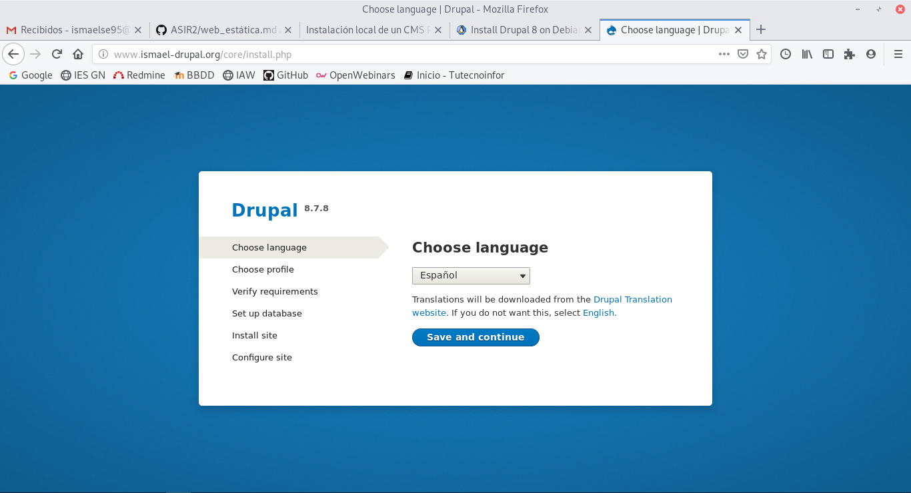

# Instalación local de un CMS PHP

## Tarea 1

Vamos a instalar toda la pila LAMP en mi caso voy a utilizar una maquina virtual de virtual box, empezaremos por apache:

~~~
apt-get install apache2
~~~

A continuacion instalamos mysql:

~~~
apt-get install mariadb-server-10.3
~~~

Y por ultimo la ultima version de php:

~~~
apt-get install php7.3 php7.3-gd
~~~

## TAREA 2

Vamos a empezar por crear una base de datos de drupal para ello tendremos que entrar en mariadb:

~~~
mysql -u root -p
~~~

Una vez dentro creamos la base de datos y le damos privilegio con los siguientes comandos:

~~~
MariaDB [(none)]>CREATE DATABASE drupal;

MariaDB [(none)]>GRANT ALL PRIVILEGES on drupal.* to 'drupal'@'localhost' identified by 'root';

MariaDB [(none)]>FLUSH PRIVILEGES;
~~~

Una vez creada la base de datos vamos a descargar drupal en la version 8.7.8:

~~~
wget https://ftp.drupal.org/files/projects/drupal-8.7.8.tar.gz
~~~

Lo descomprimimos y lo pasamos al carpeta /etc/www/html/drupal

~~~
tar xvf drupal-8.7.8.tar.gz
~~~

~~~
mv drupal-8.7.8 /var/www/html/drupal
~~~

Ahora le daremos permiso al directorio drupal:

~~~
chown -R www-data:www-data  /var/www/html/drupal
~~~

Vamos a pasar a crear el sitio en apache2 para ello nos dirigimos al directorio /etc/apache2/sites-available y creamos un fichero de configuración con el nombre drupal.conf y dentro tendremos que introducir la siguiente configuración:

~~~
<VirtualHost *:80>
        ServerAdmin webmaster@localhost
        ServerName www.ismael-drupal.org
        DocumentRoot /var/www/html/drupal
        <Directory /var/www/html/drupal/>
                Options Indexes FollowSymLinks
                AllowOverride All
                Require all granted
        </Directory>
        ErrorLog /var/log/apache2/drupal_error.log
        CustomLog /var/log/apache2/drupal_access.log combined
</VirtualHost>
~~~

Con esto podemos habilitar el sitio con el comando:

~~~
ln -s /etc/apache2/sites-available/drupal.conf /etc/apache2/sites-enabled/drupal.conf
~~~

Activamos el modo rewrite:

~~~
a2ensite rewrite
~~~

Y por ultimo reiniciamos apache2:

~~~
systemctl restart apache2
~~~

Entramos a la página para hacer la instalación en mi caso la url es www.ismael-drupal.org/core/install.php

Ahora seleccionamos estandar.

Y por último configuramos la base de datos.

Una vez configurada la base de datos esperamos a que termine la instalacion de drupal 8.7.8 en mi caso.

Bien ahora vamos a cambiar el tema a nuestra página para ello nos dirigimos a apariencia y a instalar nuevo tema. Yo en mi caso he escogido uno de la página de drupal me lo he descargado y lo he subido.

Para terminar vamos a añadir una extensión yo he escogido la de compartir las redes sociales.

## TAREA 3

Pasamos a crear una copia de seguridad de la base de datos que lo haremos con el siguiente comando:

~~~
mysqldump -u drupal -p root --single-transaction --quick --lock-tables=false > copia_seguridad.sql
~~~

Para recuperar la base de datos tendremos que ejecutar el comando:

~~~
mysql -u drupal -p root < copia_seguridad.sql
~~~

Ahora creamos el usuario remoto:

~~~
grant all on drupal.* to drupal@172.22.7.254 identified by 'root';
~~~

Por último para que todo funcione tendremos que que entrar en el fichero de configuracion de (/var/www/drupal-8.7.8/sites/default/settings.php) y poner la ip de la maquina correspondiente para que todo funcione.

~~~
$databases['default']['default'] = array (
  'database' => 'drupal',
  'username' => 'drupal',
  'password' => 'root',
  'prefix' => '',
  'host' => '172.22.7.254',
  'port' => '3306',
  'namespace' => 'Drupal\\Core\\Database\\Driver\\mysql',
  'driver' => 'mysql',
);
~~~

## TAREA 4

Vamos a instalar un nuevo CMS en mi caso Monstra para empezar tendremos que instalar en nuestro servidor php, apache..:

~~~
apt-get install apache2 php7.3 libapache2-mod-php7.3 php7.3-common php7.3-sqlite php7.3-curl php7.3-intl php7.3-mbstring php7.3-xmlrpc php7.3-mysql php7.3-gd php7.3-xml php7.3-cli php7.3-zip mariadb-server-10.3
~~~

Descargamos monstra y lo movemos a la ruta /var/www/html/ y le damos permisos:

~~~
root@debian2:/var/www/html# chown -R www-data:www-data monstra
~~~

Con esto tendremos que habilitar el sitio y configurar el fichero de configuración que se encuentra en (/etc/apache2/sites-available), creamos un fichero llamado monstra.conf y tendremos que introducir la siguiente configuración:

~~~
<VirtualHost *:80>
        ServerAdmin webmaster@localhost
        ServerName www.ismael-monstra.org
        DocumentRoot /var/www/html/monstra
        <Directory /var/www/html/monstra/>
                Options Indexes FollowSymLinks
                AllowOverride All
                Require all granted
        </Directory>
        ErrorLog /var/log/apache2/monstra_error.log
        CustomLog /var/log/apache2/monstra_access.log combined
</VirtualHost>
~~~

Y para terminar este paso tendremos que hacer habilitar el fichero monstra.conf con el comando:

~~~
a2ensite monstra.conf
~~~

Activamos el modo rewrite:

~~~
a2ensite rewrite
~~~

Reiniciamos apache2:

~~~
systemctl restart apache2
~~~

Con esto empezamos la instalación de monstra:

Pasamos a poner los parametros del usuario administrador:

Una vez puestro los parametros de usuario ya tendremos nuestra página:

## TAREA 5

Para poder mandar un correo desde drupal tendremos que instalar postfix:

~~~
apt-get install postfix
~~~

A continuación entramos en el fichero de configuración (/etc/postfix/main.cf) y tendremos que buscar la linea donde pone *relayhost* y poner la siguiente configuración:

~~~
relayhost = babuino-smtp.gonzalonazareno.org
~~~

Y por último reiniciamos postfix:

~~~
systemctl restart postfix
~~~