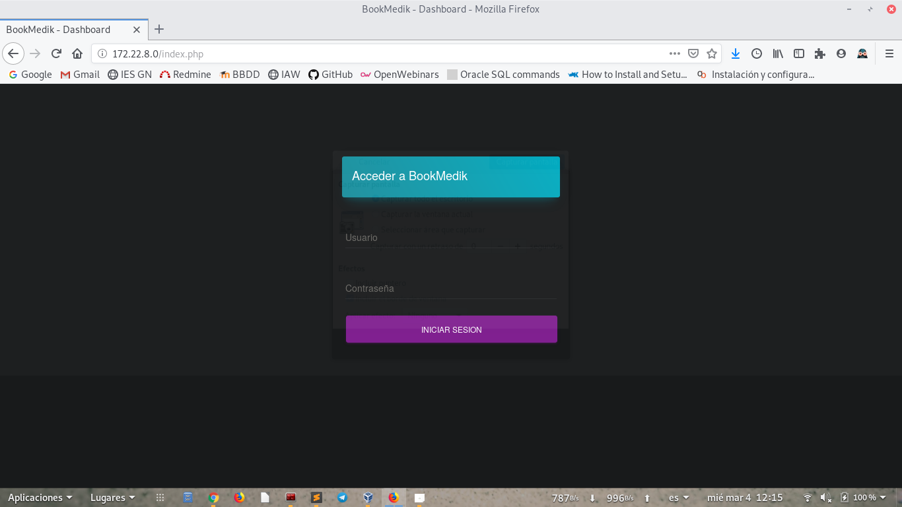
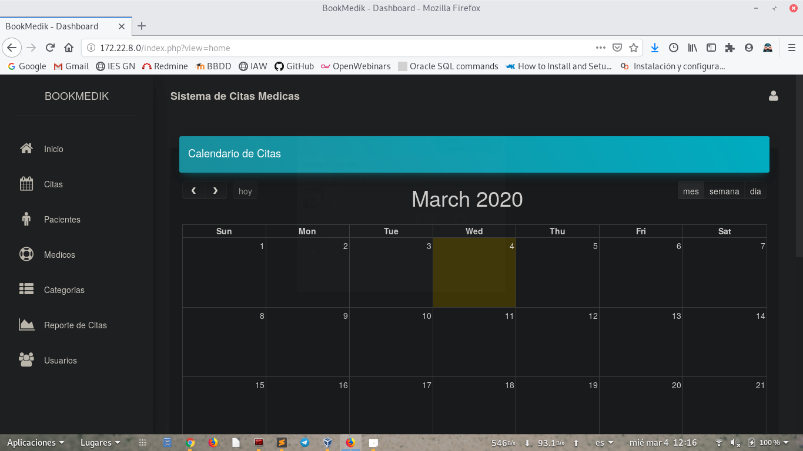
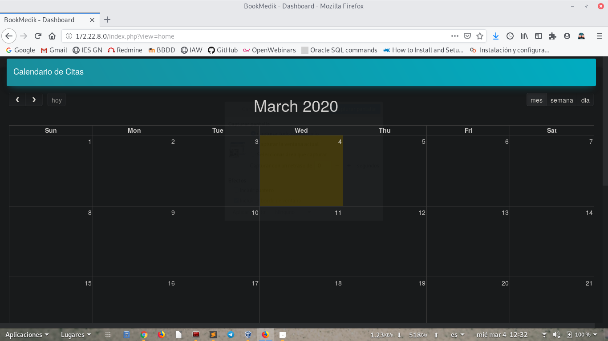
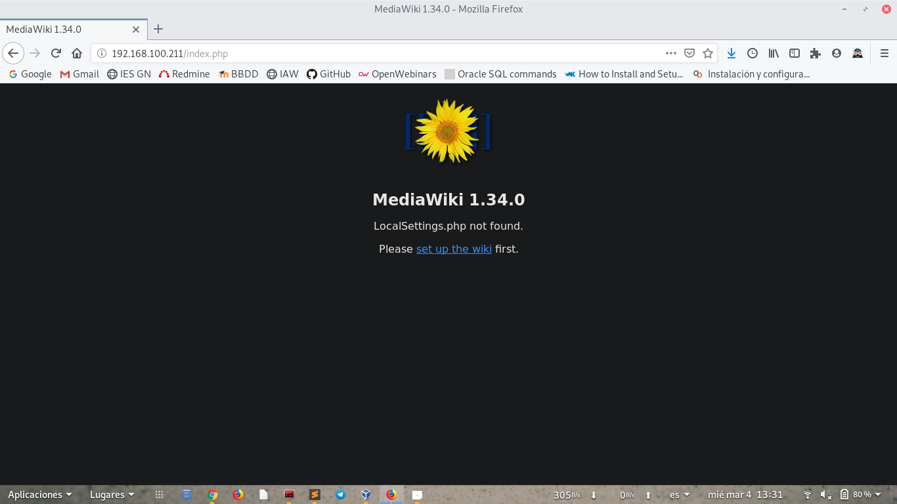
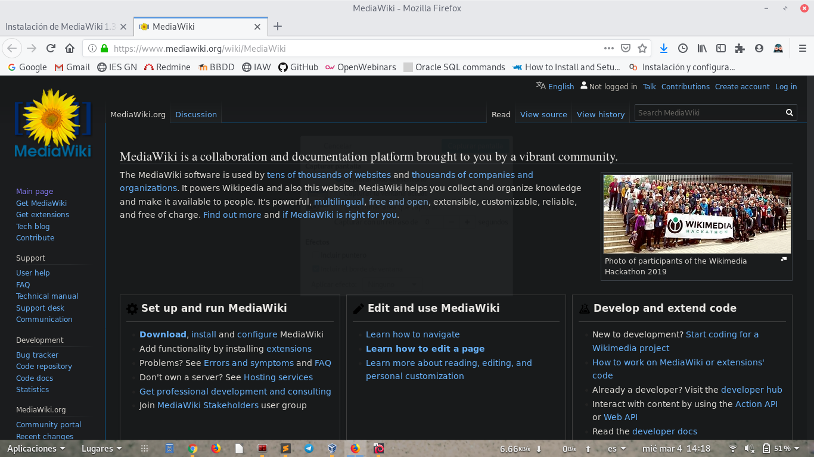
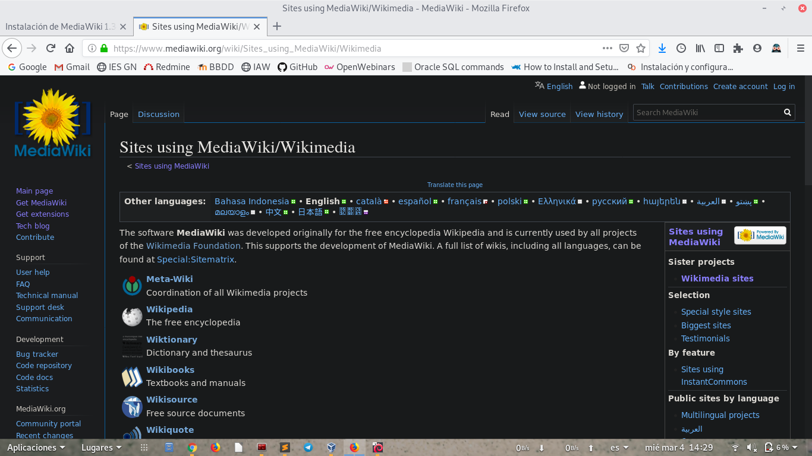
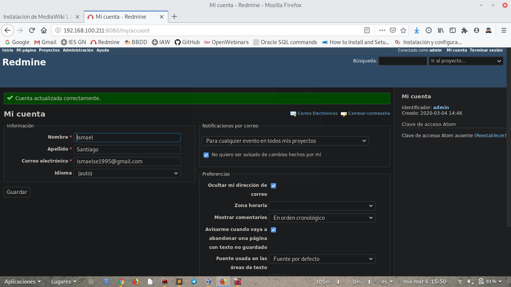

# Implantación de aplicaciones web PHP en docker

## Ejecución de una aplicación web PHP en dockerPermalink

En esta práctica vamos a crear dos contenedores docker y una base de datos para ejecutar Bookmedik.

Para empezar vamos a intalar `docker.io`.

~~~
apt install docker.io
~~~

A continuación vamos a configurar docker-compose y el fichero de configuración tiene que quedar de la siguiente forma:

~~~
version: '3.1'

services:
  db:
    container_name: bookmedik_db
    image: mariadb
    restart: always
    environment:
      MYSQL_USER: bookmedik
      MYSQL_PASSWORD: bookmedik
      MYSQL_DATABASE: bookmedik
      MYSQL_ROOT_PASSWORD: root
    volumes:
      - /home/ismael/php_docker/db:/var/lib/mysql
~~~

Ahora creamos el contenedor de base de datos:

~~~
root@debian2:/home/ismael/php_docker/compose# docker-compose up -d db
Creating network "compose_default" with the default driver
Pulling db (mariadb:)...
latest: Pulling from library/mariadb
423ae2b273f4: Pull complete
de83a2304fa1: Pull complete
f9a83bce3af0: Pull complete
b6b53be908de: Pull complete
2b41ae57cefb: Pull complete
7ecd5cacc370: Pull complete
9f96ac6b2583: Pull complete
9224e6c8f841: Pull complete
8fdc4c2808be: Pull complete
a2ae8752de58: Pull complete
5adda6a0eec5: Pull complete
c3b660834848: Pull complete
3ac908ac8219: Pull complete
62be07fe3c17: Pull complete
Digest: sha256:05b8bf8e3c5cefddb6e7190ff8a5e720872728a9f6b27e5e90a16ebe984091c1
Status: Downloaded newer image for mariadb:latest
Creating bookmedik_db ... done
root@debian2:/home/ismael/php_docker/compose# 
~~~

Ahora vamos a pasar a clonar el repositorio con el que vamos a trabajar:

~~~
git clone https://github.com/evilnapsis/bookmedik
~~~

Tendremos que eliminar en el esquema la linea `create database bookmedik;` porque se creó anteriormente al iniciar el contenedor:

~~~
cat schema.sql | docker exec -i bookmedik_db /usr/bin/mysql -u root --password=root
~~~

Podremos ver que tenemos las tablas de nuestra base de datos:

~~~
MariaDB [bookmedik]> show tables;
+---------------------+
| Tables_in_bookmedik |
+---------------------+
| category            |
| medic               |
| pacient             |
| payment             |
| reservation         |
| status              |
| user                |
+---------------------+
7 rows in set (0.001 sec)

MariaDB [bookmedik]> 
~~~

Ahora vamos a pasar a ir al fichero `core/controller/Database.php` y tendremos que poner la siguiente configuración para poder acceder a los datos:

~~~
class Database {
        public static $db;
        public static $con;
        function Database(){
                $this->user=getenv('MYSQL_USER');
                $this->pass=getenv('MYSQL_PASSWORD');
                $this->host=getenv('MYSQL_HOST');
                $this->ddbb=getenv('MYSQL_DB');
        }
~~~

Pasamos a crear el fichero Dockerfile con la siguiente configuración:

~~~
FROM debian
MAINTAINER Ismael Santiago Estevez "ismaelse95@gmail.com"

RUN apt update && apt upgrade -y && apt install -y apache2 libapache2-mod-php php7.3-mysql && apt clean && rm -rf /var/lib/apt/lists/*

ENV APACHE_RUN_USER www-data
ENV APACHE_RUN_GROUP www-data
ENV APACHE_LOG_DIR /var/log/apache2

EXPOSE 80

ENTRYPOINT ["/usr/sbin/apache2ctl", "-D", "FOREGROUND"]
~~~

Una vez creamos el fichero pasamos a crear la imagen.

~~~
docker build -t ismaelse95/bookmedik:v1 .
~~~

Pasamos a cambiar la configuracion de docker-compose.

~~~
  app:
    container_name: bookmedikv2
    image: ismaelse95/bookmedik:v1
    restart: always
    environment:
      MYSQL_USER: bookmedik
      MYSQL_PASSWORD: bookmedik
      MYSQL_DB: bookmedik
      MYSQL_HOST: bookmedik_db
    ports:
      - 80:80
    volumes:
      - /home/ismael/DOCKER/php_docker/app:/var/www/html
      - /home/ismael/DOCKER/php_docker/logs:/var/log/apache2
~~~

Y creamos el contenedor de nuevo:

~~~
root@debian2:/home/ismael/php_docker/compose# docker-compose up -d app
Creating bookmedik ... done
root@debian2:/home/ismael/php_docker/compose# 
~~~

Ahora borramos los contenedores y vemos que funciona correctamente:

~~~
#docker-compose stop db
Stopping bookmedik_db ... done
# docker-compose rm db
Going to remove bookmedik_db
Are you sure? [yN] y
Removing bookmedik_db ... done
# docker-compose up -d db
Creating bookmedik_db ... done
~~~

## Ejecución de una aplicación web PHP en dockerPermalink

Para empezar vamos a crear el fichero dockerfile:

~~~
FROM php:7.4.3-apache
MAINTAINER Ismael Santiago "ismaelse95@gmail.com"

ENV MARIADB_USER bookmedik
ENV MARIADB_PASS bookmedik
ENV MARIADB_HOST mariadb

RUN docker-php-ext-install pdo pdo_mysql mysqli json
RUN a2enmod rewrite
EXPOSE 80

WORKDIR /var/www/html
COPY ./bookmedik /var/www/html
ADD script.sh /usr/local/bin/script.sh

RUN chmod +x /usr/local/bin/script.sh

CMD ["/usr/local/bin/script.sh"]
~~~

Creamos el contenedor.

~~~
docker build -t juandi97/tarea2:v1 .
~~~

Ahora creamos la red.

~~~
docker network create tarea2
~~~

Pasamos a crear el contenedor de mariadb.

~~~
docker run -d --name mariadb --network tarea2 -v /opt/mariadb:/var/lib/mysql -e MYSQL_DATABASE=bookmedik -e MYSQL_USER=bookmedik -e MYSQL_PASSWORD=bookmedik -e MYSQL_ROOT_PASSWORD=root mariadb
~~~

Y creamos el contenedor bookmedik.

~~~
docker run -d --name bookmedik --network tarea2 -v /opt/apache2:/var/log/apache2 -p 80:80 ismaelse95/tarea2:v1
~~~

Prueba de funcionamiento:

Vamos a pasar a subir la imagen a docker hub, para ello ejecutamos el siguiente comando.

~~~
docker push ismaelse95/tarea2:v2
~~~

Por ultimo crearemos un fichero `docker-compose.yml`.

~~~
version: '3.1'

services:
  bookmedik:
    container_name: bookmedik
    image: php:7.4.3-apache
    restart: always
    environment:
      MARIADB_USER: bookmedik
      MARIADB_PASS: bookmedik
      MARIADB_HOST: mariadb
    ports:
      - 80:80
    volumes:
      - /opt/apache2:/var/log/apache2
      - ./script.sh:/usr/local/bin/script.sh
      - ./bookmedik:/var/www/html
    command: >
      bash /usr/local/bin/script.sh
  mariadb:
    container_name: mariadb
    image: mariadb
    restart: always
    environment:
      MYSQL_DATABASE: bookmedik
      MYSQL_USER: bookmedik
      MYSQL_PASSWORD: bookmedik
      MYSQL_ROOT_PASSWORD: root
    volumes:
      - /opt/mariadb:/var/lib/mysql
~~~

Y levantamos docker-compose.

~~~
docker-compose up -d
~~~

## Ejecución de una aplicación PHP en docker

En este ejercicio vamos a utilizar nginx para servidor web y también utilizaremos php-fpm.

Vamos a configurar docker-compose

## Ejecución de un CMS en docker. 1

Vamos a crear una nueva red utilizando el CMS de mediawiki, para crear la red ejecutamos el siguiente comando.

~~~
docker network create mediawiki
~~~

Ahora pasamos a crear la base de datos mediante docker.

~~~
docker run --name servidor_mariadb --network mediawiki -v /opt/mediawikimariadb:/var/lib/mysql -e MYSQL_USER=mediawiki -e MYSQL_PASSWORD=mediawiki -e MYSQL_ROOT_PASSWORD=root -e MYSQL_DATABASE=mediawiki -d mariadb
~~~

Creamos el fichero dockerfile.

~~~
FROM debian
MAINTAINER Ismael Santiago "ismaelse95@gmail.com"

RUN apt-get update && apt-get install -y apache2 \
libapache2-mod-php php php-mysql php-mbstring php-xml && apt-get clean && rm -r$

EXPOSE 80
COPY ./mediawiki-1.34.0/ /var/www/html/

ENTRYPOINT ["/usr/sbin/apache2ctl", "-D", "FOREGROUND"]
~~~

Pasamos a crear la imagen.

~~~
docker build -t ismaelse95/mediawiki:v1 .
~~~

Y por último creamos el contenedor.

~~~
docker run --name servidor_mediawiki --network mediawiki -p 80:80 -d ismaelse95/mediawiki:v1
~~~

Seguimos los pasos de instalacion y creamos la página mediawiki.

Ahora para ver que todo esta en la base de datos borramos y desplegamos de nuevo los contenedores.

~~~
docker rm -f mediawiki
docker rm -f servidor_mariadb
~~~

~~~
docker run --name servidor_mariadb --network mediawiki -v /opt/mediawikimariadb:/var/lib/mysql -e MYSQL_USER=mediawiki -e MYSQL_PASSWORD=mediawiki -e MYSQL_ROOT_PASSWORD=root -e MYSQL_DATABASE=mediawiki -d mariadb

docker run --name servidor_mediawiki --network mediawiki -p 80:80 -d ismaelse95/mediawiki:v1
~~~

## Ejecución de un CMS en docker. 2

En esta última tarea vamos a instalar redmine con docker-compose.

Para instalar mediante un contenedor tendremos que poner la siguiente configuración en el fichero `docker-compose.yml`.

~~~
version: '3.1'

services:

  redmine:
    image: redmine
    restart: always
    ports:
      - 8080:3000
    environment:
      REDMINE_DB_MYSQL: db
      REDMINE_DB_PASSWORD: root
      REDMINE_SECRET_KEY_BASE: root

  db:
    image: mysql:5.7
    restart: always
    environment:
      MYSQL_ROOT_PASSWORD: root
      MYSQL_DATABASE: redmine
~~~

Ejecutamos los contenedores.

~~~
docker-compose up -d
~~~

Y una vez finalizado entraremos mediante la ip de la máquina y vemos que funciona correctamente.

