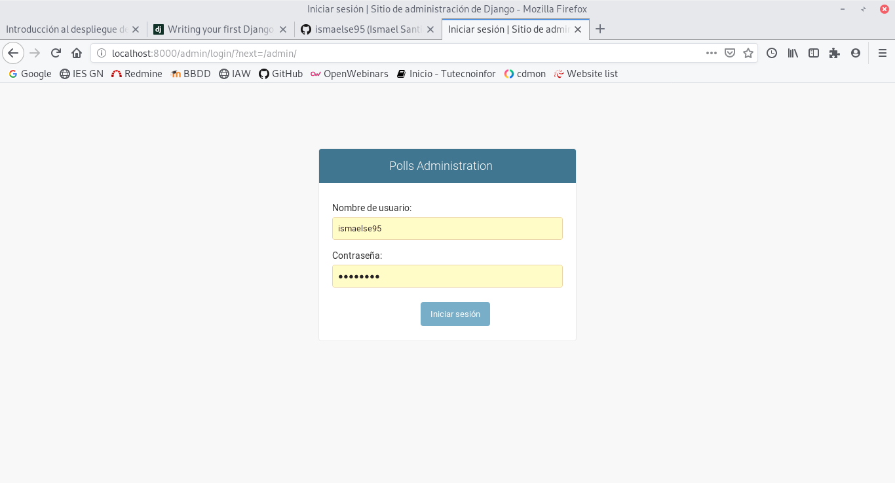
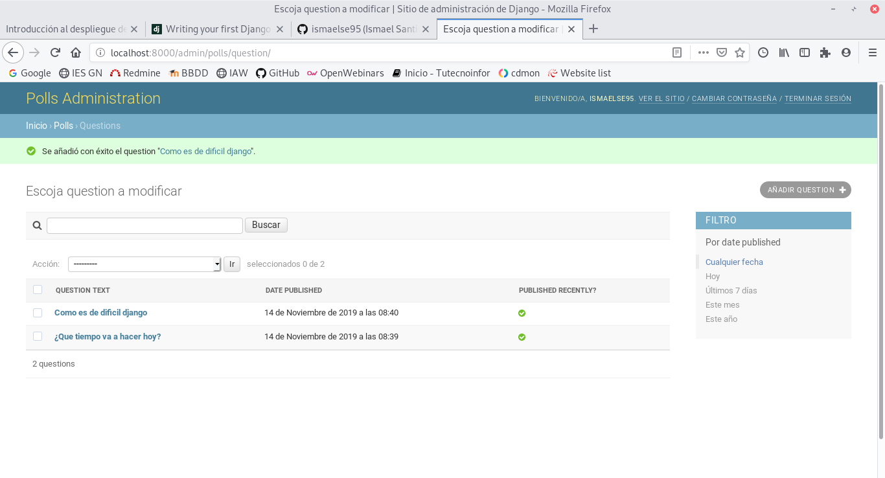
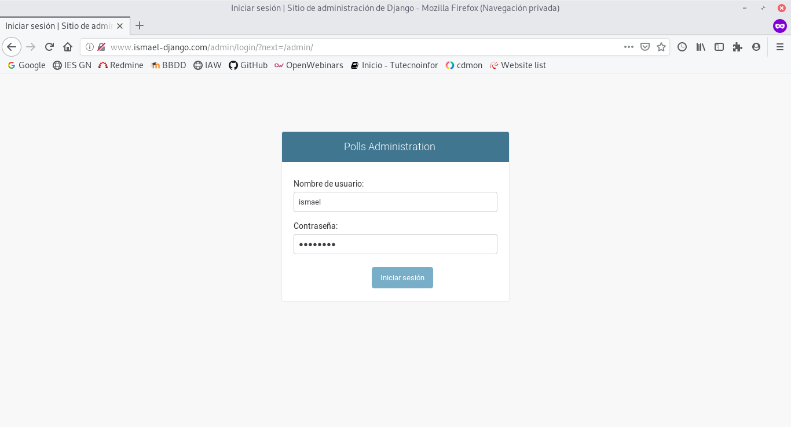

# Introducción aplicaciones python

## TAREA 1

Vamos a instalar django en un entorno virtual para ello creamos el entorno y entramos en el entorno:

~~~
python3 -m venv aplicacion_python
~~~

~~~
source aplicacion_python/bin/activate
~~~

A continuacion copiamos el repositorio de jose domingo e instalamos el fichero requeriment.txt:

~~~
git clone https://github.com/josedom24/django_tutorial
~~~

~~~
pip3 install -r requeriment.txt
~~~

Tendremos que hacer un migrate del manage.py y crear un usuario como administrador.
Una vez echo esto entramos en localhost:8000/admin:

Y por último crearemos preguntas con respuestas:

## TAREA 2

Para realizar la tarea dos tenemos que instalar los siguientes paquetes:

~~~
apt-get install apache2 libapache2-mod-wsgi-py3 python3-pip
~~~

Una vez instalados los paquetes vamos a clonar la carpeta de jose domingo:

~~~
git clone https://github.com/josedom24/django_tutorial
~~~

Ahora pasamos a crear un el fichero de configuracion de apache:

~~~
<VirtualHost *>
    ServerName www.ismael-django.com
    DocumentRoot /var/www/html/django_tutorial
    WSGIDaemonProcess django_tutorial user=www-data group=www-data processes=1 threads=5 python-path=/var/www/html/django_tutorial
    WSGIScriptAlias / /var/www/html/django_tutorial/django_tutorial/wsgi.py

    <Directory /var/www/html/django_tutorial>
            WSGIProcessGroup django_tutorial
            WSGIApplicationGroup %{GLOBAL}
            Require all granted
    </Directory>
</VirtualHost>
~~~

Creamos el enlace simbólico y reiniciamos apache2:

~~~
ln -s /etc/apache2/sites-available/django.conf /etc/apache2/sites-enabled/
~~~

~~~
systemctl restart apache2
~~~

Hacemos el migrate para crear las bases de datos:

~~~
python3 manage.py migrate
~~~

Creamos un usuario para la base de datos:

~~~
python3 manage.py createsuperuser
~~~

Y por último arrancamos el server:

~~~
python3 manage.py runserver
~~~

Para finalizar tendremos que modificar algunos de los ficheros de configuracion, para empezar vamos a cambiar el fichero (/var/www/django/django_tutorial/settings.py):

~~~
DEBUG = False

ALLOWED_HOSTS = ['www.ismael-django.com']
~~~

También tenemos que cambiar para ver el contenido estático:

1.- Añadimos la siguiente linea en el fichero settings.py:

	~~~	
	STATIC_ROOT = '/var/www/html/django_tutorial/static'
	~~~

2.- Creamos el contenido:

	~~~
	python3 manage.py collectstatic
	~~~

3.- Añadimos el contenido estático en el virtual host:

	~~~
	Alias /static /var/www/html/django_tutorial/static

  	<Directory /var/www/html/django_tutorial/static>
    	Require all granted
  	</Directory>
	~~~

Con eso ya tendriamos nuestra página configurada:

