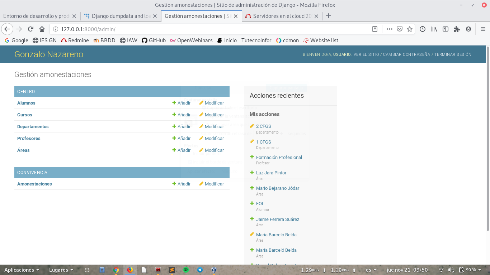
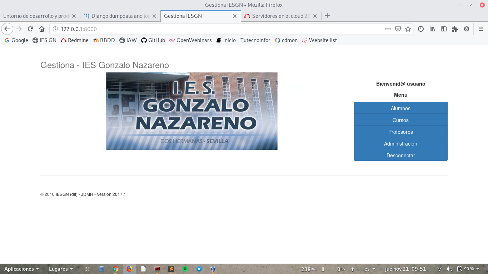
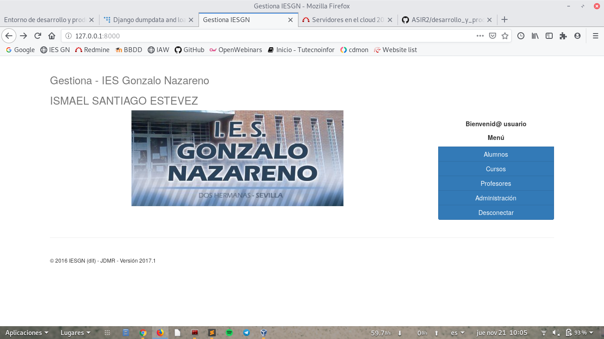
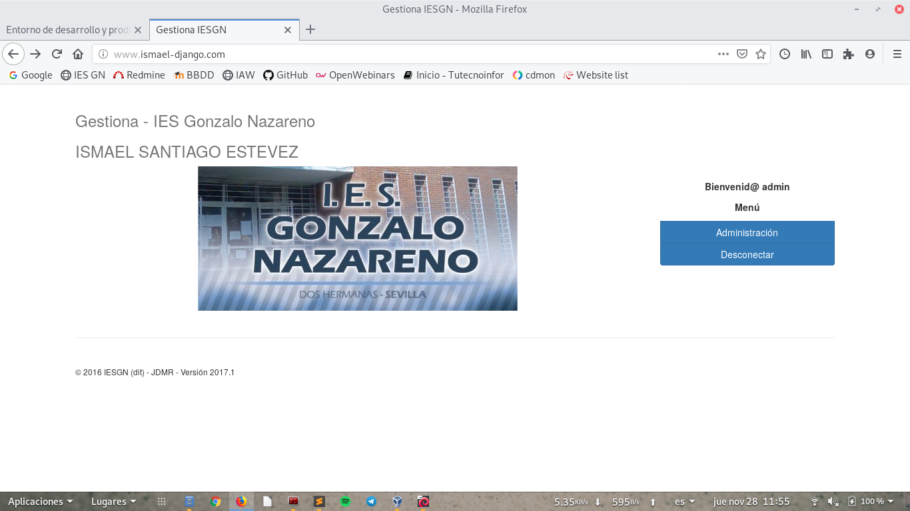
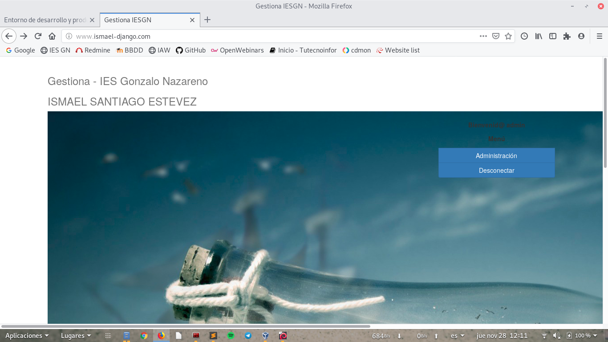
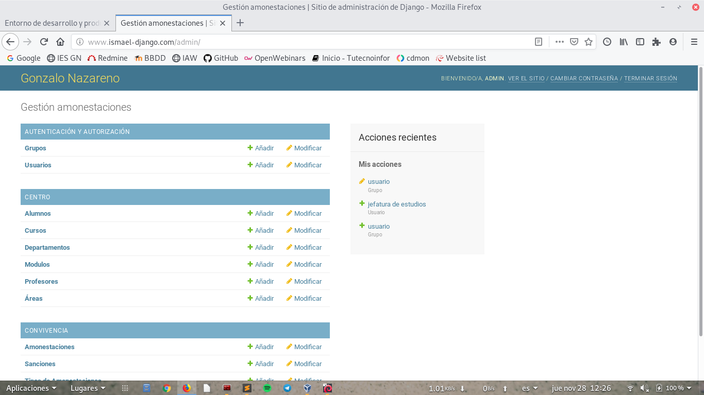

# Entorno de desarrollo y producción con aplicaciones web python.

## Tarea 1

Vamos a clonar el repositorio indicado en la tarea:

~~~
git clone https://github.com/jd-iesgn/iaw_gestionGN
~~~

Ahora pasamos a crear el virtualenv y entramos en el entorno:

~~~
python3 -m venv desa_prod_python
~~~

~~~
source desa_prod_python/bin/activate
~~~

Instalamos el fichero requirement.txt del repositorio:

~~~
pip3 install -r requirements.txt
~~~

Creamos la base de datos:

~~~
python3 manage.py migrate
~~~

Añadimos los datos de prueba del fichero datos.json:

~~~
./manage.py loaddata datos.json
~~~

Activamos la pagina y comprobamos que estan todos los datos del fichero datos.json:

~~~
python3 manage.py runserver
~~~

Entramos en la zona usuario:

## TAREA 2

Cambiamos en la página principal para que aparezca mi nombre:

## TAREA 3

Instalamos los servicios necesarios de apache2 y mysql:

~~~
apt-get install apache2 libapache2-mod-wsgi-py3 mariadb-server-10.3
~~~

~~~
apt install python3 python-dev python3-dev build-essential libssl-dev libffi-dev libxml2-dev libxslt1-dev zlib1g-dev python-pip libjpeg-dev
~~~

Pasamos a clonar mi repositorio en el document root:

~~~
git clone https://github.com/ismaelse95/iaw_gestion.git
~~~

Pasamos a crear un entorno virtual:

~~~
python3 -m venv python3_produ
~~~

~~~
source python3_produ/bin/activate
~~~

Instalamos las dependencias:

~~~
pip3 install -r requirements.txt
~~~

Instalamos los modulos tanto en el entorno como sin entorno para que permita que python trabaje con mysql:

~~~
apt-get install python3-mysqldb
~~~

~~~
pip3 install mysql-connector-python
~~~

Entramos en el fichero de configuración de virtualhost y creamos el fichero django.conf:

~~~
<VirtualHost *:80>
    ServerName www.ismael-django.com
    DocumentRoot /var/www/html/iaw_gestion
    WSGIDaemonProcess django user=www-data group=www-data processes=1 threads=5 python-path=/var/www/html/iaw_gestion:/home/ismael/prod_python3/lib64/python3.7/site-packages
    WSGIScriptAlias / /var/www/html/iaw_gestion/gestion/wsgi.py

    Alias "/static/" "/var/www/html/iaw_gestion/static/" 
                <Directory /var/www/html/iaw_gestion/static/>
                        Options +FollowSymLinks
                        Require all granted
                </Directory>

    <Directory /var/www/html/iaw_gestion>
            WSGIProcessGroup django
            WSGIApplicationGroup %{GLOBAL}
            Require all granted
    </Directory>
</VirtualHost>
~~~

Creamos el enlace simbólico y reiniciamos apache2:

~~~
ln -s /etc/apache2/sites-available/django.conf /etc/apache2/sites-enabled/
~~~

~~~
systemctl restart apache2
~~~

Cambiamos el debug y añadimos la url de nuestra página en el fichero settings.py:

~~~
DEBUG = False

ALLOWED_HOSTS = ['www.ismael-django.com']
~~~

Configuramos desde el entorno para que la zona estatica la reconozca sin problemas, ejecutaremos el siguiente comando:

~~~
python3 manage.py collectstatic
~~~

Pasamos a crear la base de datos en mysql:

~~~
CREATE DATABASE django;

GRANT ALL PRIVILEGES on django.* to 'django'@'localhost' identified by 'root';

FLUSH PRIVILEGES;
~~~

Cambiamos el fichero de configuracion settings.py y lo cambiamos por los datos de mysql:

~~~
DATABASES = {
    'default': {
        'ENGINE': 'mysql.connector.django',
        'NAME': 'django',
        'USER': 'django',
        'PASSWORD': 'root',
        'HOST': 'localhost',
        'PORT': '',
    }
}
~~~

Cargamos la base de datos con el entorno virtual activado:

~~~
./manage.py loaddata datos.json
~~~

## TAREA 4

Vamos a cambiar la imagen de nuestra página desde desarrollo, para ello subimos la imagen a nuestro git la ruta es: (../static/img). Una vez subida hacemos un push en nuestra máquina de desarrollo.

Nos vamos nuestra máquina de producción y tenemos que hacer un (git pull) para que descargar los ficheros que no teniamos.

Una vez terminado nos dirigimos a nuestra página y comprobamos que los cambios se han echo correctamente.

Vamos a crear una nueva tabla en la base de datos para ello nos vamos al fichero (centro/models.py) y tendremos que introduccir la siguiente configuración:

~~~
class Modulos(models.Model):   
     Abr = models.CharField(max_length=4)
     Nombre = models.CharField(max_length=50)
     Unidad = models.ForeignKey(Cursos,blank=True,null=True,on_delete=models.SET_NULL)
        
     def __unicode__(self):
         return self.Abr+" - "+self.Nombre      

     class Meta:
         verbose_name="Modulo"
         verbose_name_plural="Modulos"
~~~

Creamos una nueva migración pero para ello tendremos que tener los mismo permisos que la carpeta donde se encuentra nuestro entorno virtual, en mi caso es (ismael:ismael) le cambiaremos los permisos con el siguiente comando:

~~~
chown -R ismael:ismael /iaw_gestion/
~~~

Ahora podemos hacer la nueva migracion con estos dos comandos:

~~~
python3 manage.py makemigrations
~~~

~~~
python3 manage.py migrate
~~~

Añadimos un nuevo modelo en la base de datos para ello nos vamos al fichero (centro/admin.py) y tendremos que añadir Modulos en la siguiente linea:

~~~
from centro.models import Cursos,Alumnos,Departamentos,Profesores,Areas,Modulos
~~~

Y también añadiremos esta linea al final del fichero:

~~~
admin.site.register(Modulos)
~~~

Y si accedemos como admin a la página veremos que en la zona de administrador y en centro nos aparece Modulos.

