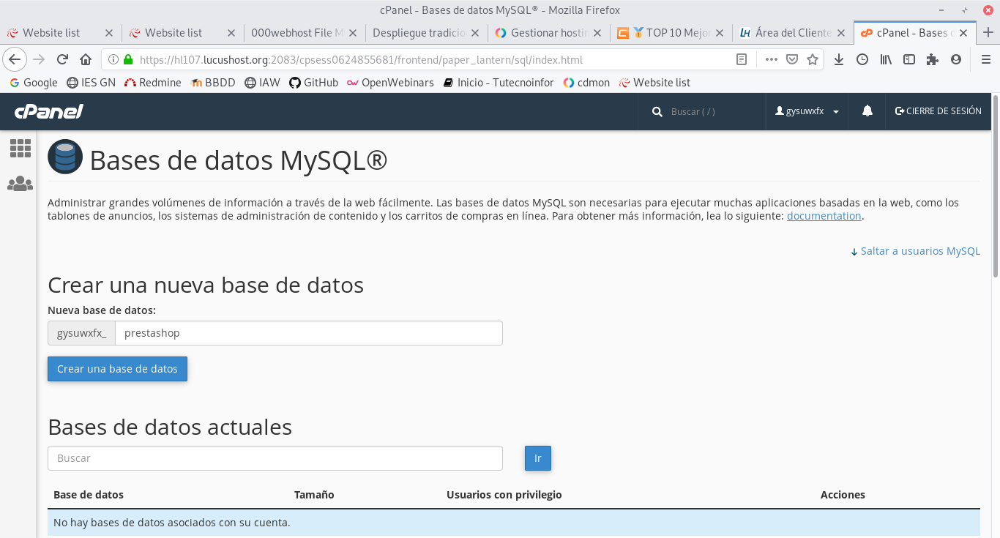
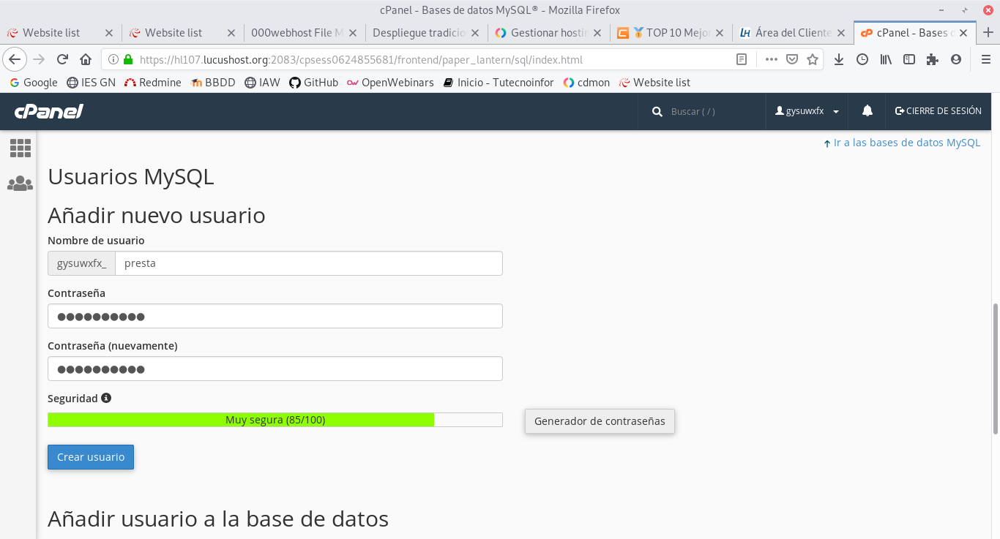
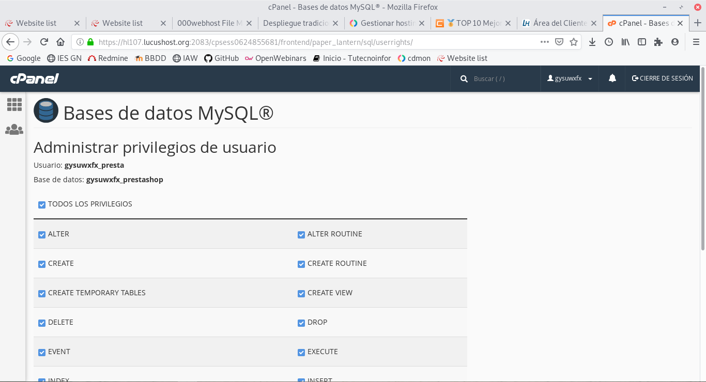
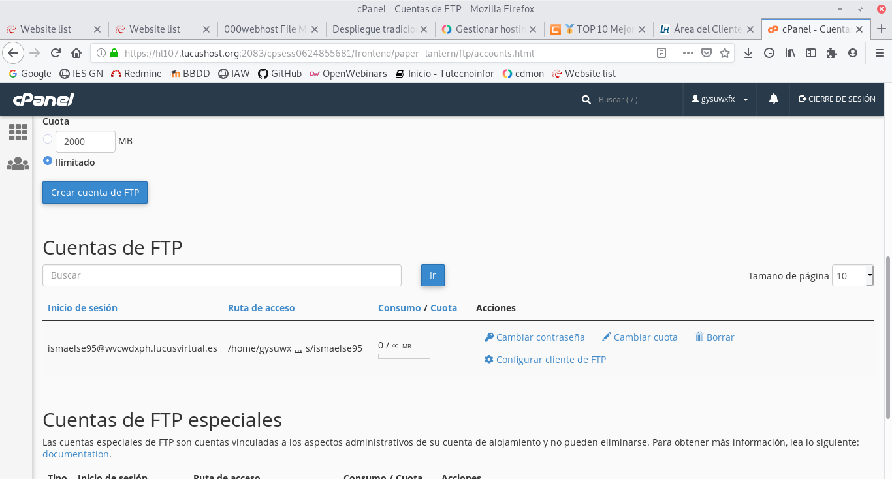
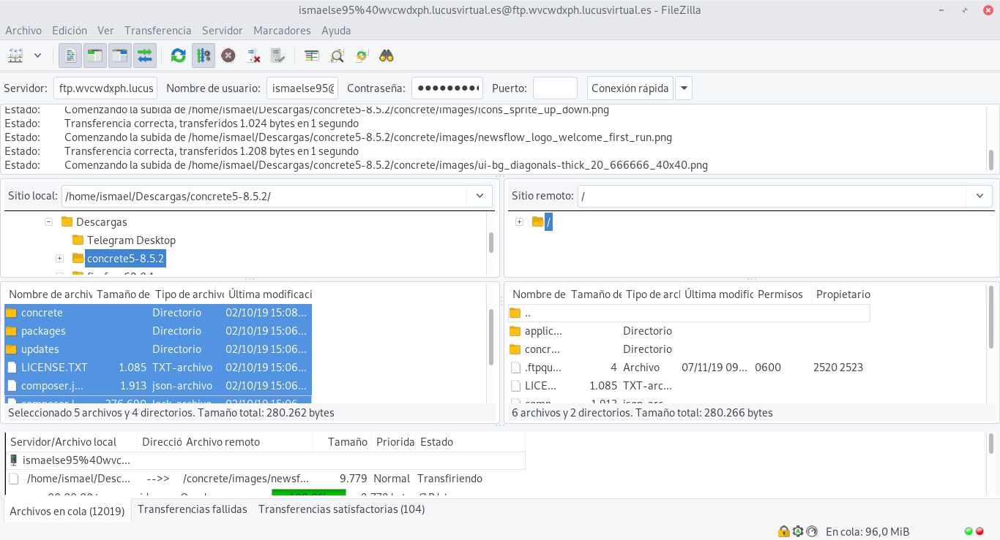
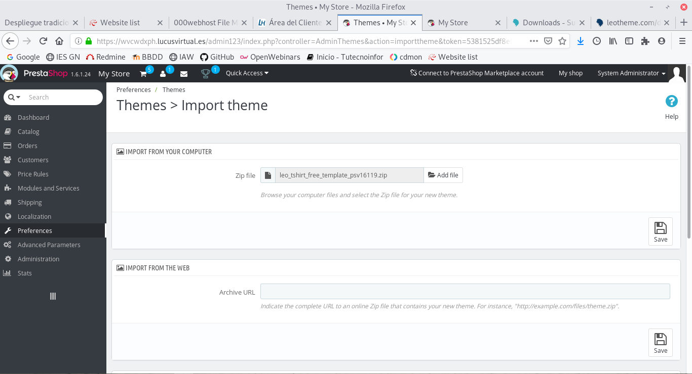
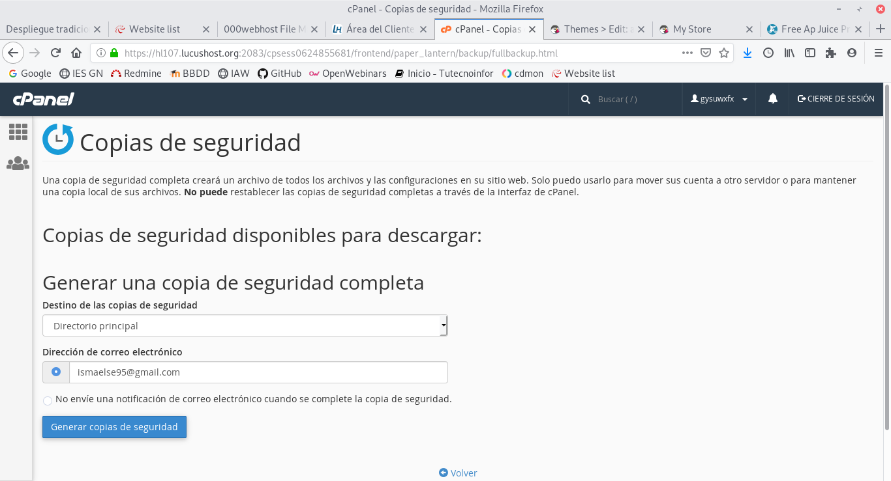

# DESPLIEGUE DE CMS

## TAREA 1, 2 y 3

Lo primero que tendremos que hacer para realizar esta tarea sera escoger dos servicios de hosting distinto en mi caso lucus y cdmon.

Empezamos con Lucus creando una base de datos, nos dirigimos a cpanel y entramos en base de datos y mysql.

Creamos tambien un usuario desde cpanel.

Por último le damos todos los privilegios.

Ahora pasamos a subir los fichero mediante ftp, en mi caso me he creado antes una cuenta ftp.

Nos conectaremos y dejaremos pasando los fichero por ftp.

Una vez subido los ficheros instalamos nuestro página y en mi caso he instalado prestashop y ahora pasaré a cambiar el tema para ello me dirijo la siguiente ruta y añadiremos el fichero zip del tema.

La url de la página seria la siguiente --> https://wvcwdxph.lucusvirtual.es/index.php

Una vez creada la página y editada pasaremos a crear la copia de seguridad para restaurarla en cdmon.

## TAREA 4