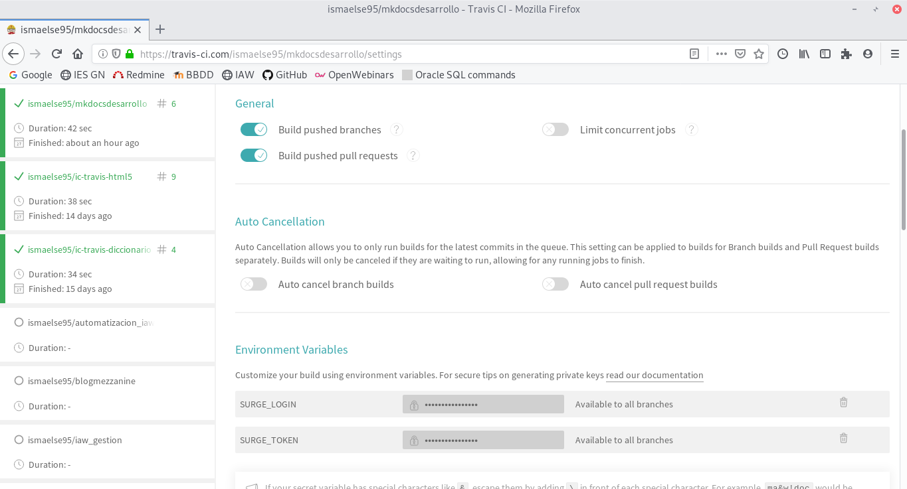
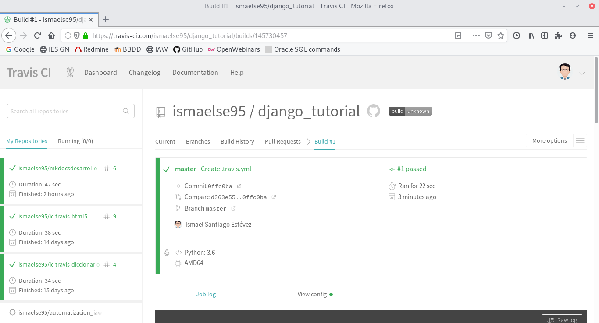
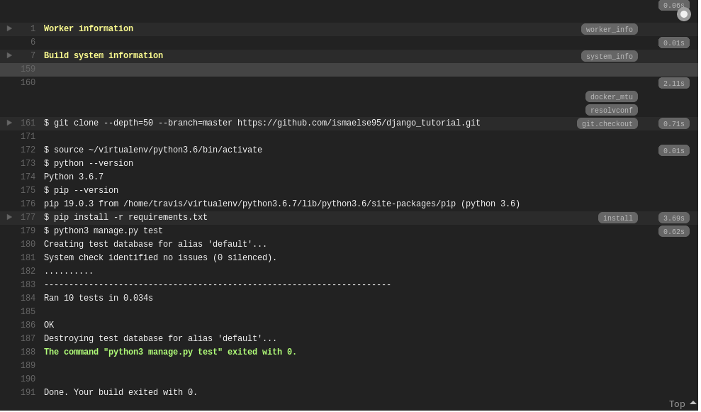
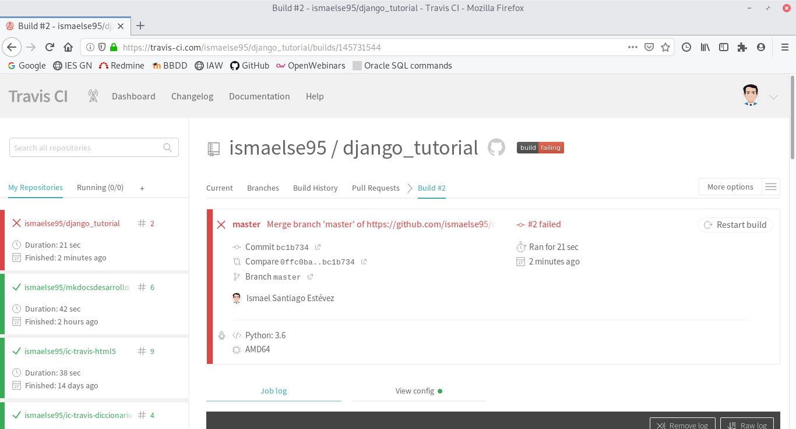
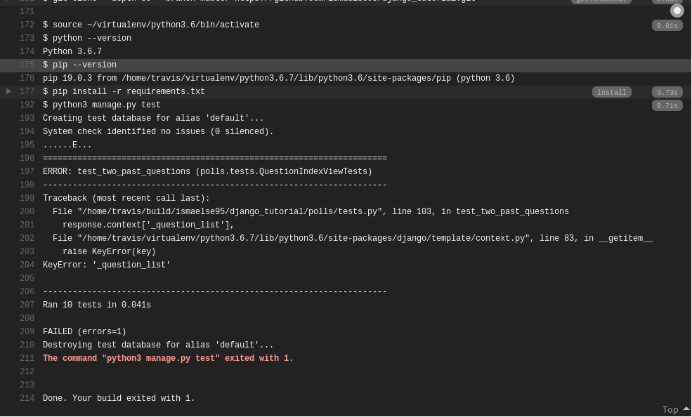

# INTEGRACION CONTINUA

## Despliegue de una página web estática

Vamos a desplegar nuestra página estatica de mkdocs con integración continua, para ello vamos a coger el repositorio de la primera práctica [mkdocsdesarrollo](https://github.com/ismaelse95/mkdocsdesarrollo).

Para que nuestro repositorio funcione correctamente en travis tendremos que crear un fichero llamado `.travis.yml` y tendremos que indicar la configuracion para que se despliegue con travis.

Este fichero lo que nos hará será instalar mkdocs y crear un proyecto:

~~~
language: python
python:
 - "3.6"

branches:
  only:
    - master

install:
 - pip install mkdocs

script: 
 - mkdocs build --clean
 - mkdocs build

deploy:
  provider: surge
  project: ./site
  domain: ismael.surge.sh
  skip_cleanup: true
~~~

Para desplegar a un hosting utilizaremos surge y para ello tendremos que crear una cuenta que nos generará un token y un login. Para crear una cuenta en surge mediante terminal vamos a ejecutar el comando de instalación:

~~~
npm install --global surge
~~~

Y para crear la cuenta una vez instalado pondremos `surge` y nos saldrá que rellenemos el formulario para crear cuenta. Una vez creada para ver nuestro token pondremos `surge token`.

Para que funcione tendremos que tener nuestro token de surge e irnos a travis y nos dirigimos a la configuración del repositorio y pondremos nuestro SURGE_TOKEN y SURGE_LOGIN. 

Con esto ya tendriamos nuestra [página](http://ismael.surge.sh/) subida con integración continua.

## Integración continúa de aplicación django

Clonaremos el repositorio [django_tutorial](https://github.com/josedom24/django_tutorial) y una vez creado entraremos en nuestro entorno virtual y ejecutaremos el comando `python3 manage.py test`:

~~~
(despliegue_surge) ismael@Ismael:~/GITHUB/django_tutorial$ python3 manage.py test
Creating test database for alias 'default'...
System check identified no issues (0 silenced).
..........
----------------------------------------------------------------------
Ran 10 tests in 0.065s

OK
Destroying test database for alias 'default'...
(despliegue_surge) ismael@Ismael:~/GITHUB/django_tutorial$ 
~~~

Podemos comprobar que no hay ningun fallo. Ahora pasaremos a crear un error al pasar el test para ello nos diriguimos al fichero `test.py` y cambiaremos lo siguiente:

~~~
    def test_two_past_questions(self):
        """
        The questions index page may display multiple questions.
        """
        create_question(question_text="Past question 1.", days=-30)
        create_question(question_text="Past question 2.", days=-5)
        response = self.client.get(reverse('polls:index'))
        self.assertQuerysetEqual(
            response.context['_question_list'],
            ['<Question: Past question 2.>', '<Question: Past question 1.>']
        )
~~~

En el apartado de dos preguntas en la misma página borraremos en la response.context la llamada a 'latest_question_list' y al ejecutar el comando `python3 manage.py test` nos salta el siguiente error:

~~~
(despliegue_surge) ismael@Ismael:~/GITHUB/django_tutorial$ python3 manage.py test
Creating test database for alias 'default'...
System check identified no issues (0 silenced).
......E...
======================================================================
ERROR: test_two_past_questions (polls.tests.QuestionIndexViewTests)
----------------------------------------------------------------------
Traceback (most recent call last):
  File "/home/ismael/GITHUB/django_tutorial/polls/tests.py", line 103, in test_two_past_questions
    response.context['_question_list'],
  File "/home/ismael/virtualenv/despliegue_surge/lib/python3.7/site-packages/django/template/context.py", line 83, in __getitem__
    raise KeyError(key)
KeyError: '_question_list'

----------------------------------------------------------------------
Ran 10 tests in 0.056s

FAILED (errors=1)
Destroying test database for alias 'default'...
(despliegue_surge) ismael@Ismael:~/GITHUB/django_tutorial$ 
~~~

Ahora vamos a pasar a validarlo en travis, para ello creamos el fichero `.travis.yml` en nuestro repositorio django_tutorial y tendremos que introducir la siguiente configuración:

~~~
language: python
python:
 - "3.6"

branches:
  only:
    - master

install:
 - pip install -r requirements.txt

script: python3 manage.py test
~~~

Ahora pasamos a activar el repositorio en travis y vemos que no ha tenido ningun fallo.

Ahora vamos a crear un error para que nos lo de en travis, para ello solo tendremos que hacer es crear un fallo por ejemplo como el anterio y hacer un commit. Con esto vemos automaticamente el fallo en travis.

