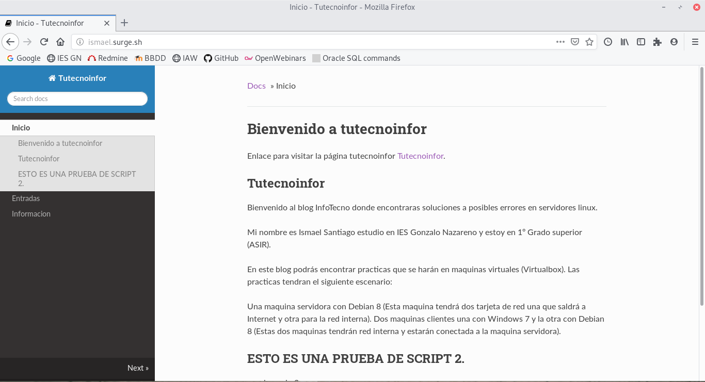

# INTEGRACION CONTINUA

## Despliegue de una página web estática

Vamos a desplegar nuestra página estatica de mkdocs con integración continua, para ello vamos a coger el repositorio de la primera práctica [mkdocsdesarrollo](https://github.com/ismaelse95/mkdocsdesarrollo).

Para que nuestro repositorio funcione correctamente en travis tendremos que crear un fichero llamado `.travis.yaml` y tendremos que indicar la configuracion para que se despliegue con travis:

~~~
language: python
python:
 - "3.6"

branches:
  only:
    - master

install:
 - pip install mkdocs

script: 
 - mkdocs build --clean
 - mkdocs build

deploy:
  provider: surge
  project: ./site
  domain: ismael.surge.sh
  skip_cleanup: true
~~~

Este fichero lo que nos hará será instalar mkdocs y crear un proyecto. 

Para que funcione tendremos que tener nuestro token de surge e irnos a travis y nos dirigimos a la configuración del repositorio y pondremos nuestro SURGE_TOKEN y SURGE_LOGIN. 

Con esto ya tendriamos nuestra [página](http://ismael.surge.sh/) subida con integración continua.

## Integración continúa de aplicación django