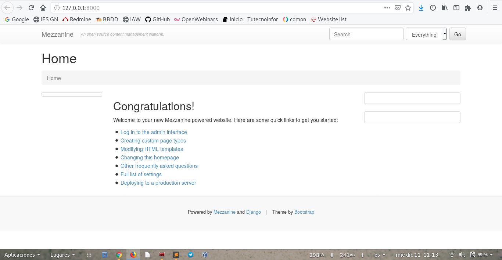
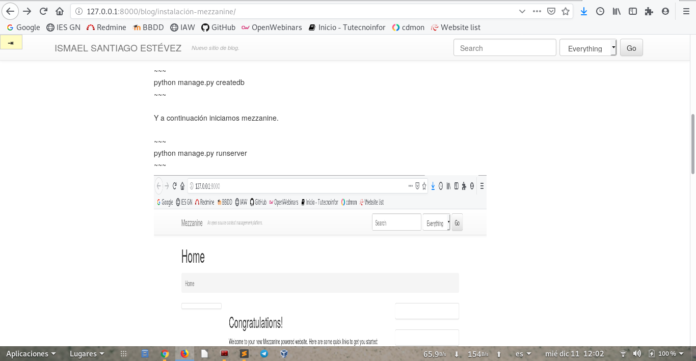

# Instalación Mezzanine

## Instalación del CMS en el entorno de desarrollo utilizando un entorno virtual. 

Vamos a instalar mezzanine en un entorno virtual para ello creamos el entorno y entramos en el entorno:

~~~
python3 -m venv mezzanine
~~~

~~~
source mezzanine/bin/activate
~~~

Creamos los fichero de mezzanine.

~~~
mezzanine-project blogmezzanine
~~~

Creamos la base de datos.

~~~
python manage.py createdb
~~~

Y a continuación iniciamos mezzanine.

~~~
python manage.py runserver
~~~

## Personalización de la página y contenido.

## Guardado de los ficheros generados durante la instalación y copia de seguridad de la bese de datos en un repositorio github.

Primero hacemos las copias de seguridad de nuestra base de datos.

~~~
python manage.py dumpdata > db.json
~~~

~~~
python manage.py dumpdata admin > admin.json
~~~

Ahora subimos al repositorio git los archivos.

## Despliegue de la aplicación en entorno de producción.

Nos vamos a la siguiente ruta `cd /usr/share/nginx/html/` y clonamos el repositorio.

~~~
git clone https://github.com/ismaelse95/blogmezzanine.git
~~~

Creamos el entorno virtual y lo activamos.

~~~
python3 -m venv mezzanine
~~~

~~~
source mezzanine/bin/activate
~~~

Ahora pasamos a intalar el fichero `requeriment.txt`.

~~~
pip3 install -r requeriment.txt
~~~

Instalamos los modulos tanto en el entorno como sin entorno para que permita que python trabaje con mysql:

~~~
apt-get install python3-mysqldb
~~~

~~~
pip3 install mysql-connector-python
~~~

