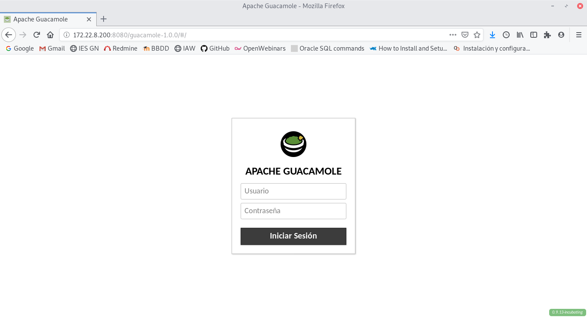

~~~
apt-get install libcairo2-dev libjpeg62-turbo-dev libpng-dev libossp-uuid-dev gcc make tomcat9 tomcat9-admin tomcat9-user
~~~

~~~
apt-get install libavcodec-dev libavutil-dev libswscale-dev libpango1.0-dev libssh2-1-dev libpango1.0-dev libtelnet-dev libvncserver-dev libpulse-dev libssl-dev libvorbis-dev libwebp-dev libfreerdp-dev
~~~

~~~
wget http://archive.apache.org/dist/guacamole/1.0.0/source/guacamole-server-1.0.0.tar.gz
~~~

~~~
tar -xzf guacamole-server-0.9.14.tar.gz
cd guacamole-server-0.9.14
~~~

~~~
./configure --with-init-dir=/etc/init.d
~~~

~~~
make
~~~

~~~
make install
~~~

~~~
ldconfig
~~~

~~~
wget http://archive.apache.org/dist/guacamole/1.0.0/source/guacamole-client-1.0.0.tar.gz
~~~

~~~
tar -zxf guacamole-client-1.0.0.tar.gz
~~~

Descargamos el .war de guacamole de la página web y lo movemos a la carpeta webapps de tomcat9:

~~~
cp guacamole-1.0.0.war /var/lib/tomcat9/webapps/guacamole.war
~~~

Con esto ya podemos entrar a la página de inicio, pero no podemos acceder:

Pasamos a configurar guacamole server.

Creamos primero el fichero `guacamole.properties` en el directorio `/etc/guacamole/` y tendremos que introducir la siguiente información:

~~~
guacd-hostname: localhost
guacd-port: 4822
user-mapping: /etc/guacamole/user-mapping.xml
auth-provider: net.sourceforge.guacamole.net.basic.BasicFileAuthenticationProvider
basic-user-mapping: /etc/guacamole/user-mapping.xml
~~~

~~~
ln -s guacamole.properties /usr/share/tomcat9/.guacamole/
~~~

~~~
<user-mapping>
        <authorize 
         username="vagrant" 
         password="63623900c8bbf21c706c45dcb7a2c083" 
         encoding="md5">
                <connection name="SSH">
                        <protocol>ssh</protocol>
                        <param name="hostname">192.168.1.129</param>
                        <param name="port">22</param>
                        <param name="username">alexrr</param>
                </connection>
                <connection name="Remote Desktop">
                <protocol>rdp</protocol>
                        <param name="hostname">192.168.1.1</param>
                        <param name="port">3389</param>
                </connection>
        </authorize>
</user-mapping>
~~~

~~~
chmod 600 user-mapping.xml
chown tomcat:tomcat user-mapping.xml
~~~

~~~
apt install apache2
~~~

~~~
<Connector port="8080" protocol="HTTP/1.1"
               connectionTimeout="20000"
               URIEncoding="UTF-8"
               redirectPort="8443" />
~~~