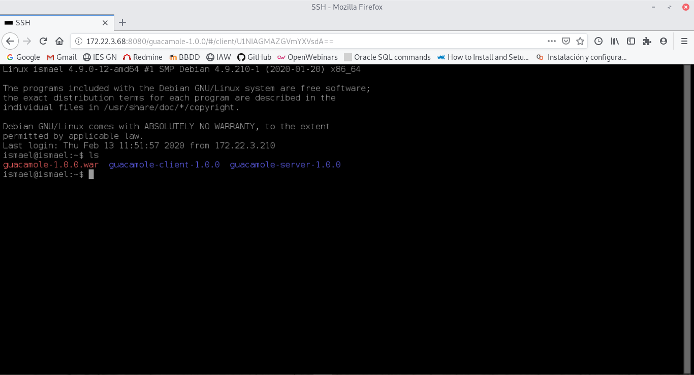

# Despliegue CMS en java

## Guacamole y su funcionalidad

En esta práctica vamos a coger un cms e instalarlo con java, en mi caso guacamole. Éste CMS nos permite conectarnos desde 

~~~
apt-get install libcairo2-dev libjpeg62-turbo-dev libpng-dev libossp-uuid-dev gcc make tomcat9 tomcat9-admin tomcat9-user
~~~

~~~
apt-get install libavcodec-dev libavutil-dev libswscale-dev libpango1.0-dev libssh2-1-dev libpango1.0-dev libtelnet-dev libvncserver-dev libpulse-dev libssl-dev libvorbis-dev libwebp-dev libfreerdp-dev
~~~

~~~
wget http://archive.apache.org/dist/guacamole/1.0.0/source/guacamole-server-1.0.0.tar.gz
~~~

~~~
tar -xzf guacamole-server-0.9.14.tar.gz
cd guacamole-server-0.9.14
~~~

~~~
./configure --with-init-dir=/etc/init.d
~~~

~~~
make
make install
ldconfig
~~~

Descargamos el .war de guacamole de la página web y lo movemos a la carpeta webapps de tomcat9:

~~~
cp guacamole-1.0.0.war /var/lib/tomcat9/webapps/
~~~

Con esto ya podemos entrar a la página de inicio, pero no podemos acceder:

Pasamos a configurar guacamole server.

Creamos primero el fichero `guacamole.properties` en el directorio `/etc/guacamole/` y tendremos que introducir la siguiente información:

~~~
guacd-hostname: localhost
guacd-port: 4822
user-mapping: /etc/guacamole/user-mapping.xml
auth-provider: net.sourceforge.guacamole.net.basic.BasicFileAuthenticationProvider
basic-user-mapping: /etc/guacamole/user-mapping.xml
~~~

Creamos el enlace simbolico dirigido hacia la carpeta `.guacamole`.

~~~
ln -s guacamole.properties /usr/share/tomcat9/.guacamole/
~~~

Ahora pasamos a crear el mapping para poder acceder mediante el navegador, para ello nos diriguimos a la carpeta `/etc/guacamole/` y creamos el fichero `user-mapping.xml` e introducimos la siguiente configuración

~~~
<user-mapping>
  <authorize
    username="usuario"
    password="f8032d5cae3de20fcec887f395ec9a6a"
    encoding="md5">
   <connection name="SSH">
    <protocol>ssh</protocol>
    <param name="hostname">172.22.3.68</param>
    <param name="port">22</param>
    <param name="username">usuario</param>
   </connection>
  </authorize>
</user-mapping>
~~~

Le damos permiso al fichero mapping y reiniciamos tomcat:

~~~
chmod 600 user-mapping.xml
chown tomcat:tomcat user-mapping.xml
~~~

~~~
/etc/init.d/tomcat9 restart
/etc/init.d/guacd restart
~~~

Con esto ya podriamos conectarnos sin apache mediante ssh:

~~~
apt install apache2
~~~

~~~
<Connector port="8080" protocol="HTTP/1.1"
               connectionTimeout="20000"
               URIEncoding="UTF-8"
               redirectPort="8443" />
~~~

~~~
<Valve className="org.apache.catalina.valves.RemoteIpValve"
               internalProxies="127.0.0.1"
               remoteIpHeader="x-forwarded-for"
               remoteIpProxiesHeader="x-forwarded-by"
               protocolHeader="x-forwarded-proto" />
~~~

~~~
a2enmod proxy
a2enmod proxy_http
a2enmod proxy_balancer
a2enmod lbmethod_byrequests
a2enmod proxy_wstunnel
~~~