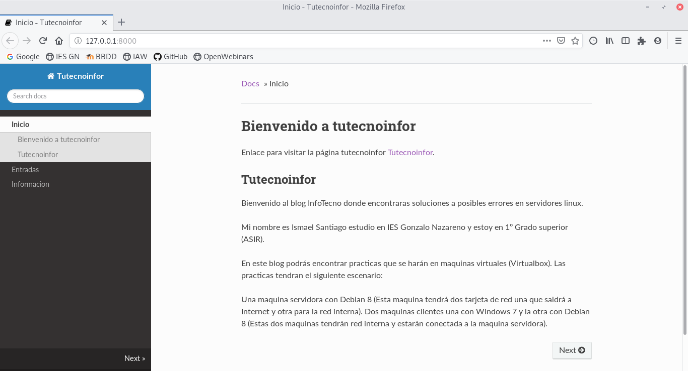
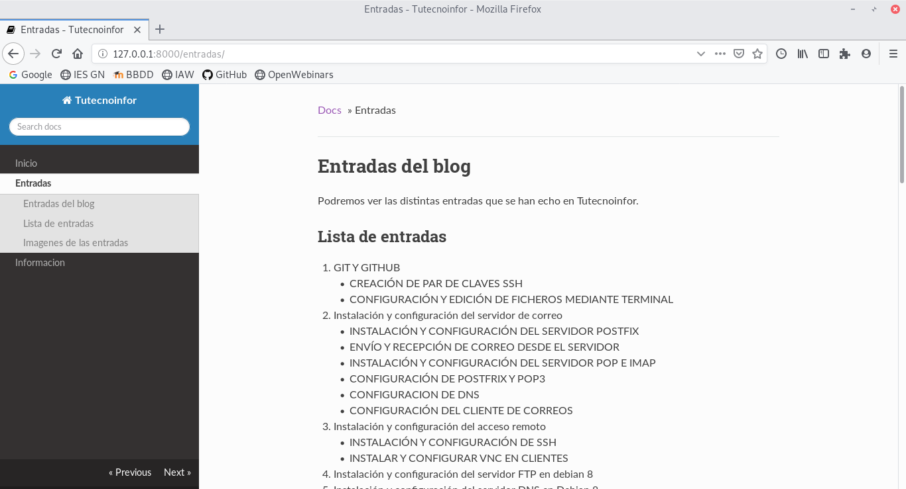
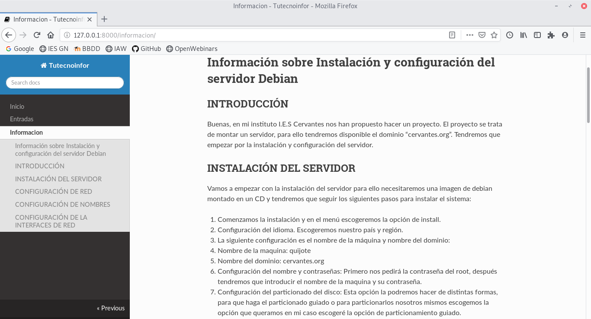

1.- Comenta la instalación del generador de página estática. Recuerda que el generador tienes que instalarlo en tu entorno de desarrollo. Indica el lenguaje en el que está desarrollado y el sistema de plantillas que utiliza. (1 punto)

Lo primero que vamos a hacer es crear un entorno virtual, empezamos instalando los paquetes que necesitamos que serán virtualenv y python3:

~~~
	sudo apt-get install python3-pip
~~~

~~~
	pip install virtualenv
~~~

~~~
	sudo pip3 install virtualenv
~~~

Una vez instalados los paquetes pasamos a crear el entorno virtual:

~~~
	virtualenv mkdocs-python -p python3
~~~

Con este comando crearemos una carpeta y aqui es donde instalaremos todos los paquetes que nos
hagan falta para usar nuestro entorno.

Para activar el entorno o desactivarlo tendremos que poner los siguientes comandos:

Activar entorno: 
~~~
	source mkdocs-python/bin/activate
~~~

Desactivar entorno: 
~~~
	deactivate
~~~

Pasamos a instalar MkDocs, que una vez dentro de nuestro entorno virtual tendremos que ejecutar el siguiente comando:

~~~
pip install mkdocs
~~~

MkDocs utiliza python como lenguaje de desarrollo y jinja2 como sistema de plantillas.

2.- Configura el generador para cambiar el nombre de tu página, el tema o estilo de la página,… Indica cualquier otro cambio de configuración que hayas realizado. (1 punto)

Para empezar a configurar la página primero tendremos que crear un nuevo proyecto, para ello
tendremos que poner el siguiente comando.

~~~
mkdocs new web_estatica
~~~

Con esto mkdocs nos crearia una carpeta docs una dentro un index.md y el fichero de configuracion que se llama mkdocs.yml.

En el fichero de mkdocs.yml podremos cambiar el nombre de la página en site_name pondremos el nombre de la página que queramos, tambien podremos añadir la siguiente información:

~~~
site_name: Tutecnoinfor
site_description: 'Soluciones a problemas informaticos'
site_author: 'Ismael Santiago Estévez'
site_url: ''
~~~

También podremos añadir páginas web para ello utilizaremos una de prueba de mkdocs y la añadimos con el siguiente comando:

~~~
curl 'https://jaspervdj.be/lorem-markdownum/markdown.txt' > docs/about.md
~~~

Ahora vamos a añadir un nuevo tema a nuestra página estática para ello entraremos en el fichero mkdocs.yml y tendremos que añadir una nueva linea con el nombre *theme*.

~~~
site_name: ISMAEL

theme: readthedocs
~~~

3.- Genera un sitio web estático con al menos 3 páginas. Deben estar escritas en Markdown y deben tener los siguientes elementos HTML: títulos, listas, párrafos, enlaces e imágenes. El código que estas desarrollando, configuración del generado, páginas en markdown,… debe estar en un repositorio Git (no es necesario que el código generado se guarde en el repositorio, evitalo usando el fichero .gitignore). (3 puntos)

Para generar nuestro sitio estatico y tener nuestros elementos HTML tendremos que ejecutar el siguiente comando:

~~~
mkdocs build
~~~

Con este comando hemos constuido los siguientes elementos HTML.

~~~
ismael@Ismael:~/GITHUB/mkdocs$ ls
404.html  css       fonts  index.html   js         search       sitemap.xml
about     entradas  img    informacion  README.md  search.html  sitemap.xml.gz
~~~

Ahora pasamos a crear las 3 páginas:

~~~
(mkdocs-python) ismael@Ismael:~/web_estatica$ ls
docs  mkdocs.yml  site
(mkdocs-python) ismael@Ismael:~/web_estatica$ ls docs
entradas.md  img  index.md  informacion.md
~~~

Para demostrar las páginas creadas, las mostraré con tres imagenes:

Tendremos la página de inicio.

Una página de las entradas que tiene la página web.

Y una página sobre la información sobre como instalar y configurar un servidor Debian.

Por ultimo subiremos a nuestro git el fichero .gitignore:

~~~
ismael@Ismael:~/GITHUB/mkdocsdesarrollo$ ls -a
.  ..  docs  .git  .gitignore  mkdocs.yml  README.md
~~~

4.- Explica el proceso de despliegue utilizado por el servicio de hosting que vas a utilizar. (2 puntos)