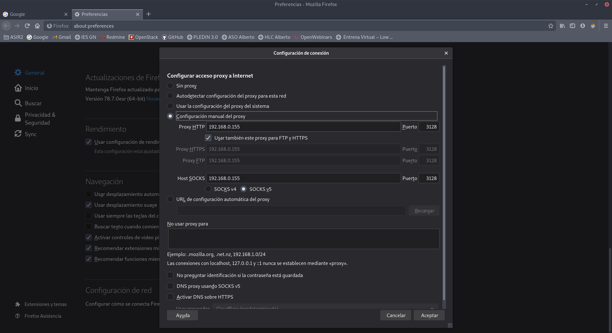
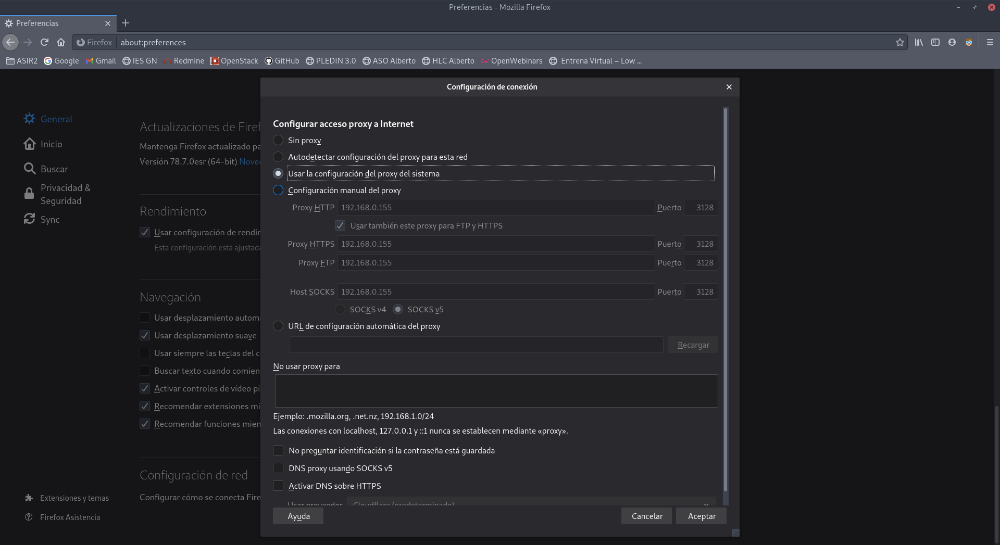
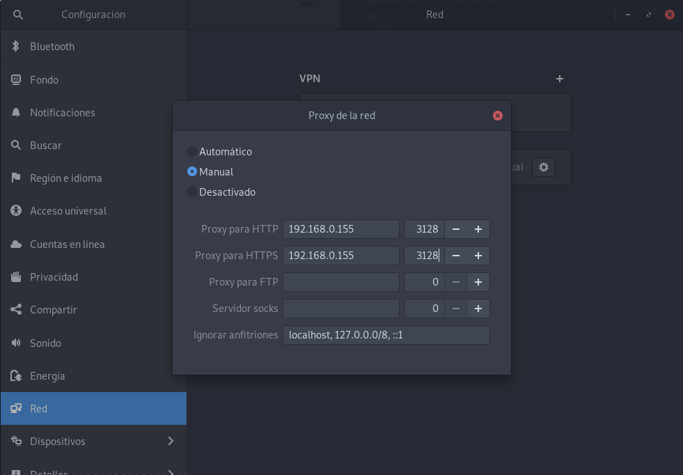
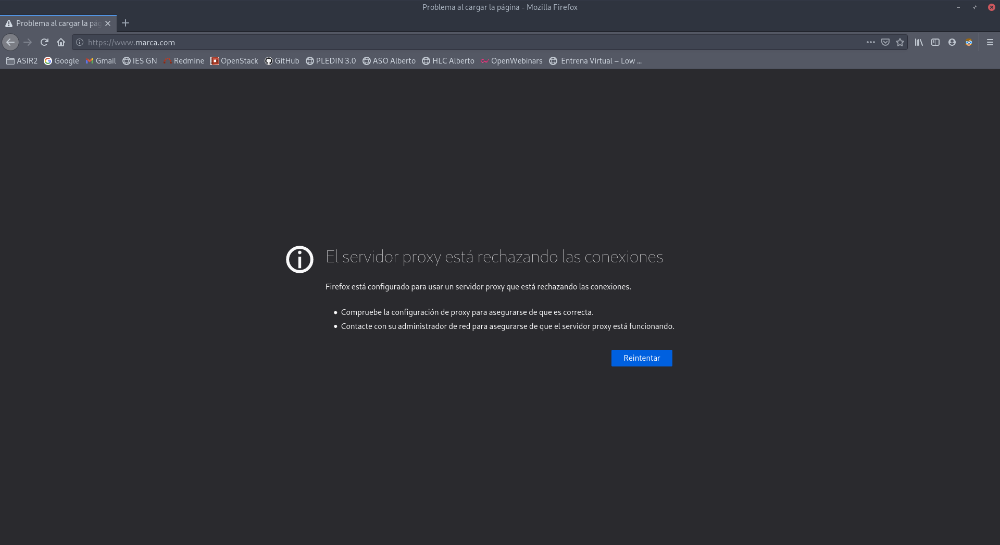
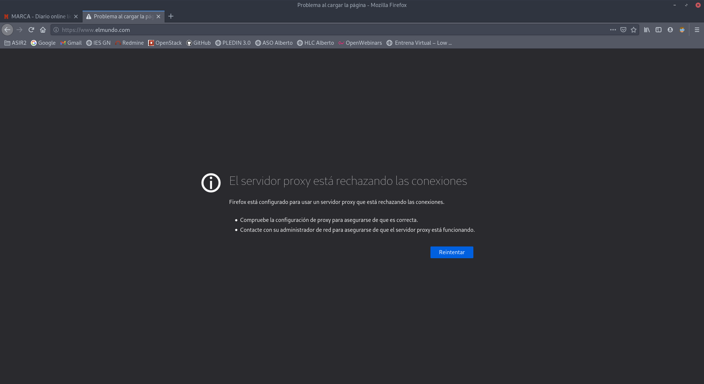

# Proxy y balanceador de carga

En esta practica vamos a tener dos máquinas virtuales, una de ellas sera el servidor y otra un cliente conectada en red interna con el servidor. Por supuesto nuestro servidor tendrá otra red externa.

## Proxy

### Tarea 1: Instala squid en la máquina squid y configúralo para que permita conexiones desde la red donde este tu ordenador.

Vamos a empezar instalando squid en nuestro servidor.
~~~
vagrant@proxy:~$ sudo apt install squid
~~~

Ahora entraremos en el fichero de configuración de `/etc/squid/squid.conf` y tendremos que poner las siguientes lineas para crear la acl.
~~~
acl externa src 192.168.0.0/24
http_access allow externa
~~~

Reiniciamos squid.
~~~
vagrant@proxy:~$ sudo systemctl restart squid
~~~

### Tarea 2: Prueba que tu ordenador está navegando a través del proxy (HTTP/HTTPS) configurando el proxy de dos maneras diferentes:

- Directamente indicándolo en el navegador.

Vamos a configurar el navegador firefox, para ello tendremos que entrar en preferencia --> configuracion de red y en la nueva ventana que nos saldrá tenemos que configurarlo de la siguiente forma.

Accedemos a marca por ejemplo y vemos el log de squid.
~~~
1613986861.519     77 192.168.0.167 TCP_MISS/200 981 POST http://r3.o.lencr.org/ - HIER_DIRECT/2.22.234.56 application/ocsp-response
1613986861.667    199 192.168.0.167 TCP_MISS/200 914 POST http://ocsp.digicert.com/ - HIER_DIRECT/72.21.91.29 application/ocsp-response
1613986861.794    199 192.168.0.167 TCP_TUNNEL/200 5658 CONNECT fundingchoicesmessages.google.com:443 - HIER_DIRECT/172.217.17.14 -
1613986861.796    216 192.168.0.167 TCP_TUNNEL/200 5655 CONNECT fundingchoicesmessages.google.com:443 - HIER_DIRECT/172.217.17.14 -
1613986862.021    199 192.168.0.167 TCP_MISS/200 817 POST http://ocsp.pki.goog/gts1o1core - HIER_DIRECT/216.58.209.67 application/ocsp-response
1613986862.064     74 192.168.0.167 TCP_MISS/200 1008 POST http://ocsp.usertrust.com/ - HIER_DIRECT/151.139.128.14 application/ocsp-response
1613986862.398    438 192.168.0.167 TCP_MISS/200 704 POST http://ocsp.digicert.com/ - HIER_DIRECT/72.21.91.29 application/ocsp-response
1613986862.433    129 192.168.0.167 TCP_TUNNEL/200 18441 CONNECT static.chartbeat.com:443 - HIER_DIRECT/13.32.89.178 -
1613986862.612    200 192.168.0.167 TCP_MISS/200 914 POST http://ocsp.digicert.com/ - HIER_DIRECT/72.21.91.29 application/ocsp-response
1613986862.623    141 192.168.0.167 TCP_MISS/200 2448 POST http://ocsp.starfieldtech.com/ - HIER_DIRECT/192.124.249.23 application/ocsp-response
1613986862.837    107 192.168.0.167 TCP_TUNNEL/200 13008 CONNECT api.unidadeditorial.es:443 - HIER_DIRECT/13.32.91.94 -
1613986863.350   3222 192.168.0.167 TCP_TUNNEL/200 3916 CONNECT pixelcounter.marca.com:443 - HIER_DIRECT/193.110.128.197 -
1613986863.490    228 192.168.0.167 TCP_MISS/200 915 POST http://status.thawte.com/ - HIER_DIRECT/72.21.91.29 application/ocsp-response
~~~

- Configurando el proxy del sistema en el entorno gráfico (tienes que indicar en el navegador que vas a hacer uso del proxy del sistema).

Para configurar el proxy del sistema en el entorno tendremos que especificarlo en el navegador y en nuestro sistema.
Primero vamos al navegador y en la misma pestaña de antes tendremos que seleccionar la siguiente opción.

Ahora nos vamos a configuración del sistema nos vamos a red y dentro de red activamos proxy, seleccionamos manual y tendremos que introducir nuestro proxy.

Ahora entramos en la página as y comprobamos el fichero de log.
~~~
1613987848.040     21 192.168.0.167 TCP_TUNNEL/200 39 CONNECT as01.epimg.net:443 - HIER_DIRECT/151.101.134.133 -
1613987848.049     21 192.168.0.167 TCP_TUNNEL/200 39 CONNECT as01.epimg.net:443 - HIER_DIRECT/151.101.134.133 -
1613987848.052     20 192.168.0.167 TCP_TUNNEL/200 39 CONNECT as01.epimg.net:443 - HIER_DIRECT/151.101.134.133 -
1613987848.056     20 192.168.0.167 TCP_TUNNEL/200 39 CONNECT as01.epimg.net:443 - HIER_DIRECT/151.101.134.133 -
1613987848.907     26 192.168.0.167 TCP_TUNNEL/200 39 CONNECT asmedia.epimg.net:443 - HIER_DIRECT/151.101.134.133 -
1613987849.647     20 192.168.0.167 TCP_TUNNEL/200 39 CONNECT as01.epimg.net:443 - HIER_DIRECT/151.101.134.133 -
~~~

### Tarea 3: Configura squid para que pueda ser utilizado desde el cliente interno. En el cliente interno configura el proxy desde la línea de comandos (con una variable de entorno). Fíjate que no hemos puesto ninguna regla SNAT y podemos navegar (protocolo HTTP), pero no podemos hacer ping o utilizar otro servicio.

Vamos a configurar nuestra red interna, para ello tendremos que entrar primero en el fichero de configuración de `/etc/squid/squid.conf` y tenemos que realizar lo siguiente.
~~~
acl redinterna src 10.0.0.0/24
http_access allow redinterna
~~~

Reiniciamos squid.
~~~
vagrant@proxy:~$ sudo systemctl restart squid
~~~

Vamos a instalar en nuestro cliente w3m para acceder a una página mediante terminal.
~~~
vagrant@buster:~$ sudo apt install w3m
~~~

Ahora vamos a configurar las variables de entorno.
~~~
root@buster:~# export https_proxy=http://10.0.0.10:3128/
root@buster:~# export http_proxy=http://10.0.0.10:3128/
~~~

Accedemos a la página elmundo y comprobamos el log.
~~~
root@buster:~# w3m elmundo.com
~~~

~~~
1613989082.751    372 10.0.0.11 TCP_MISS/301 524 GET http://elmundo.com/ - HIER_DIRECT/131.0.136.66 text/html
1613989083.519    760 10.0.0.11 TCP_TUNNEL/200 4256 CONNECT elmundo.com:443 - HIER_DIRECT/131.0.136.66 -
1613989088.859   5337 10.0.0.11 TCP_TUNNEL/200 199175 CONNECT www.elmundo.com:443 - HIER_DIRECT/131.0.136.66 -
~~~

### Tarea 4: Con squid podemos filtrar el acceso por url o dominios, realiza las configuraciones necesarias para implementar un filtro que funcione como lista negra (todo el acceso es permitido menos las url o dominios que indiquemos en un fichero.)

Bien, ahora vamos a crear un fichero en nuestra máquina servidor de proxy de listas negras, para ello vamos a crearlo en la ruta `/etc/squid/listanegra` y pondremos la siguiente página.
~~~
www.tutecnoinfor.wordpress.com/
~~~

Ahora tendremos que acceder a la configuracion de `/etc/squid/squid.conf` y añadimos la acl.
~~~
acl listanegra url_regex "/etc/squid/listanegra"
http_access deny listanegra
~~~

Reiniciamos squid.
~~~
vagrant@proxy:~$ sudo systemctl restart squid
~~~

Y comprobamos que no podemos acceder y miramos el log.

~~~
1613989800.642     56 192.168.0.167 TCP_TUNNEL/200 39 CONNECT ssl.gstatic.com:443 - HIER_DIRECT/216.58.215.131 -
1613989800.766     49 192.168.0.167 TCP_TUNNEL/200 39 CONNECT apis.google.com:443 - HIER_DIRECT/142.250.184.174 -
1613989804.426      0 192.168.0.167 TCP_DENIED/403 3959 CONNECT www.marca.com:443 - HIER_NONE/- text/html
~~~

### Tarea 5: Realiza las configuraciones necesarias para implementar un filtro que funcione como lista blanca (todo el acceso es denegado menos las url o dominios que indiquemos en un fichero.)

Vamos a crear listas blancas, para ello vamos a crear un fichero de configuración que se llamará `/etc/squid/listasblancas` y pondremos que solo podemos acceder a www.marca.com

Tendremos que entrar en el fichero de configuración squid y tendremos que poner la acl.
~~~
acl listasblancas url_regex "/etc/squid/listasblancas
http_access allow listasblancas
http_access deny all
~~~

Reiniciamos squid.
~~~
vagrant@proxy:~$ sudo systemctl restart squid
~~~

Ahora intentamos acceder a marca y a elmundo y vemos que en marca podemos acceder y elmundo no. Miramos el log de squid también.

~~~
1613990779.365      0 192.168.0.167 TCP_TUNNEL/200 3974 CONNECT e00-marca.uecdn.es:443 - HIER_NONE/- text/html
1613990780.497      0 192.168.0.167 TCP_DENIED/403 3965 CONNECT www.elmundo.com:443 - HIER_NONE/- text/html
~~~

## Balanceador de carga

Vamos a configurar el  que tenemos en la página de Jose Domingo.

Una vez iniciado el vagrantfile entramos en la máquina balanceador y vamos a instalar haproxy.
~~~

~~~
