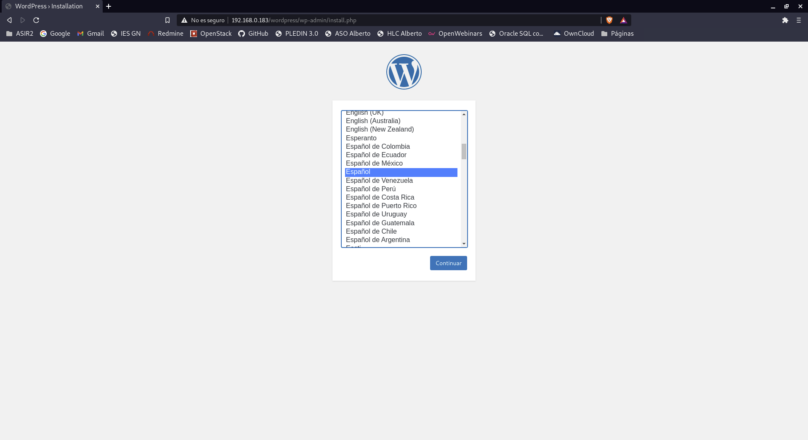
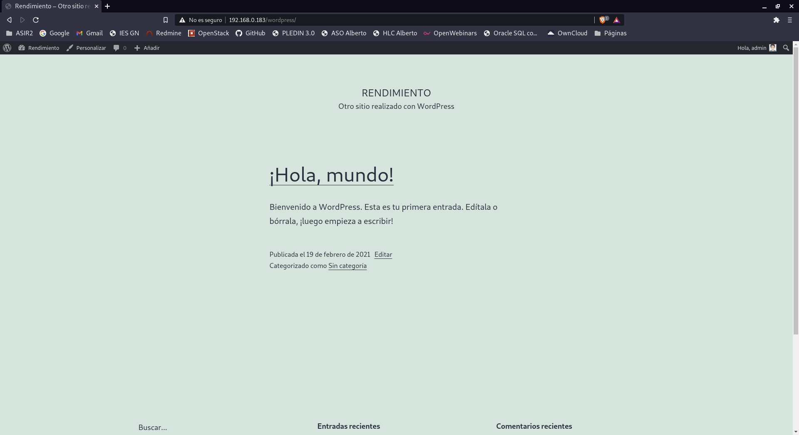

# Aumento de rendimiento de servidores web von Varnish

- Tarea 1: Vamos a configurar una máquina con la configuración ganadora: nginx + fpm_php (socket unix). Para ello ejecuta la receta ansible que encontraras en este repositorio. Accede al wordpress y termina la configuración del sitio.

Lo primero que vamos a hacer es cambiar nuestro fichero hosts para que funcione correctamente ansible y pueda iniciar el nodo. Nuestro fichero hosts se quedará así.
~~~
[servidores_web]
nodo1 ansible_ssh_host=192.168.0.183 ansible_python_interpreter=/usr/bin/python3
~~~

Una vez echo esto podremos acceder a instalar wordpress.

Terminamos de configurar y tendremos la página de prueba.

- Tarea 2: Vamos a hacer las pruebas de rendimiento desde la misma máquina.

Vamos a hacer distintas pruebas con distintas niveles de concurrencia y las pruebas son las siguientes(Entre cada prueba vamos a reiniciar el servidor nginx y el fpm-php).

~~~
vagrant@rendimiento:~/.ssh$ ab -t 10 -c 50 -k http://127.0.0.1/wordpress/index.php
This is ApacheBench, Version 2.3 <$Revision: 1843412 $>
Copyright 1996 Adam Twiss, Zeus Technology Ltd, http://www.zeustech.net/
Licensed to The Apache Software Foundation, http://www.apache.org/

Benchmarking 127.0.0.1 (be patient)
Finished 1281 requests

Server Software:        nginx/1.14.2
Server Hostname:        127.0.0.1
Server Port:            80

Document Path:          /wordpress/index.php
Document Length:        0 bytes

Concurrency Level:      50
Time taken for tests:   10.006 seconds
Complete requests:      1281
Failed requests:        0
Non-2xx responses:      1281
Keep-Alive requests:    0
Total transferred:      277977 bytes
HTML transferred:       0 bytes
Requests per second:    128.02 [#/sec] (mean)
Time per request:       390.563 [ms] (mean)
Time per request:       7.811 [ms] (mean, across all concurrent requests)
Transfer rate:          27.13 [Kbytes/sec] received

Connection Times (ms)
              min  mean[+/-sd] median   max
Connect:        0    0   0.4      0       2
Processing:    18  370  42.3    375     424
Waiting:       18  370  42.3    375     424
Total:         19  370  42.1    376     424

Percentage of the requests served within a certain time (ms)
  50%    375
  66%    381
  75%    385
  80%    388
  90%    395
  95%    400
  98%    405
  99%    409
 100%    424 (longest request)
~~~

~~~
vagrant@rendimiento:~/.ssh$ ab -t 10 -c 100 -k http://127.0.0.1/wordpress/index.php
This is ApacheBench, Version 2.3 <$Revision: 1843412 $>
Copyright 1996 Adam Twiss, Zeus Technology Ltd, http://www.zeustech.net/
Licensed to The Apache Software Foundation, http://www.apache.org/

Benchmarking 127.0.0.1 (be patient)
Finished 1292 requests

Server Software:        nginx/1.14.2
Server Hostname:        127.0.0.1
Server Port:            80

Document Path:          /wordpress/index.php
Document Length:        0 bytes

Concurrency Level:      100
Time taken for tests:   10.006 seconds
Complete requests:      1292
Failed requests:        0
Non-2xx responses:      1292
Keep-Alive requests:    0
Total transferred:      280364 bytes
HTML transferred:       0 bytes
Requests per second:    129.12 [#/sec] (mean)
Time per request:       774.490 [ms] (mean)
Time per request:       7.745 [ms] (mean, across all concurrent requests)
Transfer rate:          27.36 [Kbytes/sec] received

Connection Times (ms)
              min  mean[+/-sd] median   max
Connect:        0    0   1.3      0       6
Processing:    22  724 114.5    748     800
Waiting:       21  724 114.6    748     800
Total:         24  724 113.5    748     800

Percentage of the requests served within a certain time (ms)
  50%    748
  66%    756
  75%    761
  80%    764
  90%    772
  95%    777
  98%    782
  99%    784
 100%    800 (longest request)
~~~

~~~
vagrant@rendimiento:~/.ssh$ ab -t 10 -c 200 -k http://127.0.0.1/wordpress/index.php
This is ApacheBench, Version 2.3 <$Revision: 1843412 $>
Copyright 1996 Adam Twiss, Zeus Technology Ltd, http://www.zeustech.net/
Licensed to The Apache Software Foundation, http://www.apache.org/

Benchmarking 127.0.0.1 (be patient)
Completed 5000 requests
Completed 10000 requests
Completed 15000 requests
Completed 20000 requests
Completed 25000 requests
Completed 30000 requests
Completed 35000 requests
Completed 40000 requests
Completed 45000 requests
Completed 50000 requests
Finished 50000 requests

Server Software:        nginx/1.14.2
Server Hostname:        127.0.0.1
Server Port:            80

Document Path:          /wordpress/index.php
Document Length:        0 bytes

Concurrency Level:      200
Time taken for tests:   5.282 seconds
Complete requests:      50000
Failed requests:        49566
   (Connect: 0, Receive: 0, Length: 49566, Exceptions: 0)
Non-2xx responses:      50000
Keep-Alive requests:    49224
Total transferred:      16449248 bytes
HTML transferred:       8574918 bytes
Requests per second:    9466.94 [#/sec] (mean)
Time per request:       21.126 [ms] (mean)
Time per request:       0.106 [ms] (mean, across all concurrent requests)
Transfer rate:          3041.49 [Kbytes/sec] received

Connection Times (ms)
              min  mean[+/-sd] median   max
Connect:        0    0   0.4      0       8
Processing:     0   17 133.7      5    1943
Waiting:        0   17 133.6      5    1943
Total:          0   17 133.8      5    1948

Percentage of the requests served within a certain time (ms)
  50%      5
  66%      6
  75%      7
  80%      8
  90%     11
  95%     13
  98%     19
  99%     25
 100%   1948 (longest request)
~~~

~~~
vagrant@rendimiento:~/.ssh$ ab -t 10 -c 500 -k http://127.0.0.1/wordpress/index.php
This is ApacheBench, Version 2.3 <$Revision: 1843412 $>
Copyright 1996 Adam Twiss, Zeus Technology Ltd, http://www.zeustech.net/
Licensed to The Apache Software Foundation, http://www.apache.org/

Benchmarking 127.0.0.1 (be patient)
Completed 5000 requests
Completed 10000 requests
Completed 15000 requests
Completed 20000 requests
Completed 25000 requests
Completed 30000 requests
Completed 35000 requests
Completed 40000 requests
Completed 45000 requests
Completed 50000 requests
Finished 50000 requests

Server Software:        nginx/1.14.2
Server Hostname:        127.0.0.1
Server Port:            80

Document Path:          /wordpress/index.php
Document Length:        0 bytes

Concurrency Level:      500
Time taken for tests:   4.463 seconds
Complete requests:      50000
Failed requests:        49666
   (Connect: 0, Receive: 0, Length: 49666, Exceptions: 0)
Non-2xx responses:      50000
Keep-Alive requests:    49357
Total transferred:      16460713 bytes
HTML transferred:       8592218 bytes
Requests per second:    11204.01 [#/sec] (mean)
Time per request:       44.627 [ms] (mean)
Time per request:       0.089 [ms] (mean, across all concurrent requests)
Transfer rate:          3602.07 [Kbytes/sec] received

Connection Times (ms)
              min  mean[+/-sd] median   max
Connect:        0    6  78.0      0    1017
Processing:     0   27 143.9      9    2444
Waiting:        0   27 143.9      9    2444
Total:          0   33 182.2      9    3451

Percentage of the requests served within a certain time (ms)
  50%      9
  66%     14
  75%     17
  80%     20
  90%     26
  95%     32
  98%     50
  99%   1144
 100%   3451 (longest request)
~~~

- Tarea 3: Configura un proxy inverso - caché Varnish

Vamos a instalar y configurar varnish para que podamos hacer pruebas mediante un proxy-inverso.
~~~
sudo apt install varnish
~~~

Ahora configuramos varnish para que escuche por el puerto 80, para ello entramos en `/etc/default/varnish` y tendremos que añadir lo siguiente.
~~~
DAEMON_OPTS="-a :80
 -T localhost:6082
 -f /etc/varnish/default.vcl
 -S /etc/varnish/secret
 -s malloc,1G"
~~~

A continuación tenemos que cambiar la unidad de systemd para que arrnque varnish en el puerto 80, para ello editamos el fichero `/lib/systemd/system/varnish.service` y cambiamos la siguiente línea para que arranque en el puerto 80.
~~~
ExecStart=/usr/sbin/varnishd -j unix,user=vcache -F -a :80 -T localhost:6082 -f /etc/varnish/default.vcl -S /etc/varnish/secret -s malloc,256m
~~~

Reiniciamos los servicios para que funcione correctamente.
~~~
vagrant@rendimiento:~/.ssh$ sudo systemctl daemon-reload
vagrant@rendimiento:~/.ssh$ sudo systemctl restart varnish
~~~

Vamos a configurar ahora varnish para que escuche por el puerto 8080 para ello tendremos que entrar en el fichero `/etc/varnish/default.vcl` y tendremos que añadir la siguiente configuración.
~~~
backend default {
    .host = "127.0.0.1";
    .port = "8080";
}
~~~

Cambiamos el puerto en nginx de 80 a 8080.
~~~
server {
        listen 8080;
~~~

Vemos los puertos si estan bien puestos.
~~~
vagrant@rendimiento:~/.ssh$ sudo netstat -putan
tcp        0      0 0.0.0.0:8080            0.0.0.0:*               LISTEN      18137/nginx: master
tcp        0      0 0.0.0.0:80              0.0.0.0:*               LISTEN      17894/varnishd   
~~~

Ahora volvemos a hacer una prueba con 500 de nivel de concurrencia.
~~~
vagrant@rendimiento:~/.ssh$ ab -t 10 -c 500 -k http://127.0.0.1/wordpress/index.php
This is ApacheBench, Version 2.3 <$Revision: 1843412 $>
Copyright 1996 Adam Twiss, Zeus Technology Ltd, http://www.zeustech.net/
Licensed to The Apache Software Foundation, http://www.apache.org/

Benchmarking 127.0.0.1 (be patient)
Completed 5000 requests
Completed 10000 requests
Completed 15000 requests
Completed 20000 requests
Completed 25000 requests
Completed 30000 requests
Completed 35000 requests
Completed 40000 requests
Completed 45000 requests
Completed 50000 requests
Finished 50000 requests

Server Software:        nginx/1.14.2
Server Hostname:        127.0.0.1
Server Port:            80

Document Path:          /wordpress/index.php
Document Length:        0 bytes

Concurrency Level:      500
Time taken for tests:   1.851 seconds
Complete requests:      50000
Failed requests:        0
Non-2xx responses:      50000
Keep-Alive requests:    50000
Total transferred:      15475089 bytes
HTML transferred:       0 bytes
Requests per second:    27013.53 [#/sec] (mean)
Time per request:       18.509 [ms] (mean)
Time per request:       0.037 [ms] (mean, across all concurrent requests)
Transfer rate:          8164.78 [Kbytes/sec] received

Connection Times (ms)
              min  mean[+/-sd] median   max
Connect:        0    0   2.9      0      45
Processing:     0   18   3.8     17      46
Waiting:        0   18   3.8     17      44
Total:          0   18   4.8     17      64

Percentage of the requests served within a certain time (ms)
  50%     17
  66%     18
  75%     18
  80%     19
  90%     20
  95%     26
  98%     34
  99%     41
 100%     64 (longest request)
~~~

Vemos que el Requests per second ha cambiado y que con varnish las respuestas por segundo son mas ya que las tenemos en cache de varnish.

Vemos que sin varnish, con el puerto 80 y con nivel de concurrencia 500 es `Requests per second: 11204.01 [#/sec] (mean)` y con varnish y el puerto 8080 haciendolo con nivel de concurrencia 500 el resultado es `Requests per second: 27013.53 [#/sec] (mean)`.

Ahora vemos los dos log, tanto el de nginx como el de varnish.
~~~
vagrant@rendimiento:~/.ssh$ sudo tail /var/log/nginx/access.log
127.0.0.1 - - [19/Feb/2021:11:24:35 +0000] "GET /wordpress HTTP/1.0" 301 185 "-" "ApacheBench/2.3"
192.168.0.167 - - [19/Feb/2021:11:37:30 +0000] "GET / HTTP/1.1" 304 0 "-" "Mozilla/5.0 (X11; Linux x86_64) AppleWebKit/537.36 (KHTML, like Gecko) Chrome/88.0.4324.152 Safari/537.36"
192.168.0.167 - - [19/Feb/2021:11:42:50 +0000] "GET / HTTP/1.1" 304 0 "-" "Mozilla/5.0 (X11; Linux x86_64) AppleWebKit/537.36 (KHTML, like Gecko) Chrome/88.0.4324.152 Safari/537.36"
127.0.0.1 - - [19/Feb/2021:11:42:57 +0000] "POST /wordpress/wp-cron.php?doing_wp_cron=1613734977.6110980510711669921875 HTTP/1.1" 200 31 "-" "WordPress/5.6.1; http://192.168.0.183/wordpress"
127.0.0.1 - - [19/Feb/2021:11:42:57 +0000] "GET /wordpress/index.php HTTP/1.1" 301 5 "-" "Mozilla/5.0 (X11; Linux x86_64) AppleWebKit/537.36 (KHTML, like Gecko) Chrome/88.0.4324.152 Safari/537.36"
127.0.0.1 - - [19/Feb/2021:11:42:57 +0000] "GET /wordpress/ HTTP/1.1" 200 5297 "-" "Mozilla/5.0 (X11; Linux x86_64) AppleWebKit/537.36 (KHTML, like Gecko) Chrome/88.0.4324.152 Safari/537.36"
127.0.0.1 - - [19/Feb/2021:11:43:05 +0000] "GET /wordpress/ HTTP/1.1" 200 5297 "-" "Mozilla/5.0 (X11; Linux x86_64) AppleWebKit/537.36 (KHTML, like Gecko) Chrome/88.0.4324.152 Safari/537.36"
127.0.0.1 - - [19/Feb/2021:11:51:26 +0000] "GET / HTTP/1.1" 200 396 "-" "ApacheBench/2.3"
127.0.0.1 - - [19/Feb/2021:11:51:59 +0000] "GET /wordpress/ HTTP/1.1" 200 3484 "-" "ApacheBench/2.3"
127.0.0.1 - - [19/Feb/2021:11:52:57 +0000] "GET /wordpress/index.php HTTP/1.1" 301 5 "-" "ApacheBench/2.3"
vagrant@rendimiento:~/.ssh$ sudo tail /var/log/varnish/varnishncsa.log
127.0.0.1 - - [19/Feb/2021:11:53:08 +0000] "GET http://127.0.0.1/wordpress/index.php HTTP/1.0" 301 0 "-" "ApacheBench/2.3"
127.0.0.1 - - [19/Feb/2021:11:53:08 +0000] "GET http://127.0.0.1/wordpress/index.php HTTP/1.0" 301 0 "-" "ApacheBench/2.3"
127.0.0.1 - - [19/Feb/2021:11:53:08 +0000] "GET http://127.0.0.1/wordpress/index.php HTTP/1.0" 301 0 "-" "ApacheBench/2.3"
127.0.0.1 - - [19/Feb/2021:11:53:08 +0000] "GET http://127.0.0.1/wordpress/index.php HTTP/1.0" 301 0 "-" "ApacheBench/2.3"
127.0.0.1 - - [19/Feb/2021:11:53:08 +0000] "GET http://127.0.0.1/wordpress/index.php HTTP/1.0" 301 0 "-" "ApacheBench/2.3"
127.0.0.1 - - [19/Feb/2021:11:53:08 +0000] "GET http://127.0.0.1/wordpress/index.php HTTP/1.0" 301 0 "-" "ApacheBench/2.3"
127.0.0.1 - - [19/Feb/2021:11:53:08 +0000] "GET http://127.0.0.1/wordpress/index.php HTTP/1.0" 301 0 "-" "ApacheBench/2.3"
127.0.0.1 - - [19/Feb/2021:11:53:08 +0000] "GET http://127.0.0.1/wordpress/index.php HTTP/1.0" 301 0 "-" "ApacheBench/2.3"
127.0.0.1 - - [19/Feb/2021:11:53:08 +0000] "GET http://127.0.0.1/wordpress/index.php HTTP/1.0" 301 0 "-" "ApacheBench/2.3"
127.0.0.1 - - [19/Feb/2021:11:53:08 +0000] "GET http://127.0.0.1/wordpress/index.php HTTP/1.0" 301 0 "-" "ApacheBench/2.3"
~~~

Vemos que varnish gestiona las peticiones que hacemos.
