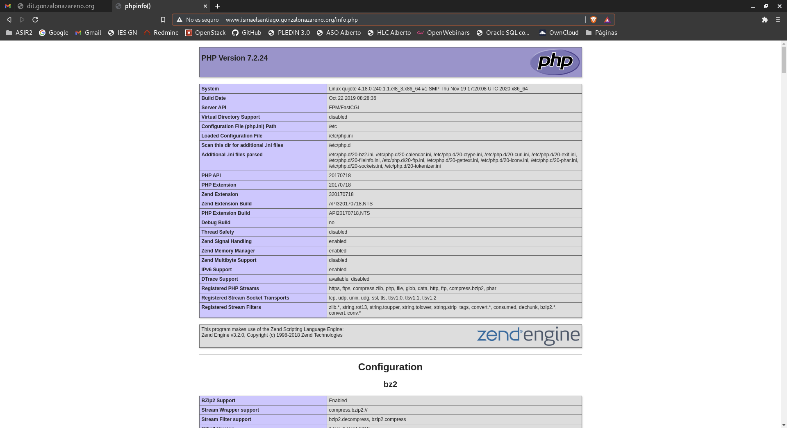

# OpenStack: Servidores Web, Base de Datos y DNS

## Servidor DNS

Para empezar vamos a instalar nuestro bind9 como servidor dns, lo instalamos en nuestra maquina freston.

~~~
sudo apt install bind9
~~~

Una vez instalado vamos a configurarlo, tendremos que acceder a /etc/bind/named.conf.local y tendremos que añadir las siguientes lineas.
~~~
acl interna { 10.0.0.0/24; localhost; };
acl externa { 172.22.0.0/16; 192.168.202.2; };

view externa {
        match-clients {172.22.0.0/16; 192.168.202.2;};
        allow-recursion { any; };

        include "/etc/bind/zones.rfc1918";
        include "/etc/bind/named.conf.default-zones";

        zone "ismaelsantiago.gonzalonazareno.org" {
          type master;
          file "/var/cache/bind/db.externa.ismaelsantiago.gonzalonazareno.org";
        };

        zone "22.172.in-addr.arpa" {
          type master;
          file "db.22.172";
        };
};

view interna {
        match-clients {10.0.1.0/24;};
        allow-recursion { any; };

        include "/etc/bind/zones.rfc1918";
        include "/etc/bind/named.conf.default-zones";

        zone "ismaelsantiago.gonzalonazareno.org" {
          type master;
          file "/var/cache/bind/db.interna.ismaelsantiago.gonzalonazareno.org";
        };

        zone "1.0.10.in-addr.arpa" {
          type master;
          file "/var/cache/bind/db.1.0.10";
        };

        zone "2.0.10.in-addr.arpa" {
          type master;
          file "/var/cache/bind/db.2.0.10";
        };
};

view DMZ {
        match-clients {10.0.2.0/24;};
        allow-recursion { any; };

        include "/etc/bind/zones.rfc1918";
        include "/etc/bind/named.conf.default-zones";

        zone "ismaelsantiago.gonzalonazareno.org" {
          type master;
          file "/var/cache/bind/db.dmz.ismaelsantiago.gonzalonazareno.org";
        };

        zone "1.0.10.in-addr.arpa" {
          type master;
          file "/var/cache/bind/db.1.0.10";
        };

        zone "2.0.10.in-addr.arpa" {
          type master;
          file "/var/cache/bind/db.2.0.10";
        };
};
~~~

Ahora tendremos que comentar la siguiente linea en el fichero de configuración /etc/bind/named.conf
~~~
//include "/etc/bind/named.conf.default-zones";
~~~

Vamos a introducir las siguientes lineas en el fichero de configuracion /etc/bind/named.conf.options
~~~
allow-query { 172.22.0.0/15;10.0.1.0/24;10.0.2.0/24;192.168.202.2; };
allow-recursion { any; };
allow-query-cache { any; };
~~~

Con esto empezariamos a definir cada zona, vamos a empezar con la zona externa para ello he creado el fichero que está ubicado en /var/cache/bind/db.externa.ismaelsantiago.gonzalonazareno.org y tendremos que definirlo de la siguiente manera.
~~~
$TTL    86400
@       IN      SOA     dulcinea.ismaelsantiago.gonzalonazareno.org. root.local$
                              1         ; Serial
                         604800         ; Refresh
                          86400         ; Retry
                        2419200         ; Expire
                          86400 )       ; Negative Cache TTL
;
@       IN      NS      dulcinea.ismaelsantiago.gonzalonazareno.org.

$ORIGIN ismaelsantiago.gonzalonazareno.org.

dulcinea        IN      A       172.22.200.162
www             IN      CNAME   dulcinea
~~~

Ahora pasamos a crear la zona interna ubicada y con el nombre en /var/cache/bind/db.interna.ismaelsantiago.gonzalonazareno.org
~~~
$TTL    86400
@       IN      SOA     freston.ismaelsantiago.gonzalonazareno.org. root.localh$
                              1         ; Serial
                         604800         ; Refresh
                          86400         ; Retry
                        2419200         ; Expire
                          86400 )       ; Negative Cache TTL
;
@       IN      NS      freston.ismaelsantiago.gonzalonazareno.org.

$ORIGIN ismaelsantiago.gonzalonazareno.org.

freston         IN      A       10.0.1.9
dulcinea        IN      A       10.0.1.10
sancho          IN      A       10.0.1.12
quijote         IN      A       10.0.2.7
www             IN      CNAME   quijote
bd              IN      CNAME   sancho
~~~

Por último terminamos de definir la DMZ que estará en la siguiente ruta /var/cache/bind/db.dmz.ismaelsantiago.gonzalonazareno.org
~~~
$TTL    86400
@       IN      SOA     freston.ismaelsantiago.gonzalonazareno.org. root.localh$
                              1         ; Serial
                         604800         ; Refresh
                          86400         ; Retry
                        2419200         ; Expire
                          86400 )       ; Negative Cache TTL
;
@       IN      NS      freston.ismaelsantiago.gonzalonazareno.org.

$ORIGIN ismaelsantiago.gonzalonazareno.org.

freston         IN      A       10.0.1.9
dulcinea        IN      A       10.0.2.11
sancho          IN      A       10.0.1.12
quijote         IN      A       10.0.2.7
www             IN      CNAME   quijote
bd              IN      CNAME   sancho
ldap            IN      CNAME   freston
~~~

Una vez terminado esto tendremos que definir la zona inversa para ello copiamos un fichero de ejemplo y lo llamamos como lo hemos definido en el fichero named.conf.local
~~~
sudo cp /etc/bind/db.127 /var/cache/bind/db.1.0.10

sudo cp /etc/bind/db.127 /var/cache/bind/db.2.0.10
~~~

Y las dos zonas inversas tienen que quedar de la siguiente manera.
~~~
$TTL    604800
@       IN      SOA     freston.ismaelsantiago.gonzalonazareno.org. root.localh$
                              1         ; Serial
                         604800         ; Refresh
                          86400         ; Retry
                        2419200         ; Expire
                         604800 )       ; Negative Cache TTL
;
@       IN      NS      freston.ismaelsantiago.gonzalonazareno.org.

$ORIGIN 1.0.10.in-addr.arpa.

10     IN      PTR     dulcinea.ismaelsantiago.gonzalonazareno.org.
9      IN      PTR     freston.ismaelsantiago.gonzalonazareno.org.
12     IN      PTR     sancho.ismaelsantiago.gonzalonazareno.org.
~~~

~~~
$TTL    604800
@       IN      SOA     freston.ismaelsantiago.gonzalonazareno.org. root.localhost. (
                              1         ; Serial
                         604800         ; Refresh
                          86400         ; Retry
                        2419200         ; Expire
                         604800 )       ; Negative Cache TTL
;
@       IN      NS      freston.ismaelsantiago.gonzalonazareno.org.

$ORIGIN 2.0.10.in-addr.arpa.

7     IN      PTR     quijote.ismaelsantiago.gonzalonazareno.org.
11    IN      PTR     dulcinea.ismaelsantiago.gonzalonazareno.org.
~~~

Ahora nos dirigimos a dulcinea y tendremos que poner la siguiente regla iptables para poder hacer las consultas DNS.
~~~
iptables -t nat -A PREROUTING -p udp --dport 53 -i eth0 -j DNAT --to 10.0.1.9:53
~~~

Para ir finalizando vamos a reiniciar bind9 en nuestra máquina freston.
~~~
systemctl restart bind9
~~~

Entraremos en los fichero de configuración de /etc/resolv.conf y modificamos poniendo las siguientes lineas.
~~~
nameserver 10.0.1.9     
search ismaelsantiago.gonzalonzareno.org
~~~

Para comprobar el funcionamiento he hecho unas preguntas dig desde Sancho.
~~~
ubuntu@sancho:~$ dig ns ismaelsantiago.gonzalonazareno.org

; <<>> DiG 9.16.1-Ubuntu <<>> ns ismaelsantiago.gonzalonazareno.org
;; global options: +cmd
;; Got answer:
;; ->>HEADER<<- opcode: QUERY, status: NOERROR, id: 64980
;; flags: qr aa rd ra; QUERY: 1, ANSWER: 1, AUTHORITY: 0, ADDITIONAL: 2

;; OPT PSEUDOSECTION:
; EDNS: version: 0, flags:; udp: 4096
; COOKIE: a97168e53f4d0804c2768ca55ff85417f4f8e85332e92d57 (good)
;; QUESTION SECTION:
;ismaelsantiago.gonzalonazareno.org. IN	NS

;; ANSWER SECTION:
ismaelsantiago.gonzalonazareno.org. 86400 IN NS	freston.ismaelsantiago.gonzalonazareno.org.

;; ADDITIONAL SECTION:
freston.ismaelsantiago.gonzalonazareno.org. 86400 IN A 10.0.1.9

;; Query time: 3 msec
;; SERVER: 10.0.1.9#53(10.0.1.9)
;; WHEN: Fri Jan 08 12:46:15 UTC 2021
;; MSG SIZE  rcvd: 129
ubuntu@sancho:~$ dig quijote.ismaelsantiago.gonzalonazareno.org

; <<>> DiG 9.16.1-Ubuntu <<>> quijote.ismaelsantiago.gonzalonazareno.org
;; global options: +cmd
;; Got answer:
;; ->>HEADER<<- opcode: QUERY, status: NOERROR, id: 13229
;; flags: qr aa rd ra; QUERY: 1, ANSWER: 1, AUTHORITY: 1, ADDITIONAL: 2

;; OPT PSEUDOSECTION:
; EDNS: version: 0, flags:; udp: 4096
; COOKIE: b058b6f2dae0e9854e1d3b055ff8547377a304abdef39834 (good)
;; QUESTION SECTION:
;quijote.ismaelsantiago.gonzalonazareno.org. IN A

;; ANSWER SECTION:
quijote.ismaelsantiago.gonzalonazareno.org. 86400 IN A 10.0.2.7

;; AUTHORITY SECTION:
ismaelsantiago.gonzalonazareno.org. 86400 IN NS	freston.ismaelsantiago.gonzalonazareno.org.

;; ADDITIONAL SECTION:
freston.ismaelsantiago.gonzalonazareno.org. 86400 IN A 10.0.1.9

;; Query time: 0 msec
;; SERVER: 10.0.1.9#53(10.0.1.9)
;; WHEN: Fri Jan 08 12:47:47 UTC 2021
;; MSG SIZE  rcvd: 153

ubuntu@sancho:~$ dig dulcinea.ismaelsantiago.gonzalonazareno.org

; <<>> DiG 9.16.1-Ubuntu <<>> dulcinea.ismaelsantiago.gonzalonazareno.org
;; global options: +cmd
;; Got answer:
;; ->>HEADER<<- opcode: QUERY, status: NOERROR, id: 18734
;; flags: qr aa rd ra; QUERY: 1, ANSWER: 1, AUTHORITY: 1, ADDITIONAL: 2

;; OPT PSEUDOSECTION:
; EDNS: version: 0, flags:; udp: 4096
; COOKIE: 26ad9153536a5fed1da6f8775ff8548ea4783ae20b4da943 (good)
;; QUESTION SECTION:
;dulcinea.ismaelsantiago.gonzalonazareno.org. IN	A

;; ANSWER SECTION:
dulcinea.ismaelsantiago.gonzalonazareno.org. 86400 IN A	10.0.1.10

;; AUTHORITY SECTION:
ismaelsantiago.gonzalonazareno.org. 86400 IN NS	freston.ismaelsantiago.gonzalonazareno.org.

;; ADDITIONAL SECTION:
freston.ismaelsantiago.gonzalonazareno.org. 86400 IN A 10.0.1.9

;; Query time: 3 msec
;; SERVER: 10.0.1.9#53(10.0.1.9)
;; WHEN: Fri Jan 08 12:48:14 UTC 2021
;; MSG SIZE  rcvd: 154
~~~

Consulta desde el exterior.
~~~
ismael@ismael:~$ dig ns dulcinea.ismaelsantiago.gonzalonazareno.org

; <<>> DiG 9.11.5-P4-5.1+deb10u2-Debian <<>> ns dulcinea.ismaelsantiago.gonzalonazareno.org
;; global options: +cmd
;; Got answer:
;; ->>HEADER<<- opcode: QUERY, status: NOERROR, id: 48665
;; flags: qr rd ra; QUERY: 1, ANSWER: 0, AUTHORITY: 1, ADDITIONAL: 1

;; OPT PSEUDOSECTION:
; EDNS: version: 0, flags:; udp: 4096
; COOKIE: 46ceec76db2b069011858d415ffebe1aacc96a9c84f13b49 (good)
;; QUESTION SECTION:
;dulcinea.ismaelsantiago.gonzalonazareno.org. IN	NS

;; AUTHORITY SECTION:
ismaelsantiago.gonzalonazareno.org. 10800 IN SOA dulcinea.ismaelsantiago.gonzalonazareno.org. root.ismaelsantiago.gonzalonazareno.org. 3 604800 86400 2419200 86400

;; Query time: 105 msec
;; SERVER: 192.168.202.2#53(192.168.202.2)
;; WHEN: mié ene 13 10:32:10 CET 2021
;; MSG SIZE  rcvd: 141

ismael@ismael:~$ dig dulcinea.ismaelsantiago.gonzalonazareno.org

; <<>> DiG 9.11.5-P4-5.1+deb10u2-Debian <<>> dulcinea.ismaelsantiago.gonzalonazareno.org
;; global options: +cmd
;; Got answer:
;; ->>HEADER<<- opcode: QUERY, status: NOERROR, id: 49222
;; flags: qr rd ra; QUERY: 1, ANSWER: 1, AUTHORITY: 1, ADDITIONAL: 1

;; OPT PSEUDOSECTION:
; EDNS: version: 0, flags:; udp: 4096
; COOKIE: 0cc301bc615cd7c86387dfe95ffebe35fc9862e2427964cc (good)
;; QUESTION SECTION:
;dulcinea.ismaelsantiago.gonzalonazareno.org. IN	A

;; ANSWER SECTION:
dulcinea.ismaelsantiago.gonzalonazareno.org. 86259 IN A	172.22.200.162

;; AUTHORITY SECTION:
ismaelsantiago.gonzalonazareno.org. 86236 IN NS	dulcinea.ismaelsantiago.gonzalonazareno.org.

;; Query time: 101 msec
;; SERVER: 192.168.202.2#53(192.168.202.2)
;; WHEN: mié ene 13 10:32:37 CET 2021
;; MSG SIZE  rcvd: 130
~~~

## Servidor Web

Vamos a instalar en Quijote un servidor web apache para ello vamos a empezar añadiendo una regla DNAT en dulcinea y la regla será la siguiente.
~~~
sudo iptables -t nat -A PREROUTING -p tcp --dport 80 -i eth0 -j DNAT --to 10.0.2.7:80

~~~

Vamos a instalar el servidor web apache en centos para ello tendremos que ejecutar el siguiente comando.
~~~
dnf install httpd php php-fpm -y
~~~

Creamos el enlace simbólico en el inicio de httpd y php.
~~~
[root@quijote ~]# systemctl start httpd php-fpm
[root@quijote ~]# systemctl enable httpd php-fpm
~~~

Y para que todo funcione correctamente tendremos que habilitar los puertos en CentOS que por defecto vienen cerrados.
~~~
[root@quijote ~]# firewall-cmd --permanent --add-port=80/tcp
success
[root@quijote ~]# firewall-cmd --permanent --add-port=443/tcp
success
[root@quijote ~]# firewall-cmd --reload
success
~~~

Ahora pasamos a configurar el fichero httpd.conf que está en la siguiente ruta /etc/httpd/conf/httpd.conf y tendremos que modificar la siguiente directiva.
~~~
IncludeOptional conf.d/*.conf
~~~

Tendremos que cambiarla y dejarla con sites-enabled.
~~~
IncludeOptional sites-enabled/*.conf
~~~

Ahora configuramos el nuestro sitio que en mi caso se llama ismaelsantiago.conf y en mi caso el fichero quedaria de la siguiente forma configurando php en el sitio.
~~~
<VirtualHost *:80>

    ServerName www.ismaelsantiago.gonzalonazareno.org
    DocumentRoot /var/www/iesgn

    <Proxy "unix:/run/php-fpm/www.sock|fcgi://php-fpm">
        ProxySet disablereuse=off
    </Proxy>

    <FilesMatch \.php$>
        SetHandler proxy:fcgi://php-fpm
    </FilesMatch>

    ErrorLog /var/www/iesgn/log/error.log
    CustomLog /var/www/iesgn/log/requests.log combined

</VirtualHost>
~~~

Creamos el enlace simbólico del sitio.
~~~
ln -s /etc/httpd/sites-available/ismaelsantiago.conf /etc/httpd/sites-enabled/
~~~

Reiniciamos httpd.
~~~
systemctl restart httpd
~~~

Y por último creamos el fichero php en nuestra ruta /var/www/iesgn.
~~~
[root@quijote ~]# echo "<?php phpinfo(); ?>" > /var/www/iesgn/info.php
~~~

Y ahora comprobamos que funciona todo correcto.

## Servidor de Base de Datos

Vamos a montar un servidor de base de datos en Sancho para ello tendremos que instalar primero mariadb.
~~~
apt install mariadb-server mariadb-client -y
~~~

Vamos a hacer una instalación segura con el comando mysql_secure_installation.
~~~
root@sancho:/home/ubuntu# mysql_secure_installation

NOTE: RUNNING ALL PARTS OF THIS SCRIPT IS RECOMMENDED FOR ALL MariaDB
      SERVERS IN PRODUCTION USE!  PLEASE READ EACH STEP CAREFULLY!

In order to log into MariaDB to secure it, we'll need the current
password for the root user.  If you've just installed MariaDB, and
you haven't set the root password yet, the password will be blank,
so you should just press enter here.

Enter current password for root (enter for none):
OK, successfully used password, moving on...

Setting the root password ensures that nobody can log into the MariaDB
root user without the proper authorisation.

Set root password? [Y/n] y
New password:
Re-enter new password:
Password updated successfully!
Reloading privilege tables..
 ... Success!

By default, a MariaDB installation has an anonymous user, allowing anyone
to log into MariaDB without having to have a user account created for
them.  This is intended only for testing, and to make the installation
go a bit smoother.  You should remove them before moving into a
production environment.

Remove anonymous users? [Y/n] y
 ... Success!

Normally, root should only be allowed to connect from 'localhost'.  This
ensures that someone cannot guess at the root password from the network.

Disallow root login remotely? [Y/n] y
 ... Success!

By default, MariaDB comes with a database named 'test' that anyone can
access.  This is also intended only for testing, and should be removed
before moving into a production environment.

Remove test database and access to it? [Y/n] y
 - Dropping test database...
 ... Success!
 - Removing privileges on test database...
 ... Success!

Reloading the privilege tables will ensure that all changes made so far
will take effect immediately.

Reload privilege tables now? [Y/n] y
 ... Success!

Cleaning up...

All done!  If you've completed all of the above steps, your MariaDB
installation should now be secure.

Thanks for using MariaDB!
root@sancho:/home/ubuntu#
~~~

Ahora vamos a iniciar la base de datos y vamos a crearnos el usuario con los privilegios.
~~~
root@sancho:/home/ubuntu# mysql -u root -p
Enter password:
Welcome to the MariaDB monitor.  Commands end with ; or \g.
Your MariaDB connection id is 57
Server version: 10.3.25-MariaDB-0ubuntu0.20.04.1 Ubuntu 20.04

Copyright (c) 2000, 2018, Oracle, MariaDB Corporation Ab and others.

Type 'help;' or '\h' for help. Type '\c' to clear the current input statement.

MariaDB [(none)]> CREATE USER 'ismael'@'10.0.2.*' IDENTIFIED BY 'ismael';
Query OK, 0 rows affected (0.001 sec)

MariaDB [(none)]> GRANT ALL PRIVILEGES ON *.* TO 'ismael'@'10.0.2.*';
Query OK, 0 rows affected (0.001 sec)

MariaDB [(none)]>
~~~

Configuramos ahora el acceso remotamente para ello nos dirigimos al fichero de configuración /etc/mysql/mariadb.conf.d/50-server.cnf y tendremos que dejar la linea de bind-address de la siguiente forma.
~~~
bind-address = 0.0.0.0
~~~

Con esto ya podremos acceder remotamente desde nuestra maquina cliente quijote, para comprobarlo tendremos que instalar primero el mysql.
~~~
dnf install mysql-server -y
~~~

Y una vez instalado para acceder tendremos que utilizar el siguiente comando.
~~~
mysql -h 10.0.1.12 -u ismael -p
~~~
