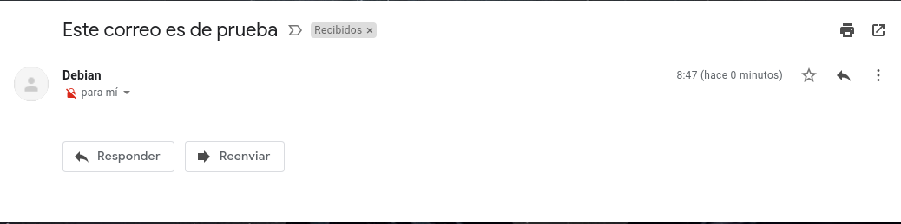
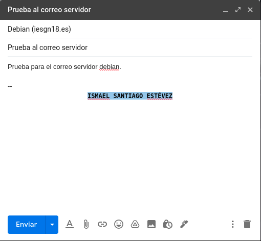

# Servidor de Correo

Vamos a configurar en nuestra máquina de OVH el servidor de correo para tu dominio iesgn18.es. El nombre del servidor de correo será mail.iesgn18.es

1. Vamos a documentar una prueba de funcionamiento, donde enviemos desde tu servidor local al exterior. Mostraremos el log donde se vea el envío. Mostraremos el correo que has recibido. Muestra el registro SPF.

Para empezar vamos a instalar postfix y mailx en nuestro servidor para ello lo instalamos con el comando.
~~~
apt install postfix bsd-mailx
~~~

Ahora vamos a configurar un registro SPF que sirve para que gmail en este caso no nos marque como spam el mensaje que vamos a enviar desde nuestra máquina.

Vamos a enviar un correo de prueba para ver que se envia correctamente para ello nos dirigimos a la terminal y escribimos lo siguiente.
~~~
debian@ise:~$ mail ismaelse95@gmail.com
Subject: Este correo es de prueba
Cc:
~~~

Nos dirigimos al correo y podemos ver que se ha recibido correctamente.

Y podemos comprobar también mostrando el correo original dentro de gmail que no se ha marcado como spam ni nada.
~~~
Delivered-To: ismaelse95@gmail.com
Received: by 2002:a9d:128e:0:0:0:0:0 with SMTP id g14csp1729676otg;
        Thu, 28 Jan 2021 23:47:49 -0800 (PST)
X-Google-Smtp-Source: ABdhPJwnvAlsF3aXvWAdAWxl0Es3xl2kITkjRlAflzJOQQ06Wk2RFb+f7pDHD1hthpMfBx24Xk8l
X-Received: by 2002:a7b:c20b:: with SMTP id x11mr2455999wmi.107.1611906469407;
        Thu, 28 Jan 2021 23:47:49 -0800 (PST)
ARC-Seal: i=1; a=rsa-sha256; t=1611906469; cv=none;
        d=google.com; s=arc-20160816;
        b=NzJgcu79xGbxrR5lOmmd6MG501cjtTvGg1INIvdZMKZ8Ykfye7UokDnYGNdn7UfBpt
         d8ZjHmMb4VWev0UgcHurOi7Y0LtujtqY0tWr7IBWjZDbdSKOXqDj039ejypz5Wug7po/
         nVsHHr2p2IFL9sMBaiUEW4uYsJNN0g7UFbwy64sSKw2ez4mjobP7COVehFBaVPDUhghT
         ftigeS7eW6fYPWBizkxy5z4QCCtSImgMogocQA/T9yb52gfv/bL6Rlnvtwd8+oSlR4mM
         OJ/WaktbxpLaJs5LiGsz7BqZSu6IXR7mMyiGbAnbKec3QUFkIr5w7UIoRUwpt69B1dhT
         ea4w==
ARC-Message-Signature: i=1; a=rsa-sha256; c=relaxed/relaxed; d=google.com; s=arc-20160816;
        h=from:date:message-id:content-transfer-encoding:mime-version:subject
         :to;
        bh=47DEQpj8HBSa+/TImW+5JCeuQeRkm5NMpJWZG3hSuFU=;
        b=fXf3QeUd+xyf03gWcO8BGmoRKxsSt75h5SLvpWUfQ/F5wkMqX8d6ZAmiH0xmnCrDjQ
         QoR8DVelx0rCFCAksyHYXAHH8cLNQObYVYB2AaPZi0aLKKt6Rx6G213Iu6QiBt3Zoq6x
         9fIsk5cWxIXIbh0bHJJiQY+VejfqQv6NsnBtM1f3/G6qLMUGuDu/mq8Ye9sg69/b4hTU
         v60OKKGbQTfnsTKHVJ45OvEek7YbqrzRXLWAumPN5jXOQbDegg+gdeIbCxVVDYBK4KkZ
         P31X70vQe3I2Nktyyq8hlditrz81zgoc02VZSUDY/qRndual5vka++3Decnvgemdb4lD
         HhHw==
ARC-Authentication-Results: i=1; mx.google.com;
       spf=pass (google.com: domain of debian@iesgn18.es designates 51.210.181.187 as permitted sender) smtp.mailfrom=debian@iesgn18.es
Return-Path: <debian@iesgn18.es>
Received: from ise.iesgn18.es (vps-ba372b0e.vps.ovh.net. [51.210.181.187])
        by mx.google.com with ESMTP id g16si6298392wmq.40.2021.01.28.23.47.49
        for <ismaelse95@gmail.com>;
        Thu, 28 Jan 2021 23:47:49 -0800 (PST)
Received-SPF: pass (google.com: domain of debian@iesgn18.es designates 51.210.181.187 as permitted sender) client-ip=51.210.181.187;
Authentication-Results: mx.google.com;
       spf=pass (google.com: domain of debian@iesgn18.es designates 51.210.181.187 as permitted sender) smtp.mailfrom=debian@iesgn18.es
Received: by ise.iesgn18.es (Postfix, from userid 1000) id ABB7D4109F; Fri, 29 Jan 2021 07:47:48 +0000 (UTC)
To: ismaelse95@gmail.com
Subject: Este correo es de prueba
MIME-Version: 1.0
Content-Type: text/plain; charset="UTF-8"
Content-Transfer-Encoding: 8bit
Message-Id: <20210129074748.ABB7D4109F@ise.iesgn18.es>
Date: Fri, 29 Jan 2021 07:47:48 +0000 (UTC)
From: Debian <debian@iesgn18.es>
~~~

También vamos a mostrar el log de nuestro servidor para ver que se envió, el fichero log es `/var/log/mail.log`.
~~~
Jan 29 07:47:48 ise postfix/pickup[2224]: ABB7D4109F: uid=1000 from=<debian>
Jan 29 07:47:48 ise postfix/cleanup[3017]: ABB7D4109F: message-id=<20210129074748.ABB7D4109F@ise.iesgn18.es>
Jan 29 07:47:48 ise postfix/qmgr[13405]: ABB7D4109F: from=<debian@iesgn18.es>, size=405, nrcpt=1 (queue active)
Jan 29 07:47:49 ise postfix/smtp[3019]: ABB7D4109F: to=<ismaelse95@gmail.com>, relay=gmail-smtp-in.l.google.com[173.194.76.26]:25, delay=0.76, delays=0.01/0.01/0.37/0.37, dsn=2.0.0, status=sent (250 2.0.0 OK  1611906469 g16si6298392wmq.40 - gsmtp)
Jan 29 07:47:49 ise postfix/qmgr[13405]: ABB7D4109F: removed
~~~

2. Vamos a enviar un correo desde nuestro correo de gmail y vamos a comprobar mediante log y desde mail que el mensaje nos llega.

He configurado el registro MX y lo tengo configurado de la siguiente forma.

Ahora vamos a enviar un correo desde gmail a nuestro servidor, el correo de nuestro servidor es debian@iesgn18.es.

Antes de entrar en el mail vamos a ver el log.
~~~
Jan 29 08:02:05 ise postfix/smtpd[3203]: connect from mail-ot1-f47.google.com[209.85.210.47]
Jan 29 08:02:05 ise postfix/smtpd[3203]: C0CE04109D: client=mail-ot1-f47.google.com[209.85.210.47]
Jan 29 08:02:05 ise postfix/cleanup[3213]: C0CE04109D: message-id=<CACvLCHoEZj=HBWCu5FL6gFAMOoGJoer0wtjjcC6s8miwxK9dXA@mail.gmail.com>
Jan 29 08:02:05 ise postfix/qmgr[13405]: C0CE04109D: from=<ismaelse95@gmail.com>, size=3182, nrcpt=1 (queue active)
Jan 29 08:02:05 ise postfix/local[3214]: C0CE04109D: to=<debian@iesgn18.es>, relay=local, delay=0.02, delays=0.01/0.01/0/0, dsn=2.0.0, status=sent (delivered to mailbox)
Jan 29 08:02:05 ise postfix/qmgr[13405]: C0CE04109D: removed
Jan 29 08:02:06 ise postfix/smtpd[3203]: disconnect from mail-ot1-f47.google.com[209.85.210.47] ehlo=2 starttls=1 mail=1 rcpt=1 bdat=1 quit=1 commands=7
You have new mail in /var/mail/debian
~~~

Entramos en el correo del servidor y vemos el mensaje.
~~~
debian@ise:~$ mail
Mail version 8.1.2 01/15/2001.  Type ? for help.
"/var/mail/debian": 1 message 1 new
>N  1 ismaelse95@gmail.  Fri Jan 29 08:02   65/3276  Prueba al correo servidor
~~~

~~~
Message 1:
From ismaelse95@gmail.com  Fri Jan 29 08:02:05 2021
X-Original-To: debian@iesgn18.es
DKIM-Signature: v=1; a=rsa-sha256; c=relaxed/relaxed;
        d=gmail.com; s=20161025;
        h=mime-version:from:date:message-id:subject:to;
        bh=bzrY30sgG+jGFTfHLPRw28ZP5ki0Bt6SUmRBIf1It/w=;
        b=QNhEpZIbELSwZUQ02KauMR+nGxugKEtEqYm17TMa+QJW5sqtW6P3ubiJEQfwBFJ1pn
         bDE5E3J3XkFHVBlaP3HnJFmx86sNizHkHW0PC3v9VRkXK2uhrEJ9ebREoTojGCi2CqOW
         Pv/NMP39JCJyzzMMPOvtEtgvKftcNpSDbdE75OSXwpFHNAV9DvBwP6S7kcUKJqdlfzO2
         ziPW+xXmrL8jBFFK3mn5nc/PWCsFlhKymgY4zoU7xTkKyv7IcZpr907bPpkk83XFgCNS
         GlMJagcSY4dc491eieeT8cpEjOYOCuqf5NM5JkUjOmUkcdEvr8GcXkqT2qJgsSgBc8Qa
         mAKg==
X-Google-DKIM-Signature: v=1; a=rsa-sha256; c=relaxed/relaxed;
        d=1e100.net; s=20161025;
        h=x-gm-message-state:mime-version:from:date:message-id:subject:to;
        bh=bzrY30sgG+jGFTfHLPRw28ZP5ki0Bt6SUmRBIf1It/w=;
        b=oWJKnvpqZiDa3HK/Ad92wg6npQd3BT8SVSo+1hdEZbJmgyouMMEOLBoLS0ODud1d4N
         TZHuD13HOOKf0yYpeyB69bUc/Lwe0fCPeZfxz3lzaWnUpcMu3J2eQGJdEWdcRUm7x9l2
         eBPzBK4RICE/lEXt6GS7ZIl/UNnOULr1zPPoiRY4xLihUSAoffNw0LVCJ7wR0LK90w/k
         attCBa9PQlElWOlmWY9x9ulvVGq/u9WwYfOwv6TEICinvwzEf1OlkMIEtOGrG/Vr0lhK
         gLLi53oEQNyPS+a6iSTcmFtu5Dm/3N6wCu9FWTRpBMvtYergUxKtDABIJS33o5p0zm4+
         I5/Q==
X-Gm-Message-State: AOAM532DNEY9+2qNN11jCzuowRIxTwGJaN7btdZOLmNiwtOWQHawf565
        n2TvDW/vqEsMUt+qVtiI5CNtHvRYfEWIOrRs3BsMhjxN1T6meQ==
X-Google-Smtp-Source: ABdhPJxFkHcujAttqa/roDu8HZUGt1E9yYA5wrbfKUfi2aaoK9s7Jl9A/c8yMhYaXBs2as2OixhyrmUfsR95VIQMFLw=
X-Received: by 2002:a9d:6b02:: with SMTP id g2mr2135811otp.19.1611907324054;
 Fri, 29 Jan 2021 00:02:04 -0800 (PST)
MIME-Version: 1.0
From: =?UTF-8?Q?Ismael_Santiago_Est=C3=A9vez?= <ismaelse95@gmail.com>
Date: Fri, 29 Jan 2021 09:01:53 +0100
Subject: Prueba al correo servidor
To: Debian <debian@iesgn18.es>
~~~
