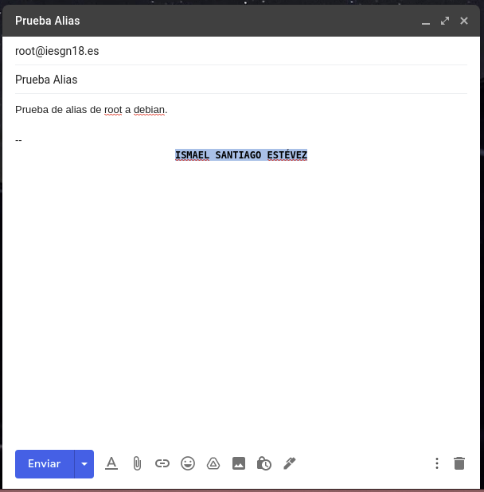
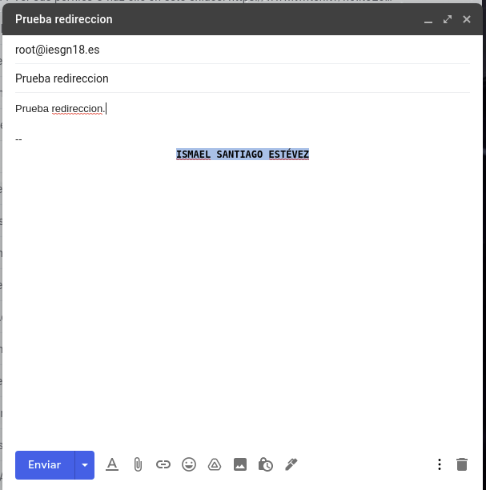
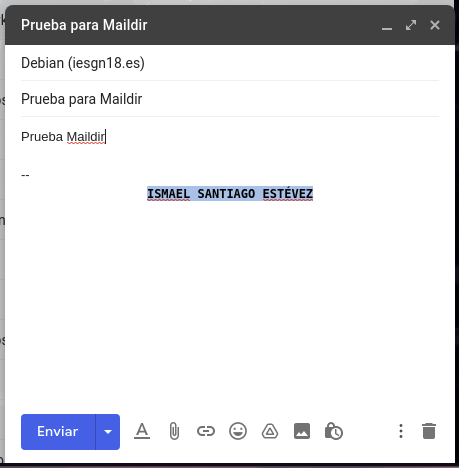
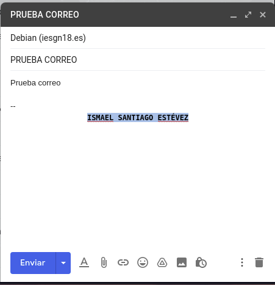
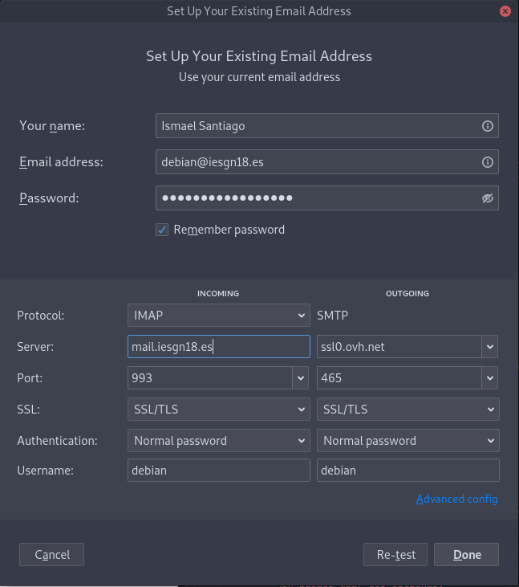
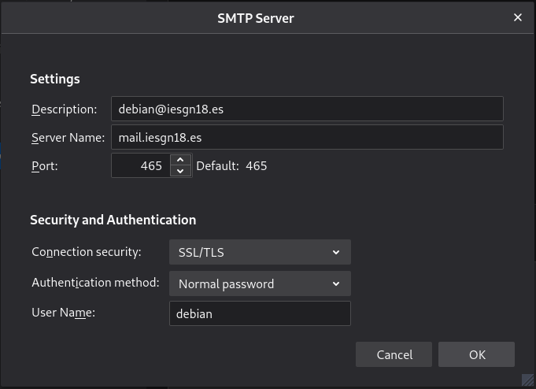
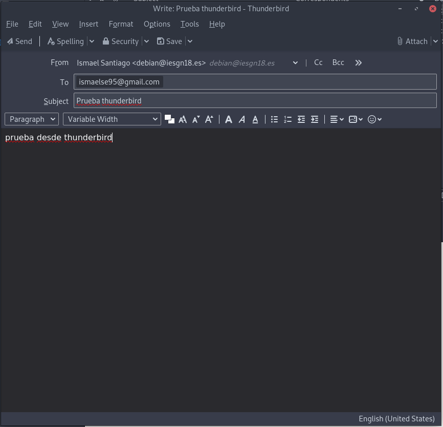

# Servidor de Correo

Vamos a configurar en nuestra máquina de OVH el servidor de correo para mi dominio iesgn18.es. El nombre del servidor de correo será mail.iesgn18.es

## Tarea 1: Vamos a documentar una prueba de funcionamiento, donde enviemos desde nuestro servidor local al exterior. Mostraremos el log donde se vea el envío. Mostraremos el correo que he recibid y el registro SPF.

Para empezar vamos a instalar postfix y mailx en nuestro servidor para ello lo instalamos con el comando.
~~~
apt install postfix bsd-mailx
~~~

Ahora vamos a configurar un registro SPF que sirve para que gmail en este caso no nos marque como spam el mensaje que vamos a enviar desde nuestra máquina.

Vamos a enviar un correo de prueba para ver que se envia correctamente para ello nos dirigimos a la terminal y escribimos lo siguiente.
~~~
debian@ise:~$ mail ismaelse95@gmail.com
Subject: Este correo es de prueba
Cc:
~~~

Nos dirigimos al correo y podemos ver que se ha recibido correctamente.

Y podemos comprobar también mostrando el correo original dentro de gmail que no se ha marcado como spam ni nada.
~~~
Delivered-To: ismaelse95@gmail.com
Received: by 2002:a9d:128e:0:0:0:0:0 with SMTP id g14csp1729676otg;
        Thu, 28 Jan 2021 23:47:49 -0800 (PST)
X-Google-Smtp-Source: ABdhPJwnvAlsF3aXvWAdAWxl0Es3xl2kITkjRlAflzJOQQ06Wk2RFb+f7pDHD1hthpMfBx24Xk8l
X-Received: by 2002:a7b:c20b:: with SMTP id x11mr2455999wmi.107.1611906469407;
        Thu, 28 Jan 2021 23:47:49 -0800 (PST)
ARC-Seal: i=1; a=rsa-sha256; t=1611906469; cv=none;
        d=google.com; s=arc-20160816;
        b=NzJgcu79xGbxrR5lOmmd6MG501cjtTvGg1INIvdZMKZ8Ykfye7UokDnYGNdn7UfBpt
         d8ZjHmMb4VWev0UgcHurOi7Y0LtujtqY0tWr7IBWjZDbdSKOXqDj039ejypz5Wug7po/
         nVsHHr2p2IFL9sMBaiUEW4uYsJNN0g7UFbwy64sSKw2ez4mjobP7COVehFBaVPDUhghT
         ftigeS7eW6fYPWBizkxy5z4QCCtSImgMogocQA/T9yb52gfv/bL6Rlnvtwd8+oSlR4mM
         OJ/WaktbxpLaJs5LiGsz7BqZSu6IXR7mMyiGbAnbKec3QUFkIr5w7UIoRUwpt69B1dhT
         ea4w==
ARC-Message-Signature: i=1; a=rsa-sha256; c=relaxed/relaxed; d=google.com; s=arc-20160816;
        h=from:date:message-id:content-transfer-encoding:mime-version:subject
         :to;
        bh=47DEQpj8HBSa+/TImW+5JCeuQeRkm5NMpJWZG3hSuFU=;
        b=fXf3QeUd+xyf03gWcO8BGmoRKxsSt75h5SLvpWUfQ/F5wkMqX8d6ZAmiH0xmnCrDjQ
         QoR8DVelx0rCFCAksyHYXAHH8cLNQObYVYB2AaPZi0aLKKt6Rx6G213Iu6QiBt3Zoq6x
         9fIsk5cWxIXIbh0bHJJiQY+VejfqQv6NsnBtM1f3/G6qLMUGuDu/mq8Ye9sg69/b4hTU
         v60OKKGbQTfnsTKHVJ45OvEek7YbqrzRXLWAumPN5jXOQbDegg+gdeIbCxVVDYBK4KkZ
         P31X70vQe3I2Nktyyq8hlditrz81zgoc02VZSUDY/qRndual5vka++3Decnvgemdb4lD
         HhHw==
ARC-Authentication-Results: i=1; mx.google.com;
       spf=pass (google.com: domain of debian@iesgn18.es designates 51.210.181.187 as permitted sender) smtp.mailfrom=debian@iesgn18.es
Return-Path: <debian@iesgn18.es>
Received: from ise.iesgn18.es (vps-ba372b0e.vps.ovh.net. [51.210.181.187])
        by mx.google.com with ESMTP id g16si6298392wmq.40.2021.01.28.23.47.49
        for <ismaelse95@gmail.com>;
        Thu, 28 Jan 2021 23:47:49 -0800 (PST)
Received-SPF: pass (google.com: domain of debian@iesgn18.es designates 51.210.181.187 as permitted sender) client-ip=51.210.181.187;
Authentication-Results: mx.google.com;
       spf=pass (google.com: domain of debian@iesgn18.es designates 51.210.181.187 as permitted sender) smtp.mailfrom=debian@iesgn18.es
Received: by ise.iesgn18.es (Postfix, from userid 1000) id ABB7D4109F; Fri, 29 Jan 2021 07:47:48 +0000 (UTC)
To: ismaelse95@gmail.com
Subject: Este correo es de prueba
MIME-Version: 1.0
Content-Type: text/plain; charset="UTF-8"
Content-Transfer-Encoding: 8bit
Message-Id: <20210129074748.ABB7D4109F@ise.iesgn18.es>
Date: Fri, 29 Jan 2021 07:47:48 +0000 (UTC)
From: Debian <debian@iesgn18.es>
~~~

También vamos a mostrar el log de nuestro servidor para ver que se envió, el fichero log es `/var/log/mail.log`.
~~~
Jan 29 07:47:48 ise postfix/pickup[2224]: ABB7D4109F: uid=1000 from=<debian>
Jan 29 07:47:48 ise postfix/cleanup[3017]: ABB7D4109F: message-id=<20210129074748.ABB7D4109F@ise.iesgn18.es>
Jan 29 07:47:48 ise postfix/qmgr[13405]: ABB7D4109F: from=<debian@iesgn18.es>, size=405, nrcpt=1 (queue active)
Jan 29 07:47:49 ise postfix/smtp[3019]: ABB7D4109F: to=<ismaelse95@gmail.com>, relay=gmail-smtp-in.l.google.com[173.194.76.26]:25, delay=0.76, delays=0.01/0.01/0.37/0.37, dsn=2.0.0, status=sent (250 2.0.0 OK  1611906469 g16si6298392wmq.40 - gsmtp)
Jan 29 07:47:49 ise postfix/qmgr[13405]: ABB7D4109F: removed
~~~

## Tarea 2: Documentación de prueba de funcionamiento, donde vamos a enviar un correo desde el exterior (gmail, hotmail,…) a nuestro servidor local. Mostraremos el log donde se vea el envío. Mostraremos cómo he leído el correo y el registro MX de nuestro dominio.

He configurado el registro MX y lo tengo configurado de la siguiente forma.

Ahora vamos a enviar un correo desde gmail a nuestro servidor, el correo de nuestro servidor es debian@iesgn18.es.

Antes de entrar en el mail vamos a ver el log.
~~~
Jan 29 08:02:05 ise postfix/smtpd[3203]: connect from mail-ot1-f47.google.com[209.85.210.47]
Jan 29 08:02:05 ise postfix/smtpd[3203]: C0CE04109D: client=mail-ot1-f47.google.com[209.85.210.47]
Jan 29 08:02:05 ise postfix/cleanup[3213]: C0CE04109D: message-id=<CACvLCHoEZj=HBWCu5FL6gFAMOoGJoer0wtjjcC6s8miwxK9dXA@mail.gmail.com>
Jan 29 08:02:05 ise postfix/qmgr[13405]: C0CE04109D: from=<ismaelse95@gmail.com>, size=3182, nrcpt=1 (queue active)
Jan 29 08:02:05 ise postfix/local[3214]: C0CE04109D: to=<debian@iesgn18.es>, relay=local, delay=0.02, delays=0.01/0.01/0/0, dsn=2.0.0, status=sent (delivered to mailbox)
Jan 29 08:02:05 ise postfix/qmgr[13405]: C0CE04109D: removed
Jan 29 08:02:06 ise postfix/smtpd[3203]: disconnect from mail-ot1-f47.google.com[209.85.210.47] ehlo=2 starttls=1 mail=1 rcpt=1 bdat=1 quit=1 commands=7
You have new mail in /var/mail/debian
~~~

Entramos en el correo del servidor y vemos el mensaje.
~~~
debian@ise:~$ mail
Mail version 8.1.2 01/15/2001.  Type ? for help.
"/var/mail/debian": 1 message 1 new
>N  1 ismaelse95@gmail.  Fri Jan 29 08:02   65/3276  Prueba al correo servidor
~~~

~~~
Message 1:
From ismaelse95@gmail.com  Fri Jan 29 08:02:05 2021
X-Original-To: debian@iesgn18.es
DKIM-Signature: v=1; a=rsa-sha256; c=relaxed/relaxed;
        d=gmail.com; s=20161025;
        h=mime-version:from:date:message-id:subject:to;
        bh=bzrY30sgG+jGFTfHLPRw28ZP5ki0Bt6SUmRBIf1It/w=;
        b=QNhEpZIbELSwZUQ02KauMR+nGxugKEtEqYm17TMa+QJW5sqtW6P3ubiJEQfwBFJ1pn
         bDE5E3J3XkFHVBlaP3HnJFmx86sNizHkHW0PC3v9VRkXK2uhrEJ9ebREoTojGCi2CqOW
         Pv/NMP39JCJyzzMMPOvtEtgvKftcNpSDbdE75OSXwpFHNAV9DvBwP6S7kcUKJqdlfzO2
         ziPW+xXmrL8jBFFK3mn5nc/PWCsFlhKymgY4zoU7xTkKyv7IcZpr907bPpkk83XFgCNS
         GlMJagcSY4dc491eieeT8cpEjOYOCuqf5NM5JkUjOmUkcdEvr8GcXkqT2qJgsSgBc8Qa
         mAKg==
X-Google-DKIM-Signature: v=1; a=rsa-sha256; c=relaxed/relaxed;
        d=1e100.net; s=20161025;
        h=x-gm-message-state:mime-version:from:date:message-id:subject:to;
        bh=bzrY30sgG+jGFTfHLPRw28ZP5ki0Bt6SUmRBIf1It/w=;
        b=oWJKnvpqZiDa3HK/Ad92wg6npQd3BT8SVSo+1hdEZbJmgyouMMEOLBoLS0ODud1d4N
         TZHuD13HOOKf0yYpeyB69bUc/Lwe0fCPeZfxz3lzaWnUpcMu3J2eQGJdEWdcRUm7x9l2
         eBPzBK4RICE/lEXt6GS7ZIl/UNnOULr1zPPoiRY4xLihUSAoffNw0LVCJ7wR0LK90w/k
         attCBa9PQlElWOlmWY9x9ulvVGq/u9WwYfOwv6TEICinvwzEf1OlkMIEtOGrG/Vr0lhK
         gLLi53oEQNyPS+a6iSTcmFtu5Dm/3N6wCu9FWTRpBMvtYergUxKtDABIJS33o5p0zm4+
         I5/Q==
X-Gm-Message-State: AOAM532DNEY9+2qNN11jCzuowRIxTwGJaN7btdZOLmNiwtOWQHawf565
        n2TvDW/vqEsMUt+qVtiI5CNtHvRYfEWIOrRs3BsMhjxN1T6meQ==
X-Google-Smtp-Source: ABdhPJxFkHcujAttqa/roDu8HZUGt1E9yYA5wrbfKUfi2aaoK9s7Jl9A/c8yMhYaXBs2as2OixhyrmUfsR95VIQMFLw=
X-Received: by 2002:a9d:6b02:: with SMTP id g2mr2135811otp.19.1611907324054;
 Fri, 29 Jan 2021 00:02:04 -0800 (PST)
MIME-Version: 1.0
From: =?UTF-8?Q?Ismael_Santiago_Est=C3=A9vez?= <ismaelse95@gmail.com>
Date: Fri, 29 Jan 2021 09:01:53 +0100
Subject: Prueba al correo servidor
To: Debian <debian@iesgn18.es>
~~~

## Tarea 3: Uso de alias y redirecciones.

Vamos a empezar configurando un nuevo Alias, tendremos que configurar que los correos que lleguen a nuestro usuario root nos lleguen a debian. Para ello tendremos que entrar en el fichero `/etc/aliases` y tendremos que dejar el fichero de la siguiente manera.
~~~
# /etc/aliases
root: debian
~~~

Ahora para que se apliquen los cambios vamos a ejecutar el comando.
~~~
debian@ise:~$ sudo newaliases
~~~

Probamos a enviar un correo a root.

Y ahora comprobamos que nos ha llegado a la bandeja de entrada de Debian.
~~~
debian@ise:~$ mail
Mail version 8.1.2 01/15/2001.  Type ? for help.
"/var/mail/debian": 1 message 1 new
>N  1 ismaelse95@gmail.  Thu Feb 11 08:33   65/3232  Prueba Alias
&
~~~

Con esto ya tendriamos creado el Alias ahora vamos a redireccionar un correo.
Para ello tendremos que crear el fichero `~/.forward` en el usuario debian y pondré un correo secundario para que me redirreccione a ese correo.
~~~
debian@ise:~$ nano .forward
ismalese1995@gmail.com
~~~

Ahora enviamos un correo a la cuenta root y tendria que llegar al correo que he puesto en el fichero forward.

## Tarea 8: Configuración del buzón de los usuarios de tipo Maildir. Envío de un correo a mi usuario y comprobación que el correo se ha guardado en el buzón Maildir del usuario del sistema correspondiente.

Para configurar el buzón de Maildir tendremos primero que entrar en la configuración de postfix `/etc/postfix/main.cf`e introducir la siguiente linea.
~~~
home_mailbox = Maildir/
~~~

Reiniciamos postfix.
~~~
sudo systemctl restart postfix
~~~

Ahora enviamos un correo para probar que todo funciona bien y efectivamente hemos creado el buzon para Maildir.

Como podemos comprobar al enviar el correo nos creara en el usuario Debian la siguiente carpeta.
~~~
debian@ise:~$ ls
Maildir  mbox
debian@ise:~$ ls Maildir/
cur  new  tmp
~~~

Y comprobamos que nos ha llegado correctamente el correo con el cliente mutt.

~~~
Date: Thu, 11 Feb 2021 18:56:16 +0100
From: Ismael Santiago Estévez <ismaelse95@gmail.com>
To: Debian <debian@iesgn18.es>
Subject: Prueba para Maildir

Prueba Maildir

--
*ISMAEL SANTIAGO ESTÉVEZ*
~~~

## Tarea 9: Instalación y configuración de dovecot para ofrecer el protocolo IMAP. Configuración de dovecot de manera adecuada para ofrecer autentificación y cifrado.

Para realizar el cifrado de la comunicación crea un certificado en LetsEncrypt para el dominio mail.iesgnXX.es. Recuerda que para el ofrecer el cifrado tiene varias soluciones:

- IMAP con STARTTLS: STARTTLS transforma una conexión insegura en una segura mediante el uso de SSL/TLS. Por lo tanto usando el mismo puerto 143/tcp tenemos cifrada la comunicación.
- IMAPS: Versión segura del protocolo IMAP que usa el puerto 993/tcp.
- Ofrecer las dos posibilidades.

Elige una de las opciones anterior para realizar el cifrado. Y muestra la configuración de un cliente de correo (evolution, thunderbird, …) y muestra como puedes leer los correos enviado a tu usuario.

Para instalar y configurar dovecot lo primero que tendremos que hacer es instalar el paquete `devecod-imapd`.
~~~
debian@ise:~/.ssh$ sudo apt-get install dovecot-imapd
~~~

Ahora pasamos a instalar certbot para certicicar realizando los siguientes pasos.
~~~
debian@ise:~/.ssh$ sudo apt install snapd
debian@ise:~/.ssh$ sudo snap install core
debian@ise:~$ sudo snap refresh core
debian@ise:~$ sudo snap install --classic certbot
~~~

Generamos el certificado.
~~~
debian@ise:~$ sudo certbot certonly --standalone
~~~

Cuando tengamos nuestro certificado vamos a configurar dovecot. Lo primero que tenemos que hacer es habilitar el mecanismo de autentificación y para ello entramos en el fichero `/etc/dovecot/conf.d/10-auth.conf`.
~~~
disable_plaintext_auth = yes
auth_mechanisms = plain login
~~~

Ahora configuramos el directorio Maildir para ello tendremos que cambiar el mail_location en el fichero `/etc/dovecot/conf.d/10-mail.conf`.
~~~
mail_location = maildir:~/Maildir
~~~

Pasamos a habilitar imaps descomentando las siguientes lineas del fichero `/etc/dovecot/conf.d/10-master.conf`.
~~~
service imap-login {
  inet_listener imap {
    port = 143
  }
  inet_listener imaps {
    port = 993
    ssl = yes
  }
[...]
unix_listener /var/spool/postfix/private/auth {
    mode = 0666
    user = postfix
    group = postfix
}
~~~

Nos queda configurar el fichero `/etc/dovecot/conf.d/10-ssl.conf` en el que tendremos que añandir nuestros certificados.
~~~
sudo nano /etc/dovecot/conf.d/10-ssl.conf

ssl = required
[...]
ssl_cert = </etc/letsencrypt/live/mail.iesgn18.es/cert.pem
ssl_key = </etc/letsencrypt/live/mail.iesgn18.es/privkey.pem
~~~

Reiniciamos Dovecot.
~~~
sudo systemctl restart dovecot
~~~

Lo miramos con mutt.
~~~
Date: Thu, 11 Feb 2021 20:03:04 +0100
From: Ismael Santiago Estévez <ismaelse95@gmail.com>
To: Debian <debian@iesgn18.es>
Subject: PRUEBA CORREO

Prueba correo

--
*ISMAEL SANTIAGO ESTÉVEZ*
~~~

Por último vamos a configurar nuestro cliente de correo thunderbird.

## Tarea 11: Configuración de manera adecuada postfix para que podamos mandar un correo desde un cliente remoto. La conexión entre cliente y servidor debe estar autentificada con SASL usando dovecor y además debe estar cifrada. Para cifrar esta comunicación puedes usar dos opciones:

- ESMTP + STARTTLS: Usando el puerto 567/tcp enviamos de forma segura el correo al servidor.
- SMTPS: Utiliza un puerto no estándar (465) para SMTPS (Simple Mail Transfer Protocol Secure). No es una extensión de smtp.
Es muy parecido a HTTPS.

Vale vamos a configurar nuestro postfix para que podamos enviar correos desde thunderbird, para ello vamos a usar el cifrado SMTPS, que usará el puerto 465.

Para empezar tendremos que hablitar SMTP-AUTH y tendremos que ejecutar los siguientes comnados para configurar postfix.
~~~
sudo postconf -e 'smtpd_sasl_type = dovecot'
sudo postconf -e 'smtpd_sasl_path = private/auth'
sudo postconf -e 'smtpd_sasl_local_domain ='
sudo postconf -e 'smtpd_sasl_security_options = noanonymous'
sudo postconf -e 'broken_sasl_auth_clients = yes'
sudo postconf -e 'smtpd_sasl_auth_enable = yes'
sudo postconf -e 'smtpd_recipient_restrictions = permit_sasl_authenticated,permit_mynetworks,reject_unauth_destination'
sudo postconf -e 'smtp_tls_security_level = may'
sudo postconf -e 'smtpd_tls_security_level = may'
sudo postconf -e 'smtp_tls_note_starttls_offer = yes'
sudo postconf -e 'smtpd_tls_loglevel = 1'
sudo postconf -e 'smtpd_tls_received_header = yes'
~~~

A continuación tendremos que descomentar las siguientes lineas del fichero `/etc/postfix/master.cf`.
~~~
smtps     inet  n       -       y       -       -       smtpd
[...]
  -o syslog_name=postfix/smtps
  -o smtpd_tls_wrappermode=yes
  -o smtpd_sasl_auth_enable=yes
  -o smtpd_reject_unlisted_recipient=no
  -o smtpd_client_restrictions=$mua_client_restrictions
  -o smtpd_helo_restrictions=$mua_helo_restrictions
  -o smtpd_sender_restrictions=$mua_sender_restrictions
  -o smtpd_recipient_restrictions=
  -o smtpd_relay_restrictions=permit_sasl_authenticated,reject
  -o milter_macro_daemon_name=ORIGINATING
~~~

Ahora añadimos el certificado y la clave privada al fichero `/etc/postfix/main.cf`.
~~~
smtpd_tls_cert_file=/etc/letsencrypt/live/mail.iesgn18.es/cert.pem
smtpd_tls_key_file=/etc/letsencrypt/live/mail.iesgn18.es/privkey.pem
~~~

Reiniciamos postfix.
~~~
sudo systemctl restart postfix
~~~

Comprobamos que podemos enviar correos primero configurando smtp server.

