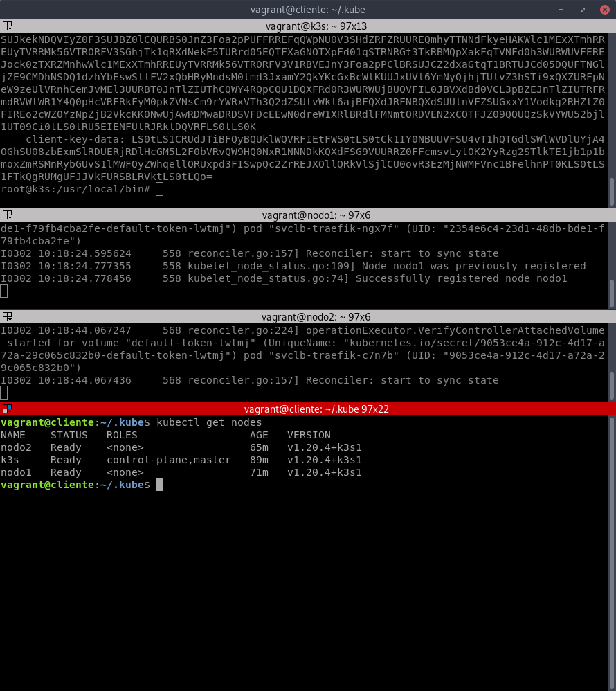
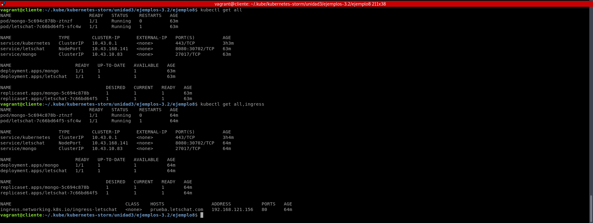
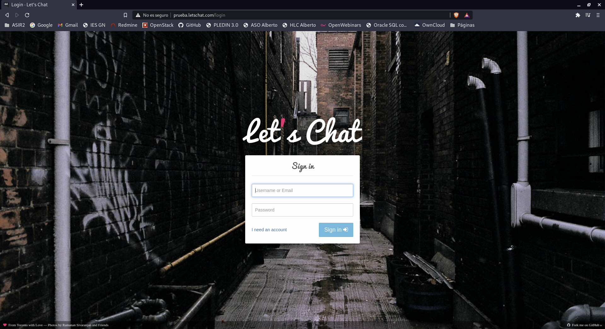
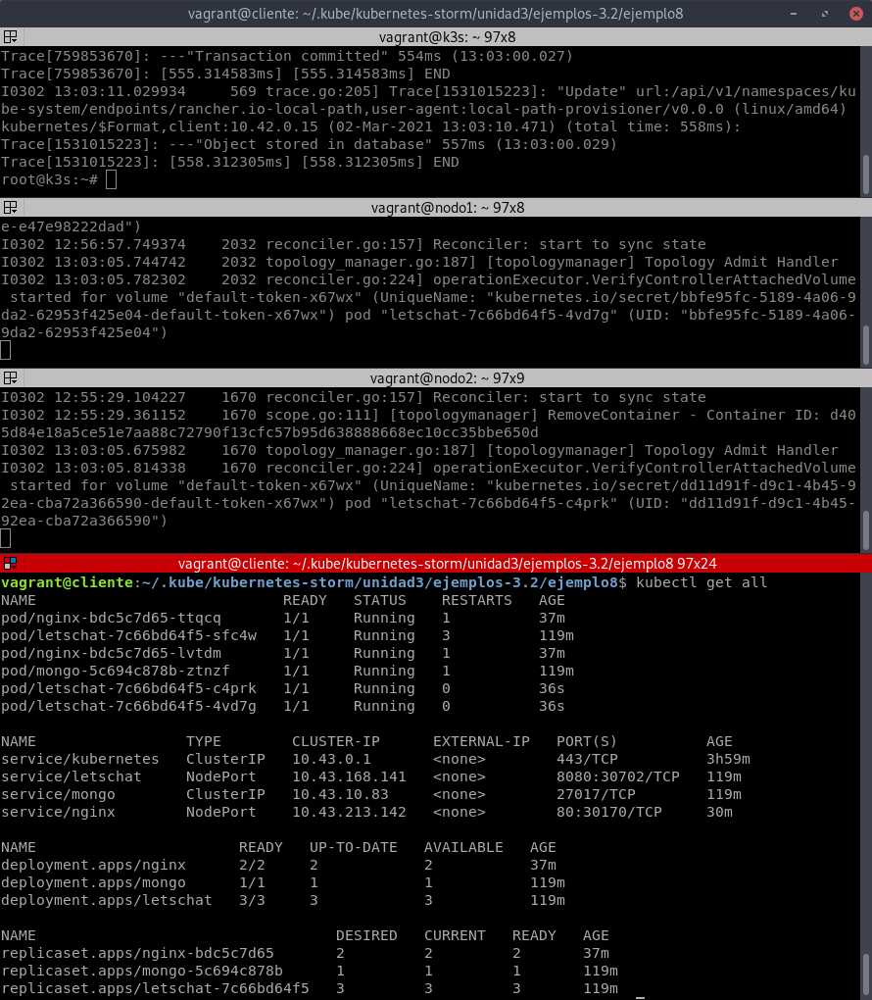
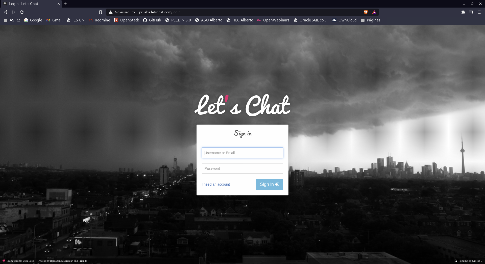
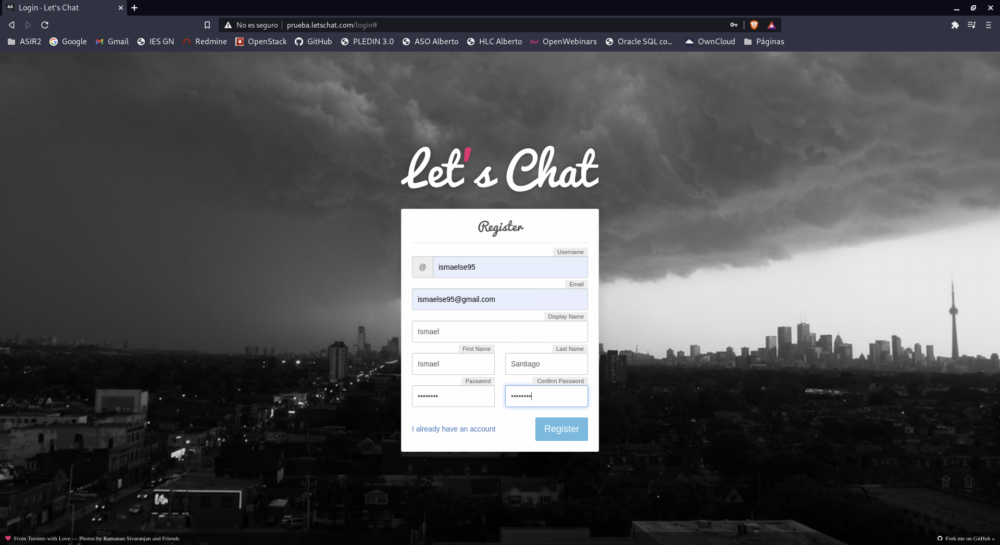
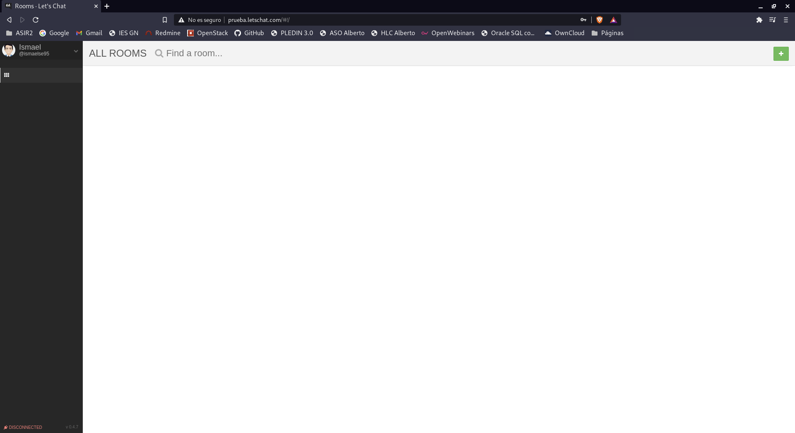

# Despliegue de un cluster de kubernetes

- Elige un método de instalación para crear un cluster de k8s con tres nodos (un controlador y dos workers), puedes usar kubeadm, k3s o cualquier otra opción equivalente que encuentres.
- Describe en la tarea los pasos principales de la instalación y configuración del cluster.
- Configura kubectl adecuadamente para gestionar el cluster desde tu máquina, no desde el nodo controlador.
- Realiza un despliegue de la aplicación del ejemplo 8 del curso: https://github.com/iesgn/kubernetes-storm/tree/master/unidad3/ejemplos-3.2/ejemplo8
- Comprueba que es posible escalar a varias réplicas el despliegue del componente letschat y funciona correctamente el componente ingress.

Vamos a hacer un despliegue de K3S donde vamos a tener una maquina controlador y dos workers, también voy a tener un cliente que va a ser mi equipo.

Lo haré en maquinas vagrant, la configuración del fichero vagrantfile es la siguiente.
~~~
Vagrant.configure("2") do |config|
  config.vm.define :k3s do |k3s|
    k3s.vm.box = "debian/buster64"
    k3s.vm.hostname = "k3s"
    k3s.vm.network :public_network,:bridge=>"eth0"
    k3s.vm.provider :libvirt do |libvirt|
      libvirt.cpus = 1
      libvirt.memory = 1024
      libvirt.qemu_use_session = true
      libvirt.uri = 'qemu:///session'
      libvirt.system_uri = 'qemu:///system'
    end
  end
  config.vm.define :nodo1 do |nodo1|
    nodo1.vm.box = "debian/buster64"
    nodo1.vm.hostname = "nodo1"
    nodo1.vm.network :public_network,:bridge=>"eth0"
    nodo1.vm.provider :libvirt do |libvirt1|
      libvirt1.cpus = 1
      libvirt1.memory = 1024
      libvirt1.qemu_use_session = true
      libvirt1.uri = 'qemu:///session'
      libvirt1.system_uri = 'qemu:///system'
    end
  end
 config.vm.define :nodo2 do |nodo2|
    nodo2.vm.box = "debian/buster64"
    nodo2.vm.hostname = "nodo2"
    nodo2.vm.network :public_network,:bridge=>"eth0"
    nodo2.vm.provider :libvirt do |libvirt2|
      libvirt2.cpus = 1
      libvirt2.memory = 1024
      libvirt2.qemu_use_session = true
      libvirt2.uri = 'qemu:///session'
      libvirt2.system_uri = 'qemu:///system'
    end
  end
  config.vm.define :cliente do |cliente|
     cliente.vm.box = "debian/buster64"
     cliente.vm.hostname = "cliente"
     cliente.vm.network :public_network,:bridge=>"eth0"
     cliente.vm.provider :libvirt do |libvirt3|
       libvirt3.cpus = 1
       libvirt3.memory = 1024
       libvirt3.qemu_use_session = true
       libvirt3.uri = 'qemu:///session'
       libvirt3.system_uri = 'qemu:///system'
     end
   end
end
~~~

## Instalación y configuración de tres nodos.

Una vez tengamos las máquinas levantadas vamos con nuestra primera máquina en la que vamos a instalar k3s. Primero vamos a descargar en la siguiente ruta.
~~~
root@k3s:/usr/local/bin# wget https://github.com/k3s-io/k3s/releases/download/v1.20.4%2Bk3s1/k3s
~~~

Vamos a darle permiso de ejecución.
~~~
root@k3s:/usr/local/bin# chmod +x k3s
~~~

Para desplegar k3s como nodo master tendremos que ejecutar el siguiente comando.
~~~
k3s server &
~~~

Instalamos kubectl.
~~~
sudo apt-get update && sudo apt-get install -y apt-transport-https
curl -s https://packages.cloud.google.com/apt/doc/apt-key.gpg | sudo apt-key add -
echo "deb https://apt.kubernetes.io/ kubernetes-xenial main" | sudo tee -a /etc/apt/sources.list.d/kubernetes.list
sudo apt-get update
sudo apt-get install -y kubectl
~~~

Vamos a ver que con kubectl que tenemos la máquina levantada y en el cluster.
~~~
vagrant@k3s:~$ sudo k3s kubectl get nodes
NAME   STATUS   ROLES                  AGE   VERSION
k3s    Ready    control-plane,master   10m   v1.20.4+k3s1
~~~

Vamos ahora a configurar el nodo1 para ello hacemos los mismos pasos de instalación de k3s.
~~~
root@nodo1:/usr/local/bin# wget https://github.com/k3s-io/k3s/releases/download/v1.20.4%2Bk3s1/k3s
root@nodo1:/usr/local/bin# chmod +x k3s
~~~

Necesitamos el token de autenticación de la máquina k3s, la encontraremos en la siguiente ruta.
~~~
root@k3s:~# cat /var/lib/rancher/k3s/server/node-token
K10af75815b304e147232ec82023631661412e8f26b49f37b451e44042462a17d81::server:a2e1e02783dfc231ea825d98c8eb8487
~~~

Con este token podremos conectar la máquina nodo1 al cluster, para ello tendremos que introducir el siguiente comando.
~~~
root@nodo1:/usr/local/bin# k3s agent --server https://192.168.0.175:6443 --token K10af75815b304e147232ec82023631661412e8f26b49f37b451e44042462a17d81::server:a2e1e02783dfc231ea825d98c8eb8487
~~~

Una vez conectado a la máquina k3s vamos a ejecutar el comando para que nos devuelva los nodos conectados.
~~~
root@k3s:~# k3s kubectl get nodes
NAME    STATUS   ROLES                  AGE     VERSION
k3s     Ready    control-plane,master   20m     v1.20.4+k3s1
nodo1   Ready    <none>                 2m17s   v1.20.4+k3s1
~~~

Este mismo proceso lo hacemos en la máquina nodo2.
~~~
root@nodo2:/usr/local/bin# wget https://github.com/k3s-io/k3s/releases/download/v1.20.4%2Bk3s1/k3s
root@nodo2:/usr/local/bin# chmod +x k3s
~~~

~~~
root@nodo2:/usr/local/bin# k3s agent --server https://192.168.0.175:6443 --token K10af75815b304e147232ec82023631661412e8f26b49f37b451e44042462a17d81::server:a2e1e02783dfc231ea825d98c8eb8487
~~~

Con esto ya tendríamos los 3 nodos como podemos observar.
~~~
root@k3s:~# k3s kubectl get nodes
NAME    STATUS   ROLES                  AGE     VERSION
k3s     Ready    control-plane,master   24m     v1.20.4+k3s1
nodo2   Ready    <none>                 27s     v1.20.4+k3s1
nodo1   Ready    <none>                 5m54s   v1.20.4+k3s1
~~~

Con esto ya tendríamos configurada el cluster.

## Configuración cliente para gestionar cluster.

Para configurar la máquina como gestion de cluster, primero tenemos que instalar kubectl.
~~~
sudo apt-get update && sudo apt-get install -y apt-transport-https
curl -s https://packages.cloud.google.com/apt/doc/apt-key.gpg | sudo apt-key add -
echo "deb https://apt.kubernetes.io/ kubernetes-xenial main" | sudo tee -a /etc/apt/sources.list.d/kubernetes.list
sudo apt-get update
sudo apt-get install -y kubectl
~~~

Necesitamos conectarnos al cluster para ello vamos a copiar el fichero `/etc/rancher/k3s/k3s.yaml` que tenemos en nuestra máquina k3s y lo copiaremos a la cliente.

En la máquina cliente vamos a crear un fichero config dentro del directorio .kube donde en server tendremos que poner la ip de k3s.
~~~
apiVersion: v1
clusters:
- cluster:
    certificate-authority-data: LS0tLS1CRUdJTiBDRVJUSUZJQ0FURS0tLS0tCk1JSUJkekNDQVIyZ0F3SUJBZ0lCQURBS0JnZ3Foa2pPUFFRREFqQWpNU0V3SHdZRFZRUUREQmhyTTNNdGMyVnkKZG1WeUxXTmhRREUyTVRRMk56VTRORFV3SGhjTk1qRXdNekF5TURrd05EQTFXaGNOTXpFd01qSTRNRGt3TkRBMQpXakFqTVNFd0h3WURWUVFEREJock0zTXRjMlZ5ZG1WeUxXTmhRREUyTVRRMk56VTRORFV3V1RBVEJnY3Foa2pPClBRSUJCZ2dxaGtqT1BRTUJCd05DQUFRY0Zaa00vYWpIcUpzVk9oMHgwdjRGMnFOTmlrbk85ZTRFa3VUejk2S0oKL2VLVW5xQXhsejBpUnBIWHZZTFlpRUc2VEtaNnhFVUtqZW1JMURETktUcFVvMEl3UURBT0JnTlZIUThCQWY4RQpCQU1DQXFRd0R3WURWUjBUQVFIL0JBVXdBd0VCL3pBZEJnTlZIUTRFRmdRVVlsZmg0MXJFZ3l1RjZSQlVtclBZCng1RDd5aGN3Q2dZSUtvWkl6ajBFQXdJRFNBQXdSUUloQUlacUp4eXNrUWJHa2tXVHJhL2VXbkE4TEtrck42MHUKeEhRQmVsRnZEK2h6QWlCK0dVTlJFVmkwQjF0Sm9NdUR2UVhoNVhaRTUzdkJrU3YyaXFQb2FIQmJ2Zz09Ci0tLS0tRU5EIENFUlRJRklDQVRFLS0tLS0K
    server: https://192.168.0.175:6443
  name: default
contexts:
- context:
    cluster: default
    user: default
  name: default
current-context: default
kind: Config
preferences: {}
users:
- name: default
  user:
    client-certificate-data: LS0tLS1CRUdJTiBDRVJUSUZJQ0FURS0tLS0tCk1JSUJrRENDQVRlZ0F3SUJBZ0lJT05BbHhkT1RiNU13Q2dZSUtvWkl6ajBFQXdJd0l6RWhNQjhHQTFVRUF3d1kKYXpOekxXTnNhV1Z1ZEMxallVQXhOakUwTmpjMU9EUTFNQjRYRFRJeE1ETXdNakE1TURRd05Wb1hEVEl5TURNdwpNakE1TURRd05Wb3dNREVYTUJVR0ExVUVDaE1PYzNsemRHVnRPbTFoYzNSbGNuTXhGVEFUQmdOVkJBTVRESE41CmMzUmxiVHBoWkcxcGJqQlpNQk1HQnlxR1NNNDlBZ0VHQ0NxR1NNNDlBd0VIQTBJQUJLNVAvL2pmbjlodk9pUFgKU3pIS0dicDQ5WDNVZHJhNVh2eW1DMTA5bm9ZODJEeEM0c0toeWo3SDVBd1ZnV0R4UkhpZlFVaWZ4cXQ5dDFkRgpJTER4TTE2alNEQkdNQTRHQTFVZER3RUIvd1FFQXdJRm9EQVRCZ05WSFNVRUREQUtCZ2dyQmdFRkJRY0RBakFmCkJnTlZIU01FR0RBV2dCU1JVWlh3SWthcE1RVUN2Y2wxNUtXaVJwMnBUekFLQmdncWhrak9QUVFEQWdOSEFEQkUKQWlCaE02aVd4S285blBadG96L2pibW05VlYveXcyQU1qRUllN2UyTSt5OWE2Z0lnZGE4NHRUMEVNaW1Uck5zNQpjTVhUN3JQTkdudkRacUJKOXE0QTk5c29MMXM9Ci0tLS0tRU5EIENFUlRJRklDQVRFLS0tLS0KLS0tLS1CRUdJTiBDRVJUSUZJQ0FURS0tLS0tCk1JSUJkekNDQVIyZ0F3SUJBZ0lCQURBS0JnZ3Foa2pPUFFRREFqQWpNU0V3SHdZRFZRUUREQmhyTTNNdFkyeHAKWlc1MExXTmhRREUyTVRRMk56VTRORFV3SGhjTk1qRXdNekF5TURrd05EQTFXaGNOTXpFd01qSTRNRGt3TkRBMQpXakFqTVNFd0h3WURWUVFEREJock0zTXRZMnhwWlc1MExXTmhRREUyTVRRMk56VTRORFV3V1RBVEJnY3Foa2pPClBRSUJCZ2dxaGtqT1BRTUJCd05DQUFTNGljZE9CMDhNSDQ1dzhYbEswSllFV2xQbHRyMndsM0lmd3JxamY2QkYKcGxBcWlKUUJxUVl6YmNyQjhjTUlvZ3hSTi9xQXZURFpNeW9zeUlVRnhCemJvMEl3UURBT0JnTlZIUThCQWY4RQpCQU1DQXFRd0R3WURWUjBUQVFIL0JBVXdBd0VCL3pBZEJnTlZIUTRFRmdRVWtWR1Y4Q0pHcVRFRkFyM0pkZVNsCm9rYWRxVTh3Q2dZSUtvWkl6ajBFQXdJRFNBQXdSUUlnVFZSUGxxY1Vodkg2RHZtZ0FIREo2cWZ0YzNpZjB2VkcKK0NwUjAwRDMwaDRDSVFDcEEwN0dreW1XRlBRdlFMNmtORDVEN2xCOTFJZ09QQUQzSkVYWU52bjl1UT09Ci0tLS0tRU5EIENFUlRJRklDQVRFLS0tLS0K
    client-key-data: LS0tLS1CRUdJTiBFQyBQUklWQVRFIEtFWS0tLS0tCk1IY0NBUUVFSU4vT1hQTGdlSWlWVDlUYjA4OGhSU08zbExmSlRDUERjRDlHcGM5L2F0bVRvQW9HQ0NxR1NNNDkKQXdFSG9VUURRZ0FFcmsvLytOK2YyRzg2STlkTE1jb1p1bmoxZmRSMnRybGUvS1lMWFQyZWhqellQRUxpd3FISwpQc2ZrREJXQllQRkVlSjlCU0ovR3EzMjNWMFVnc1BFelhnPT0KLS0tLS1FTkQgRUMgUFJJVkFURSBLRVktLS0tLQo=
~~~

Ahora vamos a cargar las credenciales y comprobamos con kubectl que tenemos los nodos.
~~~
export KUBECONFIG=~/.kube/config
~~~

## Despliegue de ejemplo8

Vamos a desplegar el ejemplo8, para iniciar todos los fichero .yaml lo haremos con el siguiente comando.
~~~
vagrant@cliente:~/.kube/kubernetes-storm/unidad3/ejemplos-3.2/ejemplo8$ kubectl apply -f .
~~~

Una vez cargado podemos ver los pods que hemos iniciado.
~~~
vagrant@cliente:~/.kube/kubernetes-storm/unidad3/ejemplos-3.2/ejemplo8$ kubectl get all        
NAME                            READY   STATUS    RESTARTS   AGE
pod/mongo-5c694c878b-ztnzf      1/1     Running   0          63m
pod/letschat-7c66bd64f5-sfc4w   1/1     Running   1          63m

NAME                 TYPE        CLUSTER-IP      EXTERNAL-IP   PORT(S)          AGE
service/kubernetes   ClusterIP   10.43.0.1       <none>        443/TCP          3h3m
service/letschat     NodePort    10.43.168.141   <none>        8080:30702/TCP   63m
service/mongo        ClusterIP   10.43.10.83     <none>        27017/TCP        63m

NAME                       READY   UP-TO-DATE   AVAILABLE   AGE
deployment.apps/mongo      1/1     1            1           63m
deployment.apps/letschat   1/1     1            1           63m

NAME                                  DESIRED   CURRENT   READY   AGE
replicaset.apps/mongo-5c694c878b      1         1         1       63m
replicaset.apps/letschat-7c66bd64f5   1         1         1       63m
~~~

También podemos ver el ingress.
~~~
vagrant@cliente:~/.kube/kubernetes-storm/unidad3/ejemplos-3.2/ejemplo8$ kubectl get all,ingress
NAME                            READY   STATUS    RESTARTS   AGE
pod/mongo-5c694c878b-ztnzf      1/1     Running   0          64m
pod/letschat-7c66bd64f5-sfc4w   1/1     Running   1          64m

NAME                 TYPE        CLUSTER-IP      EXTERNAL-IP   PORT(S)          AGE
service/kubernetes   ClusterIP   10.43.0.1       <none>        443/TCP          3h4m
service/letschat     NodePort    10.43.168.141   <none>        8080:30702/TCP   64m
service/mongo        ClusterIP   10.43.10.83     <none>        27017/TCP        64m

NAME                       READY   UP-TO-DATE   AVAILABLE   AGE
deployment.apps/mongo      1/1     1            1           64m
deployment.apps/letschat   1/1     1            1           64m

NAME                                  DESIRED   CURRENT   READY   AGE
replicaset.apps/mongo-5c694c878b      1         1         1       64m
replicaset.apps/letschat-7c66bd64f5   1         1         1       64m

NAME                                         CLASS    HOSTS                 ADDRESS           PORTS   AGE
ingress.networking.k8s.io/ingress-letschat   <none>   prueba.letschat.com   192.168.121.156   80      64m
~~~

## Escalado de ejemplo8

Vamos a escalar nuestra aplicación, para ello tendremos que ejecutar el siguiente comando.
~~~
vagrant@cliente:~/.kube/kubernetes-storm/unidad3/ejemplos-3.2/ejemplo8$ kubectl scale deployment letschat --replicas=3
deployment.apps/letschat scaled
~~~

Con esto escalamos a 3 replicas tendiendo así 3 pods por si se cae alguno tener 2 mas de respaldo.

Ahora nuestra aplicación debería seguir funcionando, vamos a comprobar y vamos a acceder a letschat.

