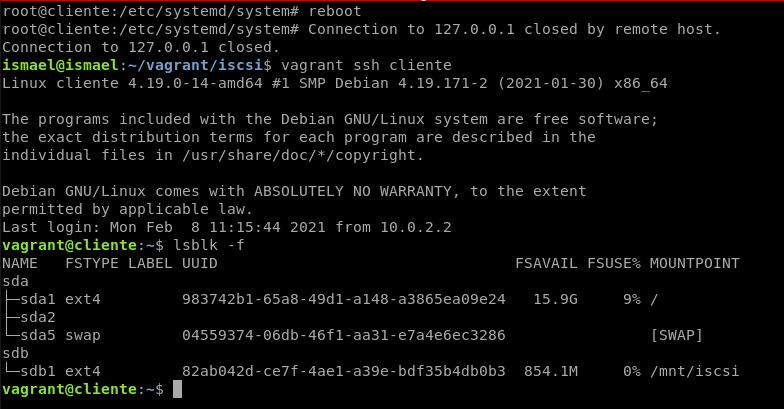

# iSCSI

Configura un escenario con vagrant o similar que incluya varias máquinas que permita realizar la configuración de un servidor iSCSI y dos clientes (uno linux y otro windows). Explica de forma detallada en la tarea los pasos realizados.

- Crea un target con una LUN y conéctala a un cliente GNU/Linux. Explica cómo escaneas desde el cliente buscando los targets disponibles y utiliza la unidad lógica proporcionada, formateándola si es necesario y montándola.
- Utiliza systemd mount para que el target se monte automáticamente al arrancar el cliente
- Crea un target con 2 LUN y autenticación por CHAP y conéctala a un cliente windows. Explica cómo se escanea la red en windows y cómo se utilizan las unidades nuevas (formateándolas con NTFS)

## Creación y configuración de targets

Vamos a empezar a instalar primero el paquete para poder configurar y crear targets.
~~~
root@iscsi-server:~# apt install tgt lvm2
~~~

Ahora vamos a crear el grupo de volúmenes.
~~~
root@iscsi-server:~# pvcreate /dev/sdb
  Physical volume "/dev/sdb" successfully created.
root@iscsi-server:~# vgcreate iscsi /dev/sdb
  Volume group "iscsi" successfully created
~~~

A continuación creamos el volumen lógico.
~~~
root@iscsi-server:~# lvcreate -L 950M -n logicoiscsi iscsi
  Rounding up size to full physical extent 952.00 MiB
  Logical volume "logicoiscsi" created.
~~~

Vamos al fichero de configuración `/etc/tgt/targets.conf` y para que detecte el target tenemos que añadir lo siguiente.
~~~
<target iqn.2020-02.com:tgiscsi>
        backing-store /dev/iscsi/logicoiscsi
</target>
~~~

Reiniciamos el servicio y vemos que el target se ha creado correctamente.
~~~
root@iscsi-server:~# systemctl restart tgt
root@iscsi-server:~# tgtadm --mode target --op show
Target 1: iqn.2020-02.com:tgiscsi
    System information:
        Driver: iscsi
        State: ready
    I_T nexus information:
    LUN information:
        LUN: 0
            Type: controller
            SCSI ID: IET     00010000
            SCSI SN: beaf10
            Size: 0 MB, Block size: 1
            Online: Yes
            Removable media: No
            Prevent removal: No
            Readonly: No
            SWP: No
            Thin-provisioning: No
            Backing store type: null
            Backing store path: None
            Backing store flags:
        LUN: 1
            Type: disk
            SCSI ID: IET     00010001
            SCSI SN: beaf11
            Size: 998 MB, Block size: 512
            Online: Yes
            Removable media: No
            Prevent removal: No
            Readonly: No
            SWP: No
            Thin-provisioning: No
            Backing store type: rdwr
            Backing store path: /dev/iscsi/logicoiscsi
            Backing store flags:
    Account information:
    ACL information:
        ALL
root@iscsi-server:~#
~~~

## Configuración iniciador

Ya tenemos configurado el servidor, ahora tendremos que configurar el iniciador para ello nos dirigimos a la máquina cliente y tendremos que instalar el paquete open-iscsi.
~~~
root@cliente:~# apt install open-iscsi
~~~

Una vez instalado el paquete vamos a entrar al fichero de configuración `/etc/iscsi/iscsid.conf` y vamos a configurarlo para que pueda leer los target de forma automáticamente.
~~~
iscsid.startup = automatic
~~~

Reiniciamos el servicio.
~~~
root@cliente:~# systemctl restart open-iscsi
~~~

Y ahora buscamos el servidor dentro de la red.
~~~
root@cliente:~# iscsiadm -m discovery -t sendtargets -p 192.168.0.142
192.168.0.142:3260,1 iqn.2020-02.com:tgiscsi
~~~

Ahora nos conectamos al target, tendremos que hacer login.
~~~
root@cliente:~# iscsiadm -m node --targetname "iqn.2020-02.com:tgiscsi" -p "192.168.0.142:3260" --login
Logging in to [iface: default, target: iqn.2020-02.com:tgiscsi, portal: 192.168.0.142,3260] (multiple)
Login to [iface: default, target: iqn.2020-02.com:tgiscsi, portal: 192.168.0.142,3260] successful.
~~~

Y podemos ver como en el cliente tenemos el disco del target.
~~~
root@cliente:~# lsblk -f
NAME   FSTYPE LABEL UUID                                 FSAVAIL FSUSE% MOUNTPOINT
sda                                                                     
├─sda1 ext4         983742b1-65a8-49d1-a148-a3865ea09e24   15.9G     9% /
├─sda2                                                                  
└─sda5 swap         04559374-06db-46f1-aa31-e7a4e6ec3286                [SWAP]
sdb   
~~~

Vamos a comprobar que podemos darle formato y podemos escribir en el disco, para ello primero vamos a darle formato y formatear la partición.
~~~
root@cliente:~# fdisk /dev/sdb

Welcome to fdisk (util-linux 2.33.1).
Changes will remain in memory only, until you decide to write them.
Be careful before using the write command.

Device does not contain a recognized partition table.
Created a new DOS disklabel with disk identifier 0x16f2e614.

Command (m for help): n
Partition type
   p   primary (0 primary, 0 extended, 4 free)
   e   extended (container for logical partitions)
Select (default p): p
Partition number (1-4, default 1):
First sector (2048-1949695, default 2048):
Last sector, +/-sectors or +/-size{K,M,G,T,P} (2048-1949695, default 1949695):

Created a new partition 1 of type 'Linux' and of size 951 MiB.

Command (m for help): w
The partition table has been altered.
Calling ioctl() to re-read partition table.
Syncing disks.

root@cliente:~# mkfs.ext4 /dev/sdb1
mke2fs 1.44.5 (15-Dec-2018)
Creating filesystem with 243456 4k blocks and 60928 inodes
Filesystem UUID: 82ab042d-ce7f-4ae1-a39e-bdf35b4db0b3
Superblock backups stored on blocks:
	32768, 98304, 163840, 229376

Allocating group tables: done                            
Writing inode tables: done                            
Creating journal (4096 blocks): done
Writing superblocks and filesystem accounting information: done
~~~

Lo montamos en `/mnt` y vemos si podemos escribir.
~~~
root@cliente:~# mount /dev/sdb1 /mnt
root@cliente:~# lsblk -f
NAME   FSTYPE LABEL UUID                                 FSAVAIL FSUSE% MOUNTPOINT
sda                                                                     
├─sda1 ext4         983742b1-65a8-49d1-a148-a3865ea09e24   15.9G     9% /
├─sda2                                                                  
└─sda5 swap         04559374-06db-46f1-aa31-e7a4e6ec3286                [SWAP]
sdb                                                                     
└─sdb1 ext4         82ab042d-ce7f-4ae1-a39e-bdf35b4db0b3  854.2M     0% /mnt
root@cliente:~# cd /mnt
root@cliente:/mnt# echo "Prueba de escritura" > prueba.txt
root@cliente:/mnt# ls
lost+found  prueba.txt
root@cliente:/mnt#
~~~

## Automontaje del target

Vamos a configurar ahora para que nuestro target se automonte en la máquina cliente para ello lo primero que tenemos que hacer es hacer login desde el cliente para que se automonte, para ello tendremos que ejecutar el siguiente comando.
~~~
root@cliente:~# iscsiadm -m node --targetname "iqn.2020-02.com:tgiscsi" -p "192.168.0.142:3260" -o update -n node.startup -v automatic
~~~

Creamos el automontaje en el fichero `/etc/systemd/system/mnt-iscsi.mount` con la siguiente configuración.
~~~
[Unit]
Description=Montaje de ISCSI

[Mount]
What=/dev/sdb1
Where=/mnt/iscsi
Type=ext4
Options=_netdev

[Install]
WantedBy=multi-user.target
~~~
Es importante que la ruta donde vamos a montar el disco y el nombre del fichero sea igual si no nos dará error.

Reiniciamos los servicios e iniciamos la unidad.
~~~
root@cliente:/etc/systemd/system# systemctl daemon-reload
root@cliente:/etc/systemd/system# systemctl enable mnt-iscsi.mount
Created symlink /etc/systemd/system/multi-user.target.wants/mnt-iscsi.mount → /etc/systemd/system/mnt-iscsi.mount.
root@cliente:/etc/systemd/system# systemctl restart mnt-iscsi.mount
~~~

Reiniciamos la maquina cliente y vemos que se automonta.

