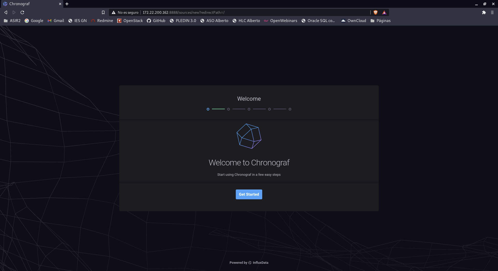
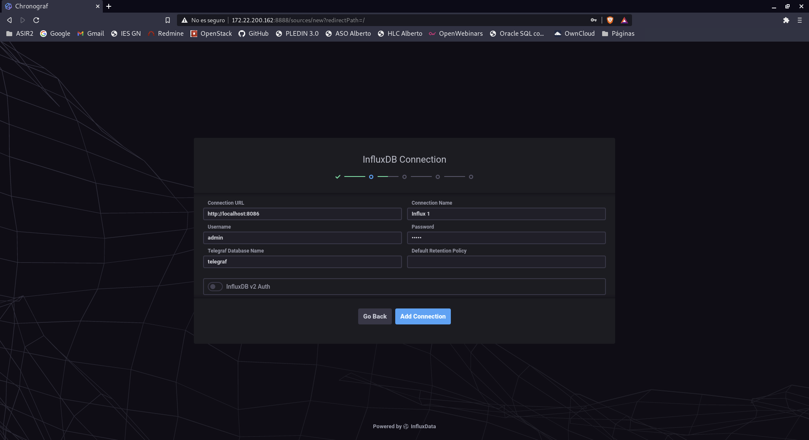
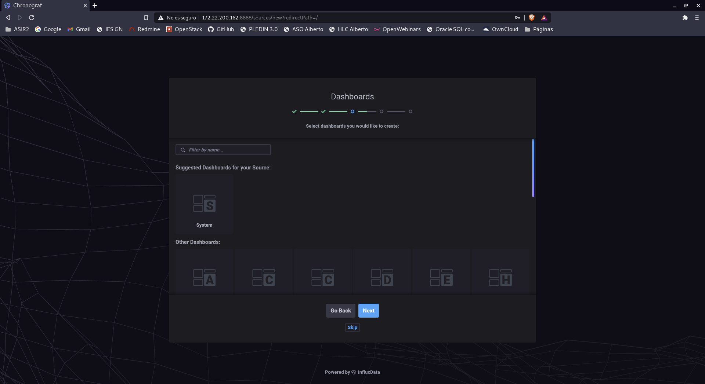
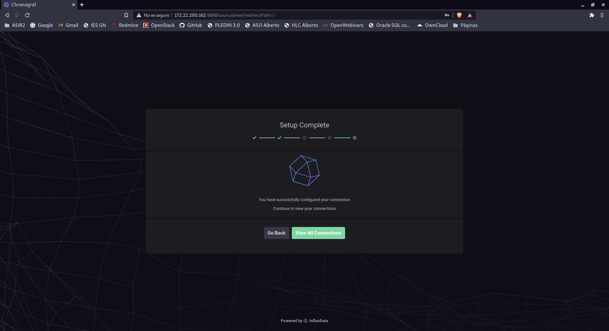
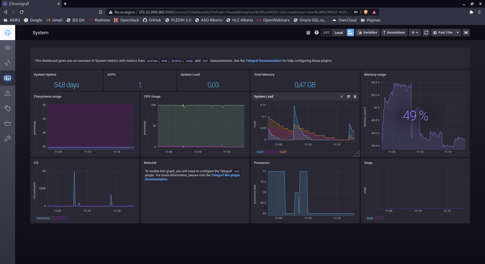
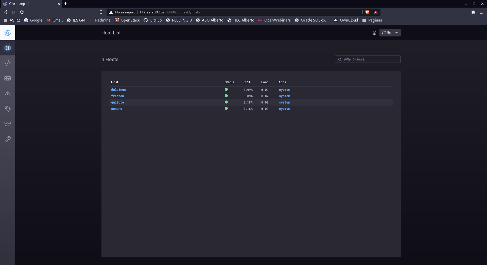

# Métricas, logs y monitorización

En esta tarea vamos a utilizar una de las instancias de OpenStack y elegiremos una de las siguientes partes a realizar entre los distintos servidores de OVH, dulcinea, sancho, quijote y frestón:

- Métricas: recolección, gestión centralizada, filtrado o selección de los parámetros relevantes y representación gráfica que permita controlar la evolución temporal de parámetros esenciales de todos los servidores.
- Monitorización: Configuración de un sistema de monitorización que controle servidores y servicios en tiempo real y envíe alertas por uso excesivo de recursos (memoria, disco raíz, etc.) y disponibilidad de los servicios. Alertas por correo, telegram, etc.
- Gestión de logs: Implementa un sistema que centralice los logs de todos los servidores y que filtre los registros con prioridad error, critical, alert o emergency. Representa gráficamente los datos relevantes extraídos de los logs o configura el envío por correo al administrador de los logs relevantes (una opción o ambas).

Vamos a empezar describiendo las herramientas que voy a utilizar.

- InfluxDB: Esta herramienta se va a encargar de crear bases de datos y guardar la información de la aplicación Telegraf.

- Telegraf: Se encarga de recolectar y gestionar todas las métricas del sistema, la conectaremos con InfluxDB.

- Chronograf: Es una aplicación que nos muestra gráficamente los datos que almacena InfluxDB.

## Configuración Dulcinea

Bien pues ahora empezamos con la instalación de InfluxDB, para ello nos descargaremos el paquete .deb de la página oficial y lo instalaremos.
~~~
debian@dulcinea:~$ sudo wget https://dl.influxdata.com/influxdb/releases/influxdb_1.8.3_amd64.deb
~~~

Instalación.
~~~
debian@dulcinea:~$ sudo dpkg -i influxdb_1.8.3_amd64.deb
~~~

Lo iniciamos ya que por defecto el servicio viene parado.
~~~
debian@dulcinea:~$ sudo systemctl enable influxdb
debian@dulcinea:~$ sudo systemctl restart influxdb
debian@dulcinea:~$ sudo systemctl status influxdb
● influxdb.service - InfluxDB is an open-source, distributed, time series databa
   Loaded: loaded (/lib/systemd/system/influxdb.service; enabled; vendor preset:
   Active: active (running) since Sat 2021-01-30 09:44:39 UTC; 2s ago
     Docs: https://docs.influxdata.com/influxdb/
 Main PID: 16161 (influxd)
    Tasks: 8 (limit: 562)
   Memory: 9.0M
   CGroup: /system.slice/influxdb.service
           └─16161 /usr/bin/influxd -config /etc/influxdb/influxdb.conf

Jan 30 09:44:40 dulcinea influxd[16161]: ts=2021-01-30T09:44:40.114883Z lvl=info
Jan 30 09:44:40 dulcinea influxd[16161]: ts=2021-01-30T09:44:40.115462Z lvl=info
Jan 30 09:44:40 dulcinea influxd[16161]: ts=2021-01-30T09:44:40.115932Z lvl=info
Jan 30 09:44:40 dulcinea influxd[16161]: ts=2021-01-30T09:44:40.115962Z lvl=info
Jan 30 09:44:40 dulcinea influxd[16161]: ts=2021-01-30T09:44:40.116449Z lvl=info
Jan 30 09:44:40 dulcinea influxd[16161]: ts=2021-01-30T09:44:40.117013Z lvl=info
Jan 30 09:44:40 dulcinea influxd[16161]: ts=2021-01-30T09:44:40.117305Z lvl=info
Jan 30 09:44:40 dulcinea influxd[16161]: ts=2021-01-30T09:44:40.117625Z lvl=info
Jan 30 09:44:40 dulcinea influxd[16161]: ts=2021-01-30T09:44:40.115120Z lvl=info
Jan 30 09:44:40 dulcinea influxd[16161]: ts=2021-01-30T09:44:40.118118Z lvl=info
~~~

Ahora pasamos a instalar Telegraf, lo instalamos con el paquete de la página oficial.
~~~
debian@dulcinea:~$ sudo wget https://dl.influxdata.com/telegraf/releases/telegraf_1.17.2-1_amd64.deb
~~~

Instalación.
~~~
debian@dulcinea:~$ sudo dpkg -i telegraf_1.17.2-1_amd64.deb
~~~

Iniciamos el servicio y comprobamos que en InfluxDB se ha creado una tabla de telegraf.
~~~
debian@dulcinea:~$ sudo systemctl enable telegraf
debian@dulcinea:~$ sudo systemctl restart telegraf
debian@dulcinea:~$ influx
Connected to http://localhost:8086 version 1.8.3
InfluxDB shell version: 1.8.3
> show databases
name: databases
name
----
_internal
telegraf
~~~

Ahora nos dirigimos al fichero de Configuración de telegraf y configuraremos los siguientes apartados para conectarse con InfluxDB.
~~~
[agent]
  interval = "10s"
  flush_interval = "10s"
  precision = "s"
  hostname = "dulcinea"

[[outputs.influxdb]]
  urls = ["http://127.0.0.1:8086"]
  database = "telegraf"

  username = "admin"
  password = "admin"

  skip_database_creation = false
~~~

Pasamos a instalar Chronograf desde la página oficial.
~~~
debian@dulcinea:~$ sudo wget https://dl.influxdata.com/chronograf/releases/chronograf_1.8.9.1_amd64.deb
~~~

Instalación.
~~~
debian@dulcinea:~$ sudo dpkg -i chronograf_1.8.9.1_amd64.deb
~~~

Con esto ya lo tendremos instalado y ahora solo hay que acceder a la aplicación mediante el navegador con la dirección `http://ip:8888` y nos saldrá lo siguiente.

## Configuración Clientes

Vamos a configurar ahora nuestros clientes.

- Quijote.
Comenzamos la instalación con Quijote, para ello instalamos telegraf y nos dirigimos al fichero de configuración para añadir los siguientes parametros.
~~~
[centos@quijote ~]$ sudo nano /etc/telegraf/telegraf.conf

[agent]
  interval = "10s"
  flush_interval = "10s"
  precision = ""
  hostname = "quijote"

# Configuration for sending metrics to InfluxDB
[[outputs.influxdb]]
  urls = ["http://10.0.2.11:8086"]
  database = "telegraf"
  skip_database_creation = true
  username = "admin"
  password = "admin"
~~~

Con esto ya lo tendríamos configurado ahora solo hay que reiniciar el servicio.
~~~
[centos@quijote ~]$ sudo systemctl restart telegraf
~~~

- Sancho.
Pasamos a configurar Sancho igual que en centos entramos en el fichero de configuración.
~~~
ubuntu@sancho:~$ sudo nano /etc/telegraf/telegraf.conf

[agent]
  interval = "10s"
  flush_interval = "10s"
  precision = ""
  hostname = "sancho"

# Configuration for sending metrics to InfluxDB
[[outputs.influxdb]]
  urls = ["http://10.0.1.10:8086"]
  database = "telegraf"
  skip_database_creation = true
  username = "admin"
  password = "admin"
~~~

Reiniciamos el servicio.
~~~
ubuntu@sancho:~$ sudo systemctl restart telegraf
~~~

- Freston.
Por último configuramos de igual manera freston.
~~~
debian@freston:~$ sudo nano /etc/telegraf/telegraf.conf

[agent]
  interval = "10s"
  flush_interval = "10s"
  precision = ""
  hostname = "freston"

# Configuration for sending metrics to InfluxDB
[[outputs.influxdb]]
  urls = ["http://10.0.1.10:8086"]
  database = "telegraf"
  skip_database_creation = true
  username = "admin"
  password = "admin"
~~~

Reiniciamos el servicio.
~~~
debian@freston:~$ sudo systemctl restart telegraf
~~~

Nos dirigimos a Chronograf y vemos que nuestras máquinas están incluidas en los hosts.

